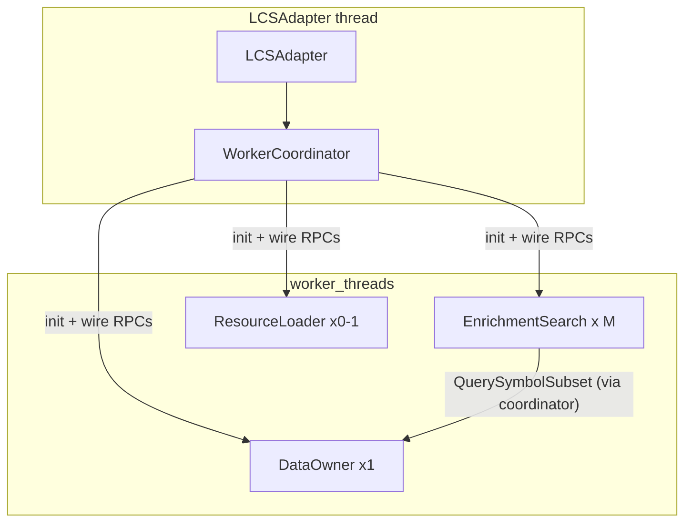
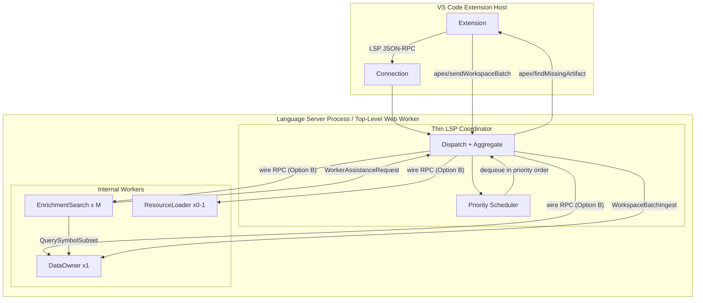

# Effect Platform Workers in apex-language-support — Full Scope

## Context from codebase exploration

- **effect 3.21.0** already pervasive; `@effect/platform` only transitive (via `@effect/opentelemetry`). No `platform-node` or `platform-browser`.
- **`processQueuedItem`** in [`priority-scheduler-utils.ts`](packages/apex-parser-ast/src/queue/priority-scheduler-utils.ts) does `Effect.fork(item.eff)` — the natural insertion point for worker dispatch. The existing `Deferred` rendezvous decouples submission from execution.
- **Wire schema precedent** exists in [`apex-lsp-shared/src/wireSchemas.ts`](packages/apex-lsp-shared/src/wireSchemas.ts) using `Schema.Struct`. Option B wire DTOs will follow this pattern but add `Schema.TaggedRequest`.
- **Two esbuild entries** in [`apex-ls/esbuild.config.ts`](packages/apex-ls/esbuild.config.ts): `server.node.js` (CJS, Node) and `server.web.js` (IIFE, browser). A worker entry becomes a third output.
- **Singleton risks**: `ResourceLoader`, `InFlightPrerequisiteRegistry`, `DocumentStateCache`, `ApexStorageManager`, `SchedulerInitializationService` are all module-level singletons. Workers get fresh copies — coordination must be explicit.
- **Priority scheduler** has 6 levels (Critical/Immediate/High/Normal/Low/Background), per-priority concurrency limits, global cap of 9, starvation relief after 10 consecutive high-priority tasks. All via Effect `Queue`, `Ref`, `Deferred`, `Fiber`, `Scope`.
- **Prerequisite orchestration** (`PrerequisiteOrchestrationService`) uses `InFlightPrerequisiteRegistry` with `acquireOrJoin` + revision counters for coordinated enrichment loops. Relies on shared mutable state (`DocumentStateCache`, `ISymbolManager`). Splitting substeps across workers breaks revision protocol visibility.
- **Missing artifact resolution** has blocking and background paths. Both require `connection.sendRequest('apex/findMissingArtifact', ...)` — only available on the coordinator thread.
- **Workspace batch protocol**: client sends N `apex/sendWorkspaceBatch` (stored), then `apex/processWorkspaceBatches` (triggers ZIP decompression + parse at `Priority.Low`). `WorkspaceLoadCoordinator` manages `isLoading`/`isLoaded`/`hasFailed` via module-level `Ref` atoms.
- **ResourceLoader** is a singleton managing stdlib protobuf cache + ZIP archive. `getSymbolTable()` / `getFile()` used by enrichment and goto-definition. Would need replication or wire proxy in worker topology.
- **Package placement**: implementation (services, layers, role backends) belongs in `lsp-compliant-services`; bundled entries + LSP host + spawn URLs belong in `apex-ls`.
- **Queue bypass risk**: Some `connection.onRequest` / notification handlers reach `lsp-compliant-services` without submitting work through `LSPQueueManager` and the priority scheduler. That skips priority ordering, per-tier and global concurrency limits, starvation relief, and queue metrics. Worker pool dispatch in Step 5 only hooks `processQueuedItem`; any remaining bypasses would defeat scheduling and make the topology incorrect — see **Step 4.5**.

---

## Step 0 — Add dependencies

**Where:** Root `package.json` + `packages/apex-ls/package.json` + `packages/lsp-compliant-services/package.json`

**What:**
- Add `@effect/platform` as a direct dependency (aligned with installed effect 3.21.x — check [Effect compatibility table](https://effect.website/docs/guides/platform/introduction))
- Add `@effect/platform-node` to `apex-ls` (Node server entry owns spawning)
- Add `@effect/platform-browser` to `apex-ls` (web server entry owns spawning)
- Verify version alignment: `@effect/platform` peers on `effect` must match `^3.20.0`

**Verification:** `npm install` succeeds; `npm run compile` still passes across all packages.

---

## Step 1 — Define Option B wire DTOs

**Where:** New file `packages/apex-lsp-shared/src/workerWireSchemas.ts` (alongside existing [`wireSchemas.ts`](packages/apex-lsp-shared/src/wireSchemas.ts))

**What:** Define `Schema.TaggedRequest` types for coordinator-to-worker IPC. **Dedicated wire-only shapes** — intentionally minimal, mapped to/from domain objects at boundaries.

**Initial set:**
- **WorkerInit** — `Schema.Struct({ _tag: "WorkerInit", role: Schema.Literal("dataOwner", "enrichmentSearch", "resourceLoader"), protocolVersion: Schema.Number })`
- **PingWorker** / **PingWorkerResult** — proves round-trip encoding/decoding
- **QuerySymbolSubset** / **QuerySymbolSubsetResult** — enrichment worker asks data owner for symbol tables by URI list
- **WorkerAssistanceRequest** / **WorkerAssistanceResponse** — worker requests coordinator-mediated client RPC (correlation id, context, blocking flag)
- **WorkspaceBatchIngest** / **WorkspaceBatchIngestResult** — coordinator forwards decoded batch to data-owner worker
- **ResourceLoaderGetSymbolTable** / **ResourceLoaderGetSymbolTableResult** — pool/coordinator queries resource-loader worker

**Role partitioning:** Tags partitioned into unions per role (or shared union with `refine`/guards) so a worker can reject disallowed tags at decode time.

**Evolution strategy:** Prefer tagged unions with `_tag` discriminant and additive fields. Breaking changes add a new tag or bump `protocolVersion` — never retcon existing tags.

Follow the existing `WireIdentifierSpecSchema` precedent for naming and module structure. Export from `apex-lsp-shared` barrel.

**Verification:** Types compile; a unit test encodes/decodes each TaggedRequest round-trip.

---

## Step 2 — Single worker entry with role init

**Where:**
- New file `packages/apex-ls/src/worker.platform.ts` — the single entry for all internal worker roles
- Update [`esbuild.config.ts`](packages/apex-ls/esbuild.config.ts) — add a third entry point

**What:**

The worker entry reads its role from the platform init message and bootstraps one Layer per role:

```typescript
// Pseudocode for worker.platform.ts
import { WorkerRunner } from "@effect/platform"

// Detect role from init payload (NodeWorkerRunner provides initialMessage)
// Switch on role:
//   "dataOwner"        -> Layer with data-owner handlers (write + subset-read)
//   "enrichmentSearch" -> Layer with pool handlers (subset query clients, rejects owner-only tags)
//   "resourceLoader"   -> Layer with artifact handlers (rejects graph-mutation tags)
// Reject disallowed TaggedRequest tags for the active role
```

**Entry bundle layout:** One compiled bundle per platform. The same file serves both **host mode** (if loaded as the LS process — not applicable here) and **internal worker mode** (when spawned by coordinator). Detection: Node `workerData` / browser first `postMessage` / env flag set by spawner.

**esbuild addition (Node first, browser in Step 10):**

```typescript
{
  ...nodeBaseConfig,
  entryPoints: { 'worker.platform': 'src/worker.platform.ts' },
  outdir: 'dist',
  format: 'cjs',
  // same externals as server.node
}
```

**Defense in depth:** The worker's handler set validates incoming `_tag` values against an allowlist for its role. Disallowed tags return `Effect.fail(new WorkerRoleViolation(...))`. Even if the coordinator misroutes, the worker fails safely.

**Package placement:** Worker entry file lives in `apex-ls` (owns bundle outputs); role-specific `Layer` implementations will live in `lsp-compliant-services` (exported as `bootstrapWorkerBackend(role)` or `provideWorkerLayers(role)` — Step 11).

**Verification:** `npm run compile` passes; esbuild produces `dist/worker.platform.js`.

---

## Step 3 — Minimal Node vertical slice (one round-trip)

**Where:**
- New file `packages/apex-ls/src/server/WorkerCoordinator.ts` — coordinator that spawns and manages workers
- Modify [`LCSAdapter.ts`](packages/apex-ls/src/server/LCSAdapter.ts) — initialize coordinator behind feature flag
- Wire DTOs from step 1

**What:** Prove typed coordinator-to-worker communication works end-to-end:

1. **WorkerCoordinator** creates a `NodeWorker` layer pointing at `dist/worker.platform.js`, sends `WorkerInit { role: "enrichmentSearch" }`, then sends `PingWorker { echo: "hello" }` and awaits `PingWorkerResult`.

2. **Feature flag:** Gate on `process.env.APEX_WORKER_EXPERIMENT` or a new setting `apex.experimental.workers.enabled` (default `false`). When off, current single-threaded behavior is unchanged.

3. **LCSAdapter integration:** In `handleInitialized()`, after existing setup, optionally call `WorkerCoordinator.initialize()` which spawns one test worker, pings it, logs the result, and shuts it down. No LSP behavior changes.

4. **Worker side:** `worker.platform.ts` receives init, registers `PingWorker` handler returning `{ echo: req.echo }`, logs role.

**Verification:**
- Start the Node language server with `APEX_WORKER_EXPERIMENT=1`
- Server log shows: worker spawned, ping sent, pong received, worker shut down
- Without the flag, no workers are spawned; existing behavior identical
- `npm run compile` and `npm run lint` pass

---

## Step 4 — Pool topology (Node)

**Where:** Expand `WorkerCoordinator.ts` + `worker.platform.ts`

**What:** Move from one test worker to the target topology:

- **Data owner (x1):** Spawned with `role: "dataOwner"`. Holds mock state initially; future: wraps `ISymbolManager` access.
- **Enrichment/search pool (xM):** `WorkerPool.make` or `makePoolSerialized` with size from settings. **M** is the configurable number; fixed roles (data owner, resource loader) are not pool slots.
- **Resource loader (x0-1):** Optional, spawned with `role: "resourceLoader"`.

Add `QuerySymbolSubset` handler to data-owner worker (returns mock data). Pool workers send subset queries to data owner via coordinator mediation.



**Settings:**
- `apex.experimental.workers.enabled: boolean` (default false)
- `apex.experimental.workers.poolSize: number` (default 2, min 1, max cpus-2)

**Verification:**
- Coordinator spawns 1 data-owner + M pool workers + optional resource-loader
- Pool worker sends QuerySymbolSubset through coordinator to data owner, gets response
- Pool size respects setting
- Graceful shutdown on server exit (Scope.close)

---

## Step 4.5 — Priority queue as sole entry to services (bypass elimination) ✅

**Status:** Complete.

**Inventory result (30 handlers):**

| Classification | Count | Examples |
|---|---|---|
| **Already queued** | 4 | documentSymbol, diagnostics, processWorkspaceBatches, didOpen (internal) |
| **Refactored → queued** | 11 | hover (Immediate), definition (High), implementation (High), references (Normal), codeLens (Low), foldingRange (Low), executeCommand (Normal), findMissingArtifact (Low), didSave (Normal), didClose (Immediate), didChange (Normal, after debounce) |
| **Coordinator-only** | 9 | initialize, initialized, didChangeConfiguration, shutdown, exit, ping, didChangeWorkspaceFolders, sendWorkspaceBatch, profiling/* |
| **Documented exceptions** | 6 | apexlib/resolve (static content), workspaceLoadComplete/Failed (lifecycle signals), queueState/graphData (dev diagnostics), didDeleteFiles (workspace event, no LSPRequestType) |

**Changes made:**
- Added `implementation`, `codeLens`, `foldingRange` to `LSPRequestType` union, `GenericRequestHandler` methodMap, `DEFAULT_SERVICE_CONFIG`, and `ServiceFactory`
- Created `FoldingRangeProcessingService` — queue-compatible wrapper that internally obtains storage
- Added `submitImplementationRequest`, `submitCodeLensRequest`, `submitFoldingRangeRequest`, `submitFindMissingArtifactRequest` to `LSPQueueManager`
- Refactored `LCSAdapter` — all 8 request handlers now use `LSPQueueManager.submit*()` instead of `dispatchProcessOn*()` calls
- Refactored `dispatchProcessOnCloseDocument`, `dispatchProcessOnSaveDocument` to route through `LSPQueueManager`
- Refactored `dispatchProcessOnChangeDocument` debounce callback to route through `submitDocumentChangeNotification` after debounce fires
- Added 5 regression tests for new submit methods in `LSPQueueManager.test.ts`

**Verification:** compile ✅, lint ✅, test (4129 pass) ✅, bundle ✅

---

## Step 5 — Priority queue to pool dispatch composition

**Prerequisite:** Step 4.5 — pool dispatch assumes **all** service-bound LSP work is already flowing through `processQueuedItem`. Remaining bypasses must be fixed first.

**Where:** [`priority-scheduler-utils.ts`](packages/apex-parser-ast/src/queue/priority-scheduler-utils.ts), `WorkerCoordinator.ts`, [`LSPQueueManager.ts`](packages/lsp-compliant-services/src/queue/LSPQueueManager.ts)

**What:** Two orthogonal concerns — **scheduling (priority)** and **dispatch (pool)** — must compose correctly:

1. **Scheduling stays on the coordinator.** The `controllerLoop` in `priority-scheduler-utils.ts` continues to dequeue tasks in priority order (Critical -> Immediate -> High -> Normal -> Low -> Background) with starvation relief, per-priority concurrency limits, and global cap. This ordering is authoritative.

2. **Dispatch goes to pool.** Replace `processQueuedItem`'s `Effect.fork(item.eff)` with a dispatch to the enrichment/search pool via `WorkerCoordinator`. The `QueuedItem.eff` is replaced by (or serialized into) an Option B wire message + handler lookup on the worker side. The existing `Deferred` rendezvous pattern (`fiberDeferred`) is adapted: coordinator fulfills it with a `Deferred<Result>` that the worker resolves via message passing.

3. **Data-owner queue dimension.** Subset queries and writes to the data owner need their own serialized or priority-aware handling so enrichment workers do not starve the owner or vice versa. Design: data-owner worker has an internal Effect `Queue` with at least two tiers (high-priority reads vs bulk writes).

4. **Existing concurrency settings become pool sizing inputs.** `maxTotalConcurrency` (currently 9) and per-priority limits map to worker pool size constraints. The pool width **M** is the parallelism dimension; priority is the ordering dimension entering that pool.

**Key invariant:** Do not replace the priority system with "whichever worker is free" — that would invert latency guarantees.

**Verification:**
- Tasks dequeued in priority order on coordinator, then dispatched to workers
- High-priority hover/completion still preempts low-priority background enrichment
- Back-pressure metrics (retries, wait times) still reported accurately
- Starvation relief still triggers for lower-priority tiers

---

## Step 6 — Prerequisite atomicity enforcement

**Where:** [`PrerequisiteOrchestrationService.ts`](packages/lsp-compliant-services/src/services/PrerequisiteOrchestrationService.ts), [`InFlightPrerequisiteRegistry.ts`](packages/lsp-compliant-services/src/services/InFlightPrerequisiteRegistry.ts), `WorkerCoordinator.ts`

**What:** Prerequisite enrichment per `(fileUri, documentVersion)` must remain atomic — never split substeps across different workers.

**Guardrails:**
1. `runPrerequisitesForLspRequestType` / `runCoordinatedPrerequisites` is **one atomic schedulable unit** per file key. Either it runs entirely on the coordinator, entirely on one enrichment worker affined to that key, or serialized through the data-owner worker. Never split enrichment vs cross-file resolution across different pool workers.

2. `InFlightPrerequisiteRegistry` stays on the coordinator thread (or data-owner worker if it owns the registry). Its `acquireOrJoin` + revision protocol depends on atomic read-modify-write against the `entries` Map — this cannot span workers without shared transactional memory.

3. `DocumentStateCache` entries (`detailLevel`, `enrichmentFailed`, `parseTree`) must be visible to the worker running the coordinated loop. If the registry stays on coordinator, the coordinator forwards cache state with the work unit.

4. Wire types (Option B) do **not** expose separate RPCs for "half" of prerequisite orchestration — e.g. no `EnrichOnly` / `CrossFileOnly` split unless internal to the data owner and ordered there.

5. Pool workers handle **independent** work units (different URIs, or read-only subset queries after prerequisites are complete) — not parallel slices of the same prerequisite chain.

**Verification:**
- No concurrent prerequisite chains for the same `(fileUri, documentVersion)` across workers
- Revision stabilization loop still converges
- Validators never see partially-enriched symbol tables from a split chain

---

## Step 7 — Missing artifact coordinator mediation

**Where:** [`MissingArtifactResolutionService.ts`](packages/lsp-compliant-services/src/services/MissingArtifactResolutionService.ts), `WorkerCoordinator.ts`, wire DTOs

**What:** Only the coordinator thread owns the LSP `Connection`. Workers that discover missing artifacts must route through the coordinator.

**Flow:**
1. **Worker** sends `WorkerAssistanceRequest` to coordinator (includes correlation id, full `IdentifierSpec` context, blocking flag — matching existing `resolveBlocking` vs `resolveInBackground` paths in [`MissingArtifactResolutionService`](packages/lsp-compliant-services/src/services/MissingArtifactResolutionService.ts)).
2. **Coordinator** calls `connection.sendRequest('apex/findMissingArtifact', ...)` (or enqueues via `LSPQueueManager` for blocking path) and awaits the client result.
3. **Coordinator** forwards `WorkerAssistanceResponse` with the same correlation id and the client result (or error) back to the requesting worker.
4. Worker continues enrichment/search; data owner eventually ingests any new artifacts.

**Deduplication:** Serialize or deduplicate concurrent missing-artifact requests from multiple workers. If worker A and B both need `MyClass.cls`, only one `apex/findMissingArtifact` goes to the client. Coordinator holds a pending-requests map keyed by dedup key (matching existing `inFlightByKey` logic in `MissingArtifactResolutionService`).

**Timeout / cooldown:** Preserve existing 3s cooldown (`recentBlockingTimeouts`) and per-request timeouts. Coordinator manages timeouts; worker receives timeout result.

**Policy:** Outbound server-to-client assistance always goes through the coordinator. Workers use internal wire messages only.

**Verification:**
- Worker discovers missing type -> coordinator sends to client -> result returned to worker
- Concurrent duplicate requests are deduplicated
- Blocking path respects timeout; background path is fire-and-forget
- Extension handler (`Client.onRequest('apex/findMissingArtifact', ...)`) unchanged

---

## Step 8 — Workspace batch ingestion via data-owner ✅

**Where:** [`WorkspaceBatchHandler.ts`](packages/apex-ls/src/server/WorkspaceBatchHandler.ts), [`WorkspaceLoadCoordinator.ts`](packages/lsp-compliant-services/src/services/WorkspaceLoadCoordinator.ts), `WorkerCoordinator.ts`, data-owner worker

**What:** Workspace file batches must be ingested by the data-owner worker consistently, regardless of whether the load was server-initiated or client-initiated.

1. **Coordinator** continues to receive `apex/sendWorkspaceBatch` and `apex/processWorkspaceBatches` via `connection.onRequest` (LSP handler stays on coordinator thread).
2. `WorkspaceBatchStorage` stays on coordinator. After `processWorkspaceBatches` finds a complete session, instead of forking `processStoredBatches` locally, coordinator sends `WorkspaceBatchIngest` wire messages to the **data-owner** worker with decoded batch data.
3. Data-owner worker runs the CPU-intensive work: `unzipSync` decompression, metadata parsing, `TextDocument` creation, `DocumentProcessingService.processDocumentOpenBatch`.
4. `WorkspaceLoadCoordinator` state refs (`isLoadingRef`, `isLoadedRef`, `hasFailedRef`) stay on the coordinator thread. Data-owner signals completion back via wire message; coordinator updates refs and sends `sendNotification('apex/queueStateChanged', ...)` / load-complete events.
5. Enrichment workers respect workspace loading semantics — coordinator broadcasts load state to workers so they can gate prerequisite behavior (mirroring `isWorkspaceLoading()` checks in [`LspRequestPrerequisiteMapping`](packages/lsp-compliant-services/src/services/LspRequestPrerequisiteMapping.ts)).

**Key invariant:** Batch application and "load complete" transitions are consistent with the data owner. No branching on initiation path (server-notified vs client-setting-triggered — both converge at `apex/sendWorkspaceBatch`).

**Implementation (completed):**
- **`WorkspaceBatchHandler.ts`**: Added `BatchIngestionDispatcher` type and `setBatchIngestionDispatcher()`/`getBatchIngestionDispatcher()` for injection. `processStoredBatches` now branches: when a dispatcher is set, `processViaDataOwner()` decodes+unzips on coordinator then dispatches entries via `WorkspaceBatchIngest`; otherwise `processLocally()` falls back to the original priority-scheduler path. Extracted `extractBatchEntries()` helper for decode+unzip+metadata-parse.
- **`WorkerCoordinator.ts`**: `WorkerTopologyDispatcher.createBatchIngestionDispatcher()` creates the dispatch function that sends `WorkspaceBatchIngest` to the data-owner worker.
- **`worker.platform.ts`**: `WorkspaceBatchIngest` handler replaced `notImplementedYet` stub with an acceptance handler that logs receipt and returns `{ processedCount: entries.length }`. Real processing (TextDocument creation + compilation) deferred to Step 11.
- **`LCSAdapter.ts`**: Wired `setBatchIngestionDispatcher(dispatcher.createBatchIngestionDispatcher())` after topology initialization.
- **Load state**: `WorkspaceLoadCoordinator` refs remain on coordinator thread unchanged. Client sends `apex/workspaceLoadComplete`/`apex/workspaceLoadFailed` notifications independently of batch processing. Prerequisite-requiring types are already gated to coordinator-local execution (Step 6), so enrichment workers don't need load state.

**Verification:** ✅
- Workspace batch processing routes to data-owner worker when dispatcher set
- Fallback to local processing when no dispatcher (backward compat)
- Load state transitions unchanged (coordinator-only)
- 11 WorkspaceBatchHandler tests pass (4 existing + 7 new Step 8 tests)
- 25 WorkerCoordinator tests pass (including live data-owner batch ingest test)
- Full apex-ls suite: 89 tests pass, 8 suites
- Compile, lint, bundle all clean

---

## Step 9 — ResourceLoader migration ✅

**Where:** [`resourceLoader.ts`](packages/apex-parser-ast/src/utils/resourceLoader.ts), resource-loader worker, wire DTOs

**What:** Move stdlib artifact loading to the resource-loader worker. Replace singleton with a message-based facade.

1. **Resource-loader worker** owns the `ResourceLoader` instance: loads protobuf cache (`apex-stdlib.pb.gz`), ZIP archive (`StandardApexLibrary.zip`), and type registry (`apex-type-registry.pb.gz`). Exposes wire RPCs: `ResourceLoaderGetSymbolTable`, `ResourceLoaderGetFile`, `ResourceLoaderResolveClass`.
2. **Coordinator and pool workers** use a `ResourceLoaderProxy` that forwards calls to the resource-loader worker via wire messages. Same interface as `ResourceLoader` (`getSymbolTable`, `getFile`, `resolveStandardClassFqn`) but backed by IPC.
3. **Initialization:** Resource-loader worker loads data at startup (triggered by coordinator after spawn). Reports ready state back to coordinator. Coordinator gates enrichment on resource-loader readiness (matching current behavior where `ResourceLoader.initialize()` is awaited before heavy work).
4. **Fallback:** If resource-loader worker is not spawned (disabled or browser limits), coordinator falls back to loading `ResourceLoader` on its own thread (current behavior).

**Implementation (completed):**
- **`workerWireSchemas.ts`**: Added `ResourceLoaderGetFile` and `ResourceLoaderResolveClass` wire DTOs. Updated `ResourceLoaderTags` and `ResourceLoaderRequest` union to include them.
- **`worker.platform.ts`**: `WorkerInit` handler triggers `ResourceLoader.getInstance().initialize()` when role is `resourceLoader` (lazy dynamic import to avoid loading at module init for other roles). Replaced stub handlers with real implementations: `ResourceLoaderGetSymbolTable` (JSON-serializes SymbolTable to avoid DataCloneError), `ResourceLoaderGetFile`, `ResourceLoaderResolveClass`.
- **`ResourceLoaderProxy.ts`** (new): Proxy class with same API — `getSymbolTable(classPath)`, `getFile(path)`, `resolveStandardClassFqn(className)` — forwards to resource-loader worker via wire RPCs.
- **`LCSAdapter.ts`**: Topology init imports `ResourceLoaderProxy` and creates an instance when `topology.resourceLoader` is present. Resource-loader worker gated by `APEX_WORKER_RESOURCE_LOADER` env var. Local `initializeResourceLoader()` remains as fallback.
- **`esbuild.config.ts`**: Worker bundle now includes `.zip`/`.gz` loaders (dataurl) since the resource-loader role imports `ResourceLoader` with embedded stdlib data.
- **`tsconfig.node.json`**: Added `ResourceLoaderProxy.ts` to include list.

**Verification:** ✅
- `getSymbolTable("System/String.cls")` via proxy returns data (live worker integration test)
- `getFile` and `resolveStandardClassFqn` work through proxy
- Unknown classes return null/undefined correctly
- Fallback: local `initializeResourceLoader()` runs when no resource-loader worker
- 5 new ResourceLoaderProxy tests pass (live worker integration)
- Full suite: 94 tests, 9 suites pass
- Compile, lint, bundle all clean

---

## Step 10 — Browser workers ✅

**Where:** [`webWorkerServer.ts`](packages/apex-ls/src/server/webWorkerServer.ts), [`esbuild.config.ts`](packages/apex-ls/esbuild.config.ts), `worker.platform.ts`, `worker.platform.web.ts`

**What:** Same topology as Node but using `@effect/platform-browser` with nested `Worker`s inside the web LS bundle.

**Implemented:**

1. **`worker.platform.web.ts`** — standalone browser worker entry mirroring `worker.platform.ts` handlers but using `BrowserWorkerRunner.layer` and `self.postMessage` for the assistance proxy. Kept self-contained (no local imports) to avoid tsx worker-thread resolution issues in tests.
2. **esbuild** — 4th build entry producing `dist/worker.platform.web.js` (IIFE, browser platform, `configureWebWorkerPolyfills` applied, `.gz`/`.zip` dataurl loaders).
3. **`WorkerCoordinator.makeBrowserWorkerLayer()`** — async factory using dynamic `import('@effect/platform-browser/BrowserWorker')` to create a browser worker layer without polluting Node builds.
4. **Polyfills** — `process`, `Buffer`, `global` set on `globalThis` before any library code, matching `webWorkerServer.ts`.
5. **postMessage sanitization** — assistance proxy messages JSON-roundtripped before `self.postMessage` to strip non-cloneable values.

**Verification:** compile ✅, lint ✅, bundle ✅ (13MB browser worker bundle produced), all 94 existing Node tests pass ✅

---

## Step 11 — Real workload offload

**Prerequisite:** Step 4.5 — handlers must already enqueue service work; offload moves execution of queued units to workers, not ad-hoc parallel calls.

**Where:** [`LCSAdapter.ts`](packages/apex-ls/src/server/LCSAdapter.ts), `WorkerCoordinator.ts`, `lsp-compliant-services` role layers

**What:** Wire actual LSP request handlers to dispatch through worker topology instead of running on the coordinator thread.

**Package placement:** Role-specific `Layer` implementations (`bootstrapWorkerBackend(role)` / `provideWorkerLayers(role)`) live in `lsp-compliant-services`, exported for `apex-ls` to import. Business logic stays co-located with `LSPQueueManager`, `PrerequisiteOrchestrationService`, etc.

**What moves where:**

- **Data-owner worker:** `dispatchProcessOnOpenDocument`, `dispatchProcessOnChangeDocument`, `dispatchProcessOnSaveDocument`, `dispatchProcessOnCloseDocument` — these trigger parsing + AST walk + symbol graph mutations. Data owner holds authoritative `ISymbolManager` state.
- **Enrichment/search pool:** `dispatchProcessOnHover`, `dispatchProcessOnDefinition`, `dispatchProcessOnReferences`, `dispatchProcessOnImplementation`, `dispatchProcessOnCodeLens` — CPU-bound symbol resolution and graph traversal. Workers query data owner for subsets.
- **Resource-loader worker:** `ResourceLoader.initialize()`, `prePopulateSymbolGraph` — startup-only protobuf deserialization and symbol graph population.
- **Coordinator keeps:** LSP `Connection`, `TextDocuments` sync, capability negotiation, `runWithSpanAndRecord` tracing, in-flight dedup maps, scheduler tick loop, config change handling, telemetry, progress reporting.

**Shared singleton migration:** `ResourceLoader.getInstance()` on the main thread becomes a message-based facade (Step 9). `ApexStorageManager`, `DocumentStateCache` become data-owner-internal state. `SchedulerInitializationService` stays on coordinator.

**Verification:**
- Hover/definition/references/diagnostics return correct results via worker dispatch
- Document open/change triggers parse on data-owner worker, not coordinator
- Coordinator thread stays responsive during heavy parse workloads
- Existing telemetry and tracing still captures per-request timing

---

## Step 12 — Transport isolation

**Where:** New interface file in `lsp-compliant-services` (e.g. `src/workers/WorkerTransport.ts`)

**What:** Mitigate lock-in to `@effect/platform` Worker by isolating the transport behind a small internal interface.

**Keep (portable across transports):**
- `@effect/schema` wire DTOs (Option B)
- `Layer` composition
- `Effect`-based services in `lsp-compliant-services`
- Domain logic that does not import `WorkerManager` or platform runner modules

**Treat as pluggable:**
- Concrete process/thread/worker spawn
- Message pump and pool implementation
- Whatever maps "send this encoded request, await response" on top of `postMessage` / `worker_threads` / nested `Worker`

**Interface shape (illustrative):**

```typescript
interface WorkerTransport {
  spawn(role: WorkerRole, init: WorkerInit): Effect<WorkerHandle, SpawnError>
  send<Req extends TaggedRequest>(handle: WorkerHandle, request: Req): Effect<Response<Req>, WorkerError>
  shutdown(handle: WorkerHandle): Effect<void, never>
}

interface WorkerPoolTransport {
  makePool(role: WorkerRole, size: number): Effect<PoolHandle, SpawnError>
  dispatch<Req extends TaggedRequest>(pool: PoolHandle, request: Req): Effect<Response<Req>, WorkerError>
  shutdown(pool: PoolHandle): Effect<void, never>
}
```

First implementation: `EffectPlatformWorkerTransport` wrapping `@effect/platform` `NodeWorker` / `BrowserWorker`. Swappable for hand-rolled IPC or another RPC library if needed.

**Verification:**
- All worker communication goes through `WorkerTransport` interface
- Swapping to a mock transport in tests is straightforward
- Schemas and Layers survive a transport swap — only the adapter changes

---

## Step 13 — Settings, documentation, and ADR

**Where:** [`package.json`](packages/apex-lsp-vscode-extension/package.json) (contributes.configuration), new ADR doc

**What:**

**ADR / docs:** Include the **sole entry via priority queue** invariant, the inventory outcome of Step 4.5, and any documented coordinator-only exceptions (no services).

**Settings schema (extension `package.json`):**
- `apex.experimental.workers.enabled: boolean` (default false) — master switch
- `apex.experimental.workers.poolSize: number` (default 2, min 1, max cpus-2) — enrichment/search pool M
- `apex.experimental.workers.resourceLoader: boolean` (default true) — spawn resource-loader worker
- Validation: reject invalid values at startup, log warning, fall back to defaults
- Distinct from existing `apex.queueProcessing.maxConcurrency` (priority-based logical concurrency) and `apex.loadWorkspace.*` (workspace file batch loading) and `apex.resources.loadMode` (stdlib lazy/full — not workspace batches)

**Documentation:**
- ADR: topology decisions, Option B wire contract rationale, prerequisite atomicity rule, priority-vs-dispatch composition, transport isolation, **queue bypass elimination (Step 4.5) and sole-entry invariant**, documented coordinator-only exceptions
- README update: new experimental settings, how to enable, expected behavior changes
- Inline JSDoc on wire DTOs, `WorkerCoordinator`, `WorkerTransport`

**Verification:**
- Settings appear in VS Code settings UI under `apex.experimental.workers.*`
- Invalid values logged and corrected at startup
- ADR reviewed and merged

---

## Architecture summary



**Language client to language server transport:** Unchanged (Node child process or web `server.web.js`). Effect workers are internal to the LS — not used for LSP framing.
