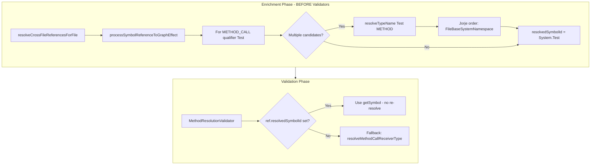

# Jorje-Style Type Name Disambiguation Plan (Revised)

## Problem

When resolving `Test.setMock()` in an @isTest class, the validator incorrectly resolves `Test` to `Canvas.Test` instead of `System.Test`. Both exist in StandardApexLibrary. The current approach uses `findSymbolByName('Test')` and picks arbitrarily (first match or `[0]`), bypassing Apex's semantic resolution rules.

## Key Insight: Resolution Belongs in Enrichment

For full detail level, **enrichment runs before validators**. The enrichment process (via `resolveCrossFileReferencesForFile`) should properly resolve references using Jorje semantics **before** validators run. Validators then consume pre-resolved refs (`ref.resolvedSymbolId`) and should not re-resolve.

**Current flow:**
1. PrerequisiteOrchestrationService: `enrichFiles([fileUri], 'full')` then `resolveCrossFileReferencesForFile(fileUri)`
2. `resolveCrossFileReferencesForFile` → `processSymbolReferencesToGraphEffect` processes refs
3. For METHOD_CALL with qualifier "Test": `findSymbolByName(typeRef.name)` → `symbols[0]` (arbitrary)
4. Validators run; MethodResolutionValidator also does its own resolution via `resolveMethodCallReceiverType` + `findSymbolByName`

**Target flow:**
1. Enrichment resolves refs using Jorje-style context-dependent resolution order
2. `ref.resolvedSymbolId` is set correctly (e.g. System.Test for `Test` in method call context)
3. Validators use `ref.resolvedSymbolId` when available; no re-resolution

---

## Jorje Reference

From [TypeNameResolutionOrders.java](apex-jorje/apex-jorje-semantic/.../TypeNameResolutionOrders.java):

- **METHOD** (method calls): InnerTypeOfCurrentType, InnerTypeOfParentType, InnerTypeOfEnclosingType, **TopLevelTypeInSameNamespace**, NamedScalarOrVoid, **FileBaseSystemNamespace**, FileBaseSchemaNamespace, LabelType, ArgumentType, **BuiltInMethodNamespace**, SObject
- **DEFAULT** (type declarations): Similar but BuiltInSystemSchema before FileBaseSystemNamespace

Key: `TopLevelTypeInSameNamespace` runs first—if the referencing class is in Canvas namespace, `Canvas.Test` wins. For default/empty namespace, `FileBaseSystemNamespace` (System.Test) is reached before other built-in namespaces.

---

## Implementation Plan

### Phase 1: Reference-type-specific resolution orders

**File:** [ResolutionRules.ts](packages/apex-parser-ast/src/namespace/ResolutionRules.ts)

1. Add **FileBaseSystemNamespace** rule (one-part)—resolve unqualified `Test` to `System.Test` for file-based apex.
2. Add **FileBaseSchemaNamespace** rule (one-part).
3. Add **BuiltInMethodNamespace** rule (one-part)—for METHOD context: System first, Schema second, then other built-in namespaces (Canvas, etc.).
4. Implement `getResolutionOrder(referenceType)` to return different rule sets:
   - **METHOD**: TopLevelTypeInSameNamespace, NamedScalarOrVoid, FileBaseSystemNamespace, FileBaseSchemaNamespace, BuiltInMethodNamespace, SObject, ...
   - **DEFAULT/VARIABLE/CLASS**: Existing or adjusted order.

### Phase 2: Resolve refs during enrichment (primary fix)

**File:** [ApexSymbolManager.ts](packages/apex-parser-ast/src/symbols/ApexSymbolManager.ts) — `processSymbolReferenceToGraphEffect` (lines 2780-2805)

**Current:** For METHOD_CALL/FIELD_ACCESS, uses `findSymbolByName(typeRef.name)` then `targetSymbol = symbols[0]`.

**Change:** When resolving the qualifier/receiver for METHOD_CALL (or type for TYPE_DECLARATION):
- If multiple candidates (`symbols.length > 1`), call `resolveTypeName` with appropriate `ReferenceType` (METHOD for METHOD_CALL, NONE for TYPE_DECLARATION) and use the resolved symbol.
- Build `CompilationContext` from: containing class symbol, fileUri, namespace (from project if available).
- Use `symbolManager` as `SymbolProvider` (it implements the interface).
- Set `typeRef.resolvedSymbolId = resolvedSymbol.id`.

For METHOD_CALL refs like `Test.setMock`, the name to resolve is the qualifier "Test". Ensure `extractQualifierFromChain` or equivalent provides the correct name for resolution.

### Phase 3: Validators consume pre-resolved refs

**File:** [MethodResolutionValidator.ts](packages/apex-parser-ast/src/semantics/validation/validators/MethodResolutionValidator.ts)

1. When resolving receiver type for a method call, **first check** if the ref (or its qualifier ref) has `resolvedSymbolId` set.
2. If `resolvedSymbolId` is set, use `symbolManager.getSymbol(resolvedSymbolId)` as `targetClass`—no re-resolution.
3. Only fall back to `resolveMethodCallReceiverType` + `findSymbolByName` when ref is not pre-resolved (e.g. older cache, different code path).
4. Remove any "prefer System" snowflake in targetClass selection.

### Phase 4: SymbolProvider / CompilationContext

- Ensure `ApexSymbolManager` as `SymbolProvider` can resolve `System.Test` via `find(referencingType, "system/test")` or `findBuiltInType`.
- Ensure `CompilationContext` can be built from validation/enrichment context: `referencingType` (containing class), `namespace` (from sfdx-project or null), `sourceFile`, `isStaticContext`.

### Phase 5: Tests

1. Test: `Test.setMock()` in @isTest class with both System.Test and Canvas.Test loaded—should resolve to System.Test (default namespace).
2. Test: Same in Canvas namespace—should resolve to Canvas.Test.
3. Regress: MethodResolutionValidator, resolveCrossFileReferencesForFile, enrichment flow.

---

## Diagram: Resolution flow (revised)

---

## Open Questions

1. **Ref structure for Test.setMock**: Is there one ref with qualifier "Test" and member "setMock", or does typeRef.name capture the qualifier? Need to verify `extractQualifierFromChain` and ref structure.
2. **Namespace source**: Where does enrichment get the compilation unit's namespace (Canvas vs default)? SymbolTable, project config, or null for file-based?
3. **Scope**: Phase 2 is the primary fix. Phases 1, 3, 4 support it. Phase 5 validates.
