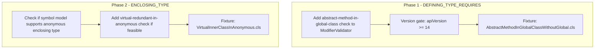

# Type Requirements (2 Remaining) Implementation Plan

## Summary

Implement 2 deferred Type Requirements error codes. Reference implementations in apex-jorje:

- **apex-jorje-semantic**: `[AnnotationRules.java](file:///Users/peter.hale/git/apex-jorje/apex-jorje-semantic/src/main/java/apex/jorje/semantic/ast/modifier/rule/AnnotationRules.java)`
- **apex-jorje-semantic**: `DefiningTypeConditionRule`, `EnclosingUnitTypeSpecificRule` (annotation modifier rules)

---

## 1. DEFINING_TYPE_REQUIRES

### Rule

Used when the **defining type already has** a modifier and we apply a conditional rule. Message: "{0} defined types requires that {1}".

### jorje

**Source**: `AnnotationRules.java` (DefiningTypeConditionRule), `ModifierTypeInfos.java` line 300-306

**Logic**: When `context.getDefiningType().getModifiers().has(modifier)`, apply inner rule. If inner rule fails, report with `I18nSupport.getLabel("defining.type.requires", modifier, name)`.

**Concrete usage** (ModifierTypeInfos.ABSTRACT):

```java
definingTypeCondition(
    minVersioned(requiredModifiers(GLOBAL), Version.V156),
    GLOBAL
)
```

- When defining type (class) **has** `global` AND API version >= 156: abstract method **must** have `global`.
- Message: "global defined types requires that {1}" where {1} is from the inner rule (e.g. "method must be global").
- {0} = modifier defining type has (GLOBAL), {1} = requirement (from requiredModifiers failure message).

### Implementation Strategy

1. **Add to ModifierValidator** in the modifier validation pass (not annotation validation):

- When validating modifiers on methods: if containing type has `global` and apiVersion >= 156, and method is `abstract`, then method must have `global`. If not, report DEFINING_TYPE_REQUIRES with ("global", requirement text).

1. **Message params**: `localizeTyped(ErrorCodes.DEFINING_TYPE_REQUIRES, 'global', 'method must be global')` or equivalent.
2. **Version check**: jorje uses `Version.V156` which maps to API version 14 (see `versions.ts`). Check `options.apiVersion >= 14` when `enableVersionSpecificValidation` is true.
3. **Scope**: Abstract methods in global classes (API 14+). Check MethodOverrideValidator or ModifierValidator for abstract method handling.

### Fixtures

- `AbstractMethodInGlobalClassWithoutGlobal.cls` — global class with abstract method that lacks global modifier (API 14+):

```apex
global class MyClass {
    abstract void m();  // Error: global defined types requires that method is global
}
```

### Key Files

- [ModifierValidator.ts](packages/apex-parser-ast/src/semantics/validation/validators/ModifierValidator.ts) — add check in modifier validation loop for methods
- [annotationModifierRules.ts](packages/apex-parser-ast/src/semantics/validation/validators/annotationModifierRules.ts) — may need DEFINING_TYPE_CONDITION_RULES map (modifier → { requiredModifiers, minVersion })

---

## 2. ENCLOSING_TYPE

### Rule

"In enclosing types of, {0}". Used in `EnclosingUnitTypeSpecificRule` when the enclosing type's unit type is in a specific set.

### jorje

**Source**: `AnnotationRules.java` (EnclosingUnitTypeSpecificRule lines 208-238), `ModifierTypeInfos.java` line 276

**Logic**: When `isInnerType(definingType)` AND `enclosingType.getUnitType() in types`, apply inner rule. Message uses `enclosing.type` with {0} = comma-joined unit types (e.g. "ANONYMOUS").

**Concrete usage** (ModifierTypeInfos.VIRTUAL):

```java
enclosingUnitTypeSpecific(redundantModifier(VIRTUAL), UnitType.ANONYMOUS)
```

- When defining type is inner AND enclosing type is ANONYMOUS: `virtual` modifier is redundant (anonymous classes are virtual by default).
- Message: "In enclosing types of, ANONYMOUS," — triggers redundant modifier warning/error.
- So ENCLOSING_TYPE is used when the **enclosing** type (not the current type) has a specific unit type, and we apply a rule (e.g. redundant virtual in anonymous context).

### Distinction from ENCLOSING_TYPE_FOR

- **ENCLOSING_TYPE_FOR** (implemented): Inner type with `global` requires enclosing type to be `global`. Validates enclosing type's modifiers.
- **ENCLOSING_TYPE**: When element is in an inner type whose **enclosing** type is ANONYMOUS (or other unit type), apply rule. Validates element's modifiers in that context.

### Implementation Strategy

1. **Add to ModifierValidator** when validating modifiers on inner types:

- If symbol is in inner class and enclosing type is anonymous block (e.g. `testMethod` with anonymous inner class): `virtual` on inner class is redundant.
- Report: could use REDUNDANT_MODIFIER or similar; ENCLOSING_TYPE is the message wrapper.

1. **Challenge**: Anonymous blocks in Apex — `Schema.Describe...` or inline instantiations. Our symbol model may not distinguish "anonymous" enclosing type vs regular class.
2. **Implementation location**: [ModifierValidator.ts](packages/apex-parser-ast/src/semantics/validation/validators/ModifierValidator.ts)
3. **Scope**: Narrow — only applies when inner type's enclosing type is ANONYMOUS. May be low priority if we don't model anonymous enclosing types.

### Fixtures

- `VirtualInnerClassInAnonymous.cls` — anonymous block with inner `virtual class` (virtual redundant):

```apex
public class Test {
    void m() {
        SomeClass c = new SomeClass() {
            virtual class Inner {}  // virtual redundant - anonymous is virtual by default
        };
    }
}
```

Note: Apex anonymous inner classes are less common than Java; may be rare case.

### Risks

- Anonymous enclosing type may not be represented in our symbol table.
- Lower priority; edge case.

---

## Implementation Order



---

## Key Files

| File                                                                                                                  | Purpose                                                                                      |
| --------------------------------------------------------------------------------------------------------------------- | -------------------------------------------------------------------------------------------- |
| [ModifierValidator.ts](packages/apex-parser-ast/src/semantics/validation/validators/ModifierValidator.ts)             | Add DEFINING_TYPE_REQUIRES (abstract in global class), ENCLOSING_TYPE (virtual in anonymous) |
| [annotationModifierRules.ts](packages/apex-parser-ast/src/semantics/validation/validators/annotationModifierRules.ts) | May add DEFINING_TYPE_CONDITION_RULES map if needed                                          |
| `messages_en_US.properties`                                                                                           | `defining.type.requires`, `enclosing.type` already defined                                   |

---

## Jorje Reference Paths

| File                                                           | Purpose                                                                     |
| -------------------------------------------------------------- | --------------------------------------------------------------------------- |
| `apex-jorje/apex-jorje-semantic/.../AnnotationRules.java`      | DefiningTypeConditionRule, EnclosingUnitTypeSpecificRule, EnclosingTypeRule |
| `apex-jorje/apex-jorje-semantic/.../ModifierTypeInfos.java`    | ABSTRACT (line 300), VIRTUAL (line 276), GLOBAL (line 131)                  |
| `apex-jorje/apex-jorje-services/.../messages_en_US.properties` | `defining.type.requires`, `enclosing.type`, `enclosing.type.for`            |
