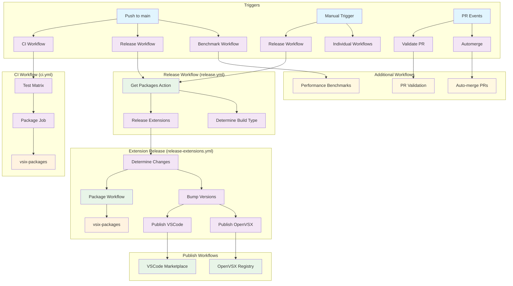
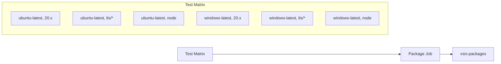
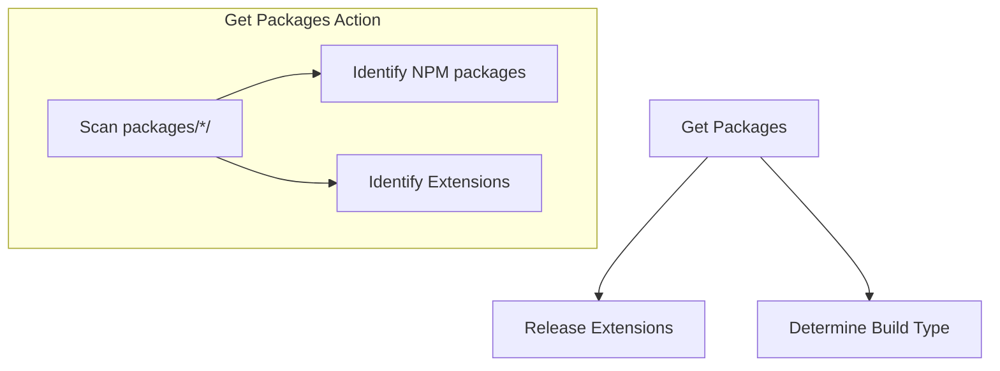
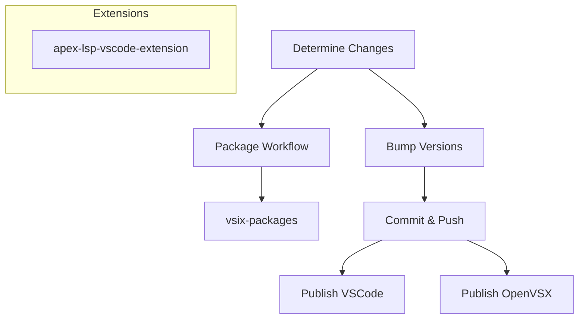
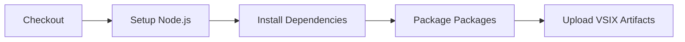
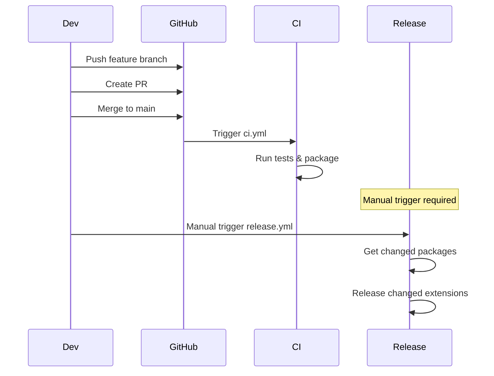
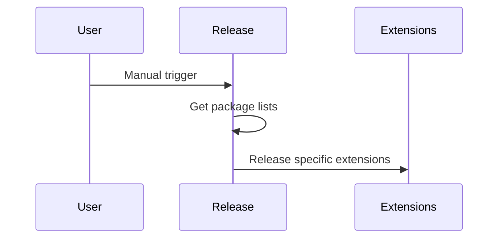
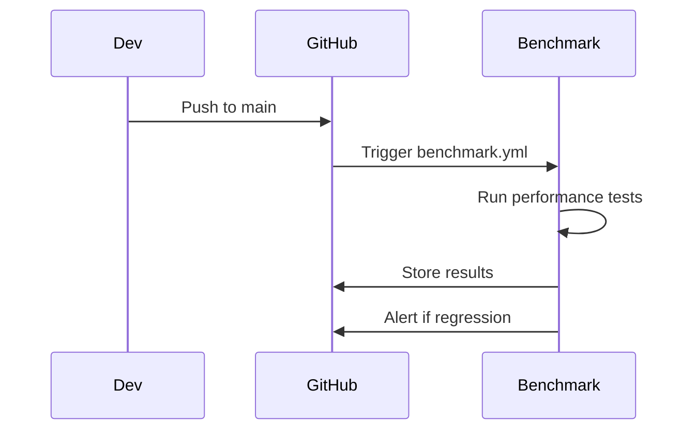

# GitHub Actions Workflow Documentation

This document provides a comprehensive overview of the GitHub Actions workflow system for the Apex Language Support monorepo.

## Workflow Architecture



## Script Integration

The workflows use TypeScript-based release scripts located in `.github/scripts/` for automation. These scripts provide:

- **Type Safety**: Full TypeScript with proper interfaces
- **Environment Variables**: All inputs/outputs use environment variables
- **Package Filtering**: Automatic separation of VS Code extensions and NPM packages
- **Error Handling**: Consistent error handling with proper exit codes

### Script Usage in Workflows

#### Extension Release Scripts

```yaml
# Determine build type
- name: Check build type
  env:
    INPUT_VERSION_BUMP: ${{ inputs.version-bump || 'auto' }}
    INPUT_PRE_RELEASE: ${{ inputs.pre-release || 'false' }}
  run: npx tsx .github/scripts/index.ts ext-build-type

# Detect changes
- name: Determine changes and version bumps
  env:
    IS_NIGHTLY: ${{ needs.determine-build-type.outputs.is-nightly }}
    VERSION_BUMP: ${{ needs.determine-build-type.outputs.version-bump }}
    PRE_RELEASE: ${{ needs.determine-build-type.outputs.pre-release }}
    IS_PROMOTION: ${{ needs.determine-build-type.outputs.is-promotion }}
    PROMOTION_COMMIT_SHA: ${{ env.PROMOTION_COMMIT_SHA || '' }}
    SELECTED_EXTENSIONS: ${{ inputs.extensions }}
  run: npx tsx .github/scripts/index.ts ext-change-detector

# Bump versions
- name: Bump versions and tag for selected extensions
  env:
    VERSION_BUMP: ${{ needs.determine-changes.outputs.version-bumps }}
    SELECTED_EXTENSIONS: ${{ needs.determine-changes.outputs.selected-extensions }}
    PRE_RELEASE: ${{ inputs.pre-release || github.event.inputs.pre-release || 'false' }}
    IS_NIGHTLY: ${{ needs.determine-build-type.outputs.is-nightly }}
    IS_PROMOTION: ${{ needs.determine-build-type.outputs.is-promotion }}
    PROMOTION_COMMIT_SHA: ${{ needs.determine-changes.outputs.promotion-commit-sha }}
  run: npx tsx .github/scripts/index.ts ext-version-bumper
```

#### NPM Release Scripts

```yaml
# Detect NPM changes
- name: Determine changed NPM packages
  env:
    INPUT_BASE_BRANCH: 'main'
  run: npx tsx .github/scripts/index.ts npm-change-detector

# Select packages
- name: Determine selected packages
  env:
    SELECTED_PACKAGE: ${{ github.event.inputs.packages || inputs.packages }}
    AVAILABLE_PACKAGES: ${{ inputs.available-packages }}
    CHANGED_PACKAGES: ${{ steps.changes.outputs.packages }}
  run: npx tsx .github/scripts/index.ts npm-package-selector
```

### Available Scripts

#### Extension Scripts (ext-\*)

- `ext-build-type`: Determine build type (nightly/promotion/regular)
- `ext-promotion-finder`: Find promotion candidates for nightly builds
- `ext-change-detector`: Detect changes in VS Code extensions
- `ext-package-selector`: Select VS Code extensions for release
- `ext-release-plan`: Display extension release plan
- `ext-version-bumper`: Bump versions for selected extensions
- `ext-publish-matrix`: Determine publish matrix for extensions
- `ext-github-releases`: Create GitHub releases for extensions

#### NPM Scripts (npm-\*)

- `npm-change-detector`: Detect changes in NPM packages
- `npm-package-selector`: Select NPM packages for release
- `npm-release-plan`: Display NPM release plan
- `npm-package-details`: Extract package details for notifications

#### Utility Scripts

- `audit-logger`: Log audit events for compliance

## Workflow Details

### 1. CI Workflow (`ci.yml`)

**Triggers:**

- Push to main
- Pull requests to main
- Manual dispatch

**Jobs:**



**Purpose:** Run tests and create packaging artifacts for each PR/merge.

**Key Features:**

- Uses composite action `npm-install-with-retries` for reliable dependency installation
- Runs linting, compilation, and tests with coverage
- Merges coverage reports across matrix runs
- Creates VSIX packages for extensions

### 2. Release Workflow (`release.yml`)

**Triggers:**

- Manual dispatch (primary)
- ~~Push to main (commented out)~~
- ~~Nightly schedule (commented out)~~

**Jobs:**



**Purpose:** Orchestrate releases of VS Code extensions (NPM releases currently disabled).

**Key Features:**

- Uses composite action `get-packages` to dynamically identify packages
- Supports manual input for branch, packages, dry-run, pre-release, etc.
- Determines build type (nightly vs regular)
- ~~NPM release workflow is commented out~~

### 3. Extension Release Workflow (`release-extensions.yml`)

**Triggers:**

- Called by release workflow
- Manual dispatch

**Jobs:**



**Purpose:** Release VS Code extensions to multiple registries.

**Script Integration:**

- Uses `ext-build-type` to determine build type
- Uses `ext-change-detector` to detect changes
- Uses `ext-version-bumper` to bump versions
- Uses `ext-github-releases` to create releases
- Uses `ext-publish-matrix` to determine publish targets

### 4. NPM Release Workflow (`release-npm.yml`)

**Triggers:**

- Push to main
- Manual dispatch

**Purpose:** Release NPM packages to npmjs.org.

**Script Integration:**

- Uses `npm-change-detector` to detect changes
- Uses `npm-package-selector` to select packages
- Uses `npm-release-plan` to display plans
- Uses `npm-package-details` for notifications

### 5. Package Workflow (`package.yml`)

**Triggers:**

- Called by other workflows
- Manual dispatch

**Jobs:**



**Purpose:** Create VSIX files for extensions.

### 6. Additional Workflows

#### Performance Benchmarks (`benchmark.yml`)

**Triggers:**

- Push to main
- Pull requests to main

**Purpose:** Run LSP performance benchmarks and track performance over time.

**Features:**

- Uses `benchmark-action/github-action-benchmark` for performance tracking
- Stores results for main branch pushes
- Compares results in PRs without storing
- Alerts on 130% performance regression

#### Validate PR (`validatePR.yml`)

**Triggers:**

- Pull request events (opened, reopened, edited, synchronize)
- Target branch: `develop`

**Purpose:** Validate pull requests using Salesforce CLI workflows and code quality checks.

**Features:**

- Uses `salesforcecli/github-workflows` for PR validation
- Runs linting checks
- Ensures code quality standards

#### Automerge (`automerge.yml`)

**Triggers:**

- Pull request events
- Check suite completion
- Status events

**Purpose:** Automatically merge PRs with specific labels.

**Features:**

- Merges PRs with `automerge` or `dependencies` labels
- Supports Dependabot PRs
- Uses squash merge method
- Requires 1 approval

#### Stale (`stale.yml`)

**Triggers:**

- Scheduled (daily at 1:30 AM)

**Purpose:** Close stale issues and pull requests.

**Features:**

- Marks issues stale after 30 days, closes after 35 days
- Marks PRs stale after 30 days, closes after 40 days
- Exempts issues/PRs with specific labels

## Composite Actions

The workflow system uses several composite actions to reduce code duplication and improve maintainability:

### 1. Get Packages (`get-packages/action.yml`)

**Purpose:** Dynamically determines NPM packages and VS Code extensions in the monorepo.

**Outputs:**

- `npm-packages`: Comma-separated list of NPM package names
- `extensions`: Comma-separated list of VS Code extension names
- `extension-paths`: Extension package paths for publishing

### 2. Download VSIX Artifacts (`download-vsix-artifacts/action.yml`)

**Purpose:** Downloads and finds VSIX artifacts for publishing workflows.

**Inputs:**

- `artifact-name`: Name for the VSIX artifacts (default: 'vsix-packages')

**Outputs:**

- `vsix_files`: JSON array of VSIX file paths

### 3. Publish VSIX (`publish-vsix/action.yml`)

**Purpose:** Publishes VSIX files to a marketplace with dry-run support.

**Inputs:**

- `vsix-path`: Path to the VSIX file to publish
- `publish-tool`: Publishing tool to use (ovsx or vsce)
- `pat-secret`: Personal access token secret name
- `pre-release`: Publish as pre-release version
- `dry-run`: Run in dry-run mode

### 4. NPM Install with Retries (`npm-install-with-retries/action.yml`)

**Purpose:** Installs NPM dependencies with retry logic for reliability.

### 5. Calculate Artifact Name (`calculate-artifact-name/action.yml`)

**Purpose:** Calculates artifact names with run isolation.

## Execution Scenarios

### Scenario 1: Normal Development Flow



### Scenario 2: Manual Release



### Scenario 3: Performance Monitoring



## Package Classification

### NPM Packages (7 total)

- `apex-lsp-shared`
- `apex-parser-ast`
- `apex-ls`
- `lsp-compliant-services`
- `custom-services`
- `apex-lsp-vscode-extension`
- `apex-lsp-testbed`

**Note:** NPM package releases are currently enabled and functional.

### VS Code Extensions (1 total)

- `apex-lsp-vscode-extension` (desktop)

## Artifact Management

### CI Artifacts

- **Name**: `vsix-packages`
- **Purpose**: PR-specific packaging
- **Retention**: 5 days

### Release Artifacts

- **Name**: `vsix-packages-{run_number}-release` (normal) or `vsix-packages-{run_number}-dry-run` (dry-run)
- **Purpose**: Release packaging with run isolation
- **Retention**: 5 days
- **Pattern**: `{base_name}-{run_number}-{mode}` where mode is `release` or `dry-run`

## Safety Features

1. **Manual Control**: Release workflow requires manual trigger
2. **Change Detection**: Only releases packages with changes
3. **Branch Protection**: Automatic releases only from main (when enabled)
4. **Dry-run Support**: Full dry-run capability for testing
5. **Artifact Isolation**: PR artifacts don't interfere with releases
6. **Performance Monitoring**: Automatic performance regression detection
7. **Audit Logging**: All release attempts are logged for compliance

## Common Commands

### View Workflow Runs

```bash
# View all workflow runs
gh run list

# View specific workflow
gh run list --workflow=release.yml

# View workflow details
gh run view <run-id>
```

### Manual Triggers

```bash
# Trigger release workflow
gh workflow run release.yml

# Trigger with inputs
gh workflow run release.yml -f extensions=changed -f dry-run=true

# Trigger benchmark workflow
gh workflow run benchmark.yml
```

## Troubleshooting

### Common Issues

1. **Artifact not found**: Check if package workflow completed successfully
2. **Version conflicts**: Ensure semantic-release is configured correctly
3. **Permission errors**: Verify NPM_TOKEN and OVSX_PAT secrets are set
4. **Branch issues**: Ensure workflows are called with correct branch parameter
5. **Script errors**: Check environment variables are set correctly

### Debug Steps

1. Check workflow run logs
2. Verify artifact upload/download
3. Confirm package.json versions
4. Check composite action outputs
5. Verify script environment variables

## Smart Version Bumping Strategy

The extension release workflow uses a smart version bumping strategy that combines **conventional commits** with **VS Code's even/odd versioning** for pre-releases vs stable releases.

### Version Bumping Rules

#### **VS Code Even/Odd Strategy:**

- **Even minor versions** (0.2.x, 0.4.x): **Stable releases**
- **Odd minor versions** (0.3.x, 0.5.x): **Pre-releases**

#### **Conventional Commits:**

- **`fix:`** → **patch** bump (0.1.0 → 0.1.1)
- **`feat:`** → **minor** bump (0.1.0 → 0.2.0)
- **`BREAKING CHANGE:`** → **major** bump (1.0.0 → 2.0.0)

### Smart Bumping Examples

#### **Pre-release Mode (`pre-release: true`)**

| Current Version | Conventional Commit | New Version | Explanation                   |
| --------------- | ------------------- | ----------- | ----------------------------- |
| 0.1.0 (odd)     | `fix:`              | 0.1.1 (odd) | Patch bump, stays odd         |
| 0.1.0 (odd)     | `feat:`             | 0.3.0 (odd) | Minor bump, jumps to next odd |
| 0.2.0 (even)    | `feat:`             | 0.3.0 (odd) | Minor bump, jumps to next odd |
| 0.3.0 (odd)     | `feat:`             | 0.5.0 (odd) | Minor bump, jumps to next odd |

#### **Stable Release Mode (`pre-release: false`)**

| Current Version | Conventional Commit | New Version  | Explanation                    |
| --------------- | ------------------- | ------------ | ------------------------------ |
| 0.1.0 (odd)     | `fix:`              | 0.1.1 (odd)  | Patch bump, stays odd          |
| 0.1.0 (odd)     | `feat:`             | 0.2.0 (even) | Minor bump, jumps to next even |
| 0.2.0 (even)    | `feat:`             | 0.4.0 (even) | Minor bump, jumps to next even |
| 0.3.0 (odd)     | `feat:`             | 0.4.0 (even) | Minor bump, jumps to next even |

### Benefits

1. **Conventional Commits**: Maintains semantic versioning based on commit types
2. **VS Code Compatibility**: Ensures proper even/odd versioning for marketplace
3. **Pre-release Support**: Automatically handles pre-release vs stable versioning
4. **Clear Intent**: Version numbers clearly indicate release type

### Usage

```bash
# Pre-release with feature
gh workflow run release-extensions.yml --field pre-release=true

# Stable release with feature
gh workflow run release-extensions.yml --field pre-release=false
```

## Current Status and Notes

### Active Features

1. **Extension Releases**: Fully functional with manual triggers
2. **NPM Package Releases**: Fully functional with manual triggers
3. **Performance Benchmarks**: Active monitoring and alerting
4. **PR Validation**: Active validation for develop branch
5. **Automerge**: Active for labeled PRs
6. **Stale Management**: Active cleanup of stale issues/PRs

### Composite Actions Benefits

1. **Code Reduction**: ~90% reduction in duplicate code across workflows
2. **Reusability**: Actions can be used in any workflow
3. **Maintainability**: Clear separation of concerns
4. **Consistency**: All workflows use identical logic for common operations
5. **Flexibility**: Easy to modify behavior without touching multiple files

### Script Integration Benefits

1. **Type Safety**: Full TypeScript with proper interfaces
2. **Error Handling**: Consistent error handling with proper exit codes
3. **Maintainability**: Clear function signatures and documentation
4. **Debugging**: Better stack traces and logging
5. **Package Filtering**: Automatic separation of extensions and NPM packages

### Future Enhancements

1. **Re-enable Automatic Releases**: When ready, uncomment push triggers
2. **Re-enable Nightly Builds**: When needed, uncomment scheduled builds
3. **Versioning**: Composite actions can be versioned independently if needed
4. **Testing**: Add dedicated tests for composite actions and scripts
5. **Documentation**: Expand documentation for each action and script
6. **Validation**: Add input validation to composite actions and scripts
