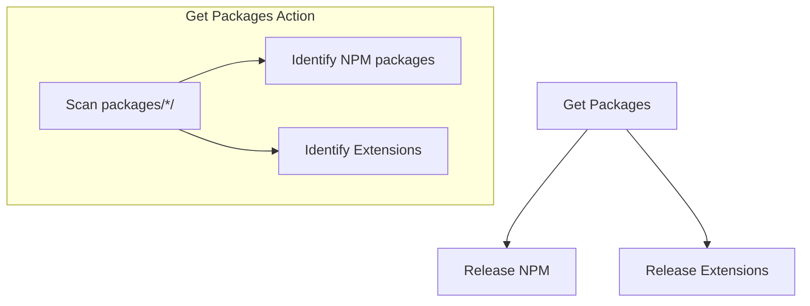
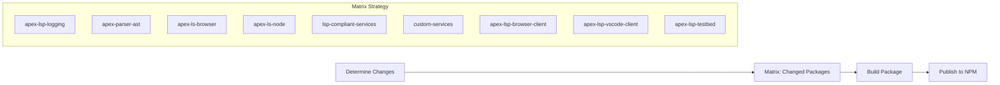
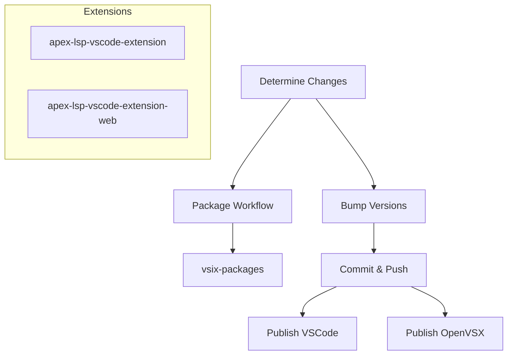
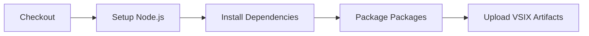
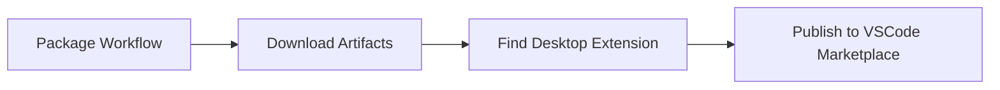
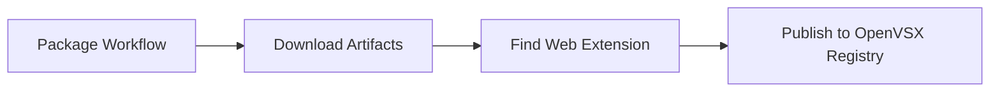
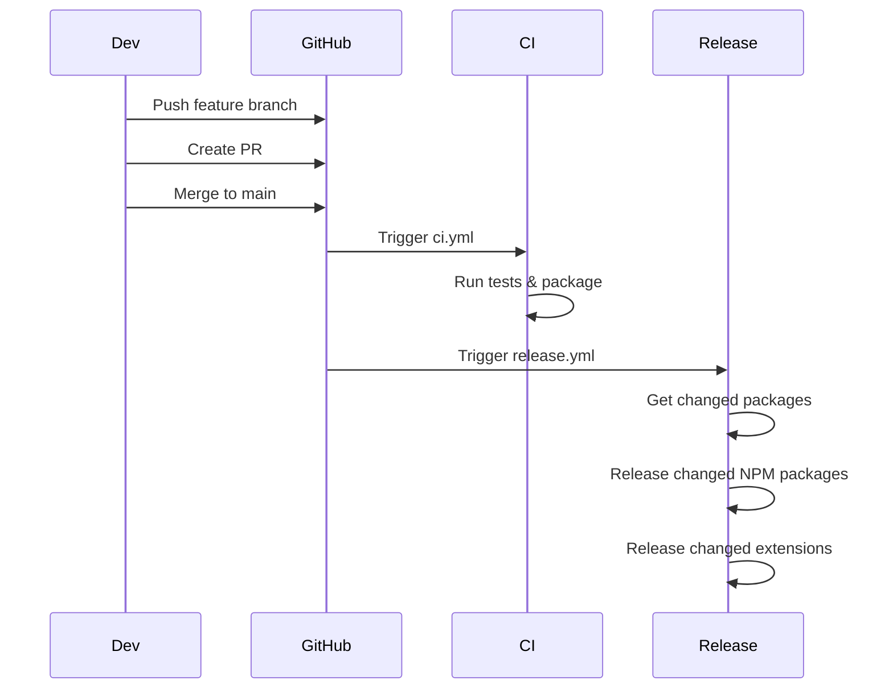
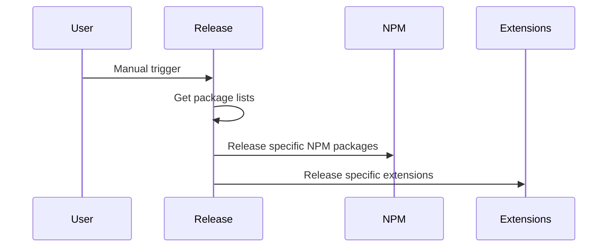
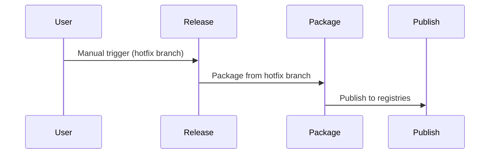

# GitHub Actions Workflow Documentation

This document provides a comprehensive overview of the GitHub Actions workflow system for the Apex Language Support monorepo.

## Workflow Architecture

```mermaid
graph TB
    %% Triggers
    subgraph "Triggers"
        A[Push to main] --> B[CI Workflow]
        A --> C[Release Workflow]
        D[Manual Trigger] --> E[Release Workflow]
        D --> F[Individual Workflows]
    end

    %% CI Workflow
    subgraph "CI Workflow (ci.yml)"
        B --> G[Test Matrix]
        G --> H[Package Job]
        H --> I[vsix-packages-{run_number}]
    end

    %% Release Workflow
    subgraph "Release Workflow (release.yml)"
        C --> J[Get Packages Action]
        E --> J
        J --> K[Release NPM]
        J --> L[Release Extensions]
    end

    %% Sub-workflows
    subgraph "NPM Release (release-npm.yml)"
        K --> M[Determine Changes]
        M --> N[Matrix: Changed Packages]
        N --> O[Build & Publish to NPM]
    end

    subgraph "Extension Release (release-extensions.yml)"
        L --> P[Determine Changes]
        P --> Q[Package Workflow]
        Q --> R[vsix-packages]
        P --> S[Bump Versions]
        S --> T[Publish VSCode]
        S --> U[Publish OpenVSX]
    end

    %% Publish Workflows
    subgraph "Publish Workflows"
        T --> V[VSCode Marketplace]
        U --> W[OpenVSX Registry]
    end

    %% Styling
    classDef trigger fill:#e1f5fe
    classDef workflow fill:#f3e5f5
    classDef action fill:#e8f5e8
    classDef artifact fill:#fff3e0

    class A,D trigger
    class B,C,E,F,G,H,K,L,M,N,P,Q,S,T,U workflow
    class J,O,V,W action
    class I,R artifact
```

## Workflow Details

### 1. CI Workflow (`ci.yml`)

**Triggers:**

- Push to main
- Pull requests to main
- Manual dispatch

**Jobs:**

```mermaid
graph LR
    A[Test Matrix] --> B[Package Job]
    B --> C[vsix-packages-{run_number}]

    subgraph "Test Matrix"
        D[ubuntu-latest, 20.x]
        E[ubuntu-latest, lts/*]
        F[ubuntu-latest, node]
        G[windows-latest, 20.x]
        H[windows-latest, lts/*]
        I[windows-latest, node]
    end
```

**Purpose:** Run tests and create packaging artifacts for each PR/merge.

### 2. Release Workflow (`release.yml`)

**Triggers:**

- Push to main (automatic)
- Manual dispatch

**Jobs:**



**Purpose:** Orchestrate releases of NPM packages and VS Code extensions.

### 3. NPM Release Workflow (`release-npm.yml`)

**Triggers:**

- Called by release workflow
- Manual dispatch

**Jobs:**



**Purpose:** Release NPM packages using semantic-release.

### 4. Extension Release Workflow (`release-extensions.yml`)

**Triggers:**

- Called by release workflow
- Manual dispatch

**Jobs:**



**Purpose:** Release VS Code extensions to multiple registries.

### 5. Package Workflow (`package.yml`)

**Triggers:**

- Called by other workflows
- Manual dispatch

**Jobs:**



**Purpose:** Create VSIX files for extensions.

### 6. Publish Workflows

#### VSCode Marketplace (`publishVSCode.yml`)



#### OpenVSX Registry (`publishOpenVSX.yml`)



## Execution Scenarios

### Scenario 1: Normal Development Flow



### Scenario 2: Manual Release



### Scenario 3: Emergency Release



## Package Classification

### NPM Packages (9 total)

- `apex-lsp-logging`
- `apex-parser-ast`
- `apex-ls-browser`
- `apex-ls-node`
- `lsp-compliant-services`
- `custom-services`
- `apex-lsp-browser-client`
- `apex-lsp-vscode-client`
- `apex-lsp-testbed`

### VS Code Extensions (2 total)

- `apex-lsp-vscode-extension` (desktop)
- `apex-lsp-vscode-extension-web` (web)

## Artifact Management

### CI Artifacts

- **Name**: `vsix-packages-{run_number}`
- **Purpose**: PR-specific packaging
- **Retention**: 30 days

### Release Artifacts

- **Name**: `vsix-packages`
- **Purpose**: Release packaging
- **Retention**: 30 days

## Safety Features

1. **NPM Publishing**: Defaults to "none" (manual override required)
2. **Change Detection**: Only releases packages with changes
3. **Branch Protection**: Automatic releases only from main
4. **Manual Control**: Full override capability for emergencies
5. **Artifact Isolation**: PR artifacts don't interfere with releases

## Common Commands

### View Workflow Runs

```bash
# View all workflow runs
gh run list

# View specific workflow
gh run list --workflow=release.yml

# View workflow details
gh run view <run-id>
```

### Manual Triggers

```bash
# Trigger release workflow
gh workflow run release.yml

# Trigger with inputs
gh workflow run release.yml -f npm-packages=all -f extensions=changed
```

## Troubleshooting

### Common Issues

1. **Artifact not found**: Check if package workflow completed successfully
2. **Version conflicts**: Ensure semantic-release is configured correctly
3. **Permission errors**: Verify NPM_TOKEN and OVSX_PAT secrets are set
4. **Branch issues**: Ensure workflows are called with correct branch parameter

### Debug Steps

1. Check workflow run logs
2. Verify artifact upload/download
3. Confirm package.json versions
