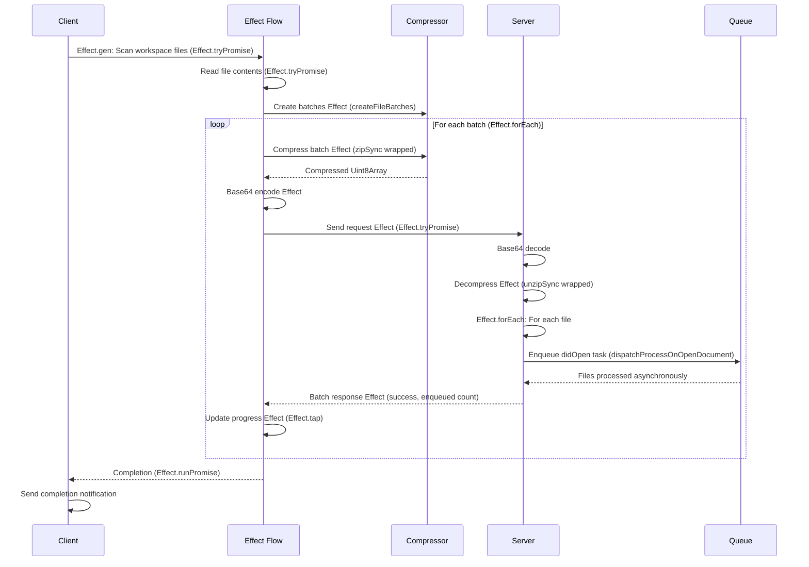

# Batch Workspace Loading with Compression

## Overview

Replace the current fire-and-forget `didOpen` notification flood during workspace loading with a structured batch request/response mechanism. Files will be scanned, batched, compressed using `fflate` (ZIP format), and sent sequentially to the server via a custom LSP request.

**Implementation Approach:** The implementation will use Effect-TS extensively for:
- Composable async operations (`Effect.gen`, `Effect.tryPromise`)
- Error handling (`Effect.catchAll`, `Effect.tapError`, `Effect.either`)
- Sequential processing (`Effect.forEach`)
- Cancellation support (`Effect.interruptible`)
- Progress reporting (`Effect.tap`)
- All operations wrapped in Effect for type-safe, composable code

## Architecture

### Current Flow
```
Client: scan files → openTextDocument() → didOpen notifications (fire-and-forget) → Server
```

### New Flow
```
Client: scan files → batch files → compress with fflate → sendBatchRequest → wait for response → next batch
Server: receiveBatchRequest → decompress → process files → sendBatchResponse
```

## Implementation Plan

### 1. Add Compression Dependencies

**Files:**
- `packages/apex-lsp-vscode-extension/package.json` - Add `fflate` dependency
- `packages/apex-ls/package.json` - Add `fflate` dependency (if not already available via apex-parser-ast)

**Action:** Add `fflate: "^0.8.1"` to dependencies in both packages.

### 2. Define Request/Response Types

**File:** `packages/apex-lsp-shared/src/types.ts`

Add new types:
- `WorkspaceFileBatch` - Contains batch metadata and compressed payload
- `SendWorkspaceBatchParams` - Request parameters (batch index, total batches, compressed data, file metadata)
- `SendWorkspaceBatchResult` - Response (success, processed count, error if any)

**Key fields:**
- `batchIndex: number` - Current batch number (0-indexed)
- `totalBatches: number` - Total number of batches
- `compressedData: Uint8Array` - ZIP-compressed batch (base64 encoded for JSON-RPC)
- `fileMetadata: Array<{uri: string, version: number}>` - File URIs and versions in this batch
- `isLastBatch: boolean` - Whether this is the final batch

### 3. Add Configuration Settings

**File:** `packages/apex-lsp-shared/src/settings/ApexSettingsUtilities.ts`

Add to `ApexLoadWorkspaceSettings`:

- `batchSize: number` - Files per batch (default: 100, configurable)

**File:** `packages/apex-lsp-vscode-extension/package.json`

Add configuration properties under `apex.loadWorkspace`:

- `batchSize` (number, default: 100)

### 4. Create Batch Compression Utility (Effect-TS)

**File:** `packages/apex-lsp-vscode-extension/src/workspace-batch-compressor.ts`

Create Effect-based utility functions:

- `createFileBatches(files: Array<{uri: vscode.Uri, version: number, content: string}>, batchSize: number): Effect.Effect<Array<WorkspaceFileBatch>, never, never>` - Pure Effect for batch creation
- `compressBatch(batch: WorkspaceFileBatch): Effect.Effect<Uint8Array, Error, never>` - Effect wrapping `zipSync` from `fflate` with compression level 6 (default), using `Effect.try()` for error handling
- `encodeBatchForTransport(compressed: Uint8Array): Effect.Effect<string, Error, never>` - Effect wrapping base64 encoding for JSON-RPC

**Compression strategy:**

- Each batch is a ZIP file containing files keyed by URI
- File contents stored as UTF-8 strings in ZIP entries
- Metadata stored as separate JSON entry in ZIP
- All operations wrapped in Effect for composability and error handling

### 5. Create Server-Side Batch Handler (Effect-TS)

**File:** `packages/apex-ls/src/server/WorkspaceBatchHandler.ts`

Create Effect-based handler:

- `handleWorkspaceBatchEffect(params: SendWorkspaceBatchParams): Effect.Effect<SendWorkspaceBatchResult, Error, never>`
- Use `Effect.gen` for structured async flow
- Decompress using `Effect.try(() => unzipSync(...))` wrapping `fflate` operations
- Use `Effect.forEach` to process each file in the batch:
  - Create TextDocument instance from decompressed content
  - Create TextDocumentChangeEvent (didOpen event)
  - Enqueue as didOpen task using `dispatchProcessOnOpenDocument()` (existing function)
- Return acknowledgment with enqueued count (files are processed asynchronously via queue)
- Wrap handler function: `handleWorkspaceBatch(params): Promise<SendWorkspaceBatchResult>` that runs the Effect with `Effect.runPromise`

**File:** `packages/apex-ls/src/server/LCSAdapter.ts`

Register handler:

- Add `connection.onRequest('apex/sendWorkspaceBatch', handleWorkspaceBatch)` in `setupProtocolHandlers()`

### 6. Update Workspace Loader (Effect-TS)

**File:** `packages/apex-lsp-vscode-extension/src/workspace-loader.ts`

Modify `loadWorkspaceForServer()` to use Effect-TS patterns:

- Use `Effect.gen` for the main loading flow (existing pattern)
- Scan files (existing Effect-based logic)
- Read file contents using `Effect.tryPromise` wrapping `vscode.workspace.fs.readFile()` (instead of `openTextDocument()`)
- Create batches using `createFileBatches()` Effect
- Use `Effect.forEach` for sequential batch processing:
  - Compress batch using `compressBatch()` Effect
  - Encode for transport using `encodeBatchForTransport()` Effect
  - Send `apex/sendWorkspaceBatch` request using `Effect.tryPromise` wrapping `languageClient.sendRequest()`
  - Update progress using Effect-based progress reporting
  - Handle cancellation using `Effect.interruptible` and cancellation token checks
- Compose all Effects using `Effect.gen` and pipe operations

**Key changes:**

- Replace `openTextDocument()` calls with `Effect.tryPromise` wrapping `vscode.workspace.fs.readFile()`
- Sequential batch processing using `Effect.forEach` (no parallel batch sends)
- All operations wrapped in Effect for composability
- Progress reporting integrated into Effect flow
- Cancellation handled via Effect cancellation tokens

### 7. Integration with Document Processing

**File:** `packages/apex-ls/src/server/WorkspaceBatchHandler.ts`

The batch handler will:

- Use existing `dispatchProcessOnOpenDocument()` function (or equivalent)
- Route each file through the standard didOpen processing pipeline
- Files will be processed by the existing DocumentOpenBatcher and DocumentProcessingService
- No changes needed to DocumentProcessingService - it already handles didOpen events

### 8. Error Handling (Effect-TS)

**Files:** Multiple

- Use `Effect.catchAll` or `Effect.catchTag` for error recovery
- If batch request fails: use `Effect.tapError` for logging, then `Effect.fail` to propagate error
- If decompression fails: return `Effect.fail(Error)` with descriptive error, client can retry batch
- If server is busy: client waits for acknowledgment before next batch (handled by sequential `Effect.forEach`)
- Cancellation: use `Effect.interruptible` and check cancellation token between batches
- Use `Effect.either` to convert errors to Either type when needed for error handling logic
- All errors flow through Effect error channel for consistent error handling

### 9. Progress Reporting (Effect-TS)

**File:** `packages/apex-lsp-vscode-extension/src/workspace-loader.ts`

Update progress reporting using Effect:

- Use `Effect.tap` to report progress at each stage without breaking Effect chain
- Report batch progress: `Effect.tap(() => progress.report({message: "Sending batch 3/10..."}))`
- Report compression progress: `Effect.tap(() => progress.report({message: "Compressing batch..."}))`
- Report server processing: `Effect.tap(() => progress.report({message: "Server processing batch..."}))`
- Integrate progress reporting into Effect flow using `pipe` and `Effect.tap`
- Use existing `sendProgressNotification` wrapped in `Effect.try` for LSP progress tokens

## Data Flow Diagram



## Files to Modify

1. `packages/apex-lsp-shared/src/types.ts` - Add batch types
2. `packages/apex-lsp-shared/src/settings/ApexSettingsUtilities.ts` - Add batch settings
3. `packages/apex-lsp-vscode-extension/package.json` - Add fflate dependency and config
4. `packages/apex-lsp-vscode-extension/src/workspace-loader.ts` - Implement batch loading
5. `packages/apex-lsp-vscode-extension/src/workspace-batch-compressor.ts` - NEW - Compression utilities
6. `packages/apex-ls/package.json` - Add fflate dependency (if needed)
7. `packages/apex-ls/src/server/LCSAdapter.ts` - Register batch handler
8. `packages/apex-ls/src/server/WorkspaceBatchHandler.ts` - NEW - Batch handler
9. `packages/lsp-compliant-services/src/services/DocumentProcessingService.ts` - Add batch processing method

## Testing Considerations

- Test with various batch sizes (10, 50, 100, 500 files)
- Test with large files (ensure compression helps)
- Test cancellation mid-batch
- Test server error handling and retry
- Verify didOpen still works for manual file opens (not workspace loading)

