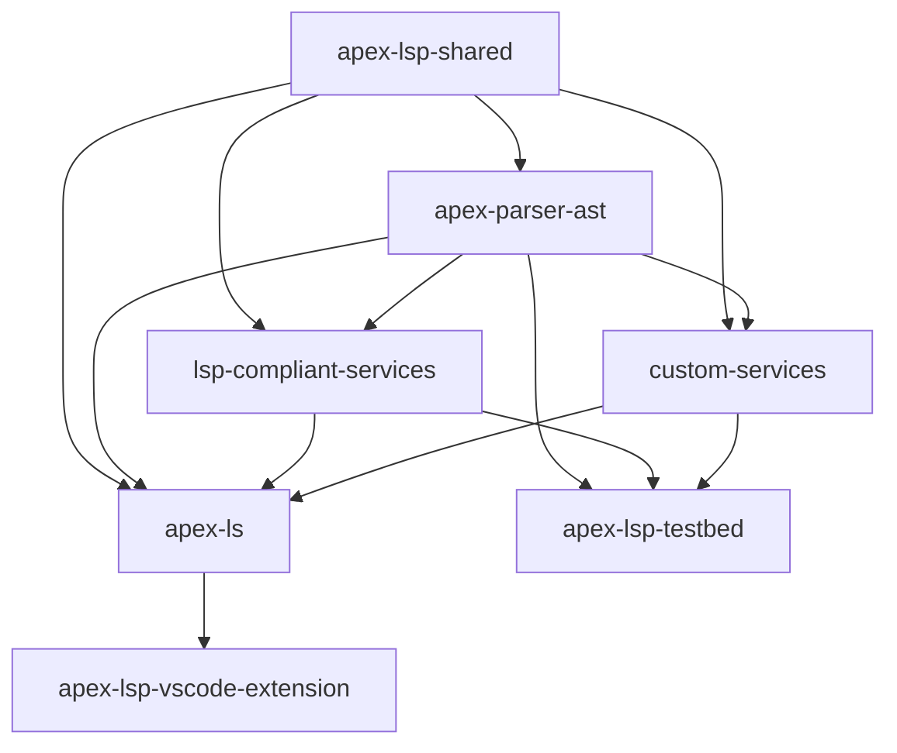

# Contributing to Apex Language Server (TypeScript)

Thank you for your interest in contributing to the Apex Language Server project! This document provides guidelines and setup instructions to help you get started.

## Prerequisites

Before you begin, ensure your development environment meets these requirements:

- **Node.js**: v20.0.0 or higher (v22.x recommended)
- **npm**: v10.2.0 or higher
- Git

## Development Environment Setup

1. **Fork and clone the repository**:

   ```bash
   git clone https://github.com/your-username/apex-language-server-ts.git
   cd apex-language-server-ts
   ```

2. **Install dependencies**:

   ```bash
   npm install
   ```

3. **Build the project**:
   ```bash
   npm run compile
   ```

## Project Structure & Architecture

The project is organized as a **monorepo** using npm workspaces with multiple interconnected packages. The architecture follows a layered approach with clear separation of concerns:

### Package Overview

```
packages/
├── apex-parser-ast/              # Core AST parsing functionality
├── apex-lsp-shared/             # Centralized logging utilities
├── lsp-compliant-services/       # Standard LSP protocol implementations
├── custom-services/              # Custom language server services
├── apex-ls/                      # Language server implementation
├── apex-lsp-vscode-extension/    # VS Code extension (desktop & web)
└── apex-lsp-testbed/             # Testing utilities and benchmarks
```

### Layer Architecture

1. **Foundation Layer**:
   - `apex-lsp-shared`: Centralized logging across all packages
   - `apex-parser-ast`: Core parsing, AST generation, and symbol analysis

2. **Service Layer**:
   - `lsp-compliant-services`: Standard LSP services (hover, completion, etc.)
   - `custom-services`: Salesforce-specific language features

3. **Server Layer**:
   - `apex-ls`: Language server implementation for Node.js, browser, and web worker environments

4. **Client Layer**:
   - `apex-lsp-vscode-extension`: VS Code extension for both desktop and web environments

5. **Testing Layer**:
   - `apex-lsp-testbed`: Integration tests and performance benchmarks

### Key Configuration Files

#### Root Configuration

- **`package.json`**: Monorepo configuration, workspace definitions, and root scripts
- **`tsconfig.json`**: TypeScript project references and path mappings
- **`tsconfig.base.json`**: Shared TypeScript compiler options
- **`turbo.json`**: Build pipeline configuration and task dependencies
- **`jest.config.cjs`**: Root Jest configuration for testing
- **`eslint.config.cjs`**: ESLint configuration for code quality
- **`.prettierrc`**: Code formatting rules

#### Build & Bundling

- **`esbuild.config.ts`**: TypeScript bundling configuration
- **`scripts/build-and-package.js`**: Packaging script for extensions
- **`scripts/merge-coverage.js`**: Test coverage aggregation

#### Development Tools

- **`.husky/`**: Git hooks for pre-commit checks
- **`commitlint.config.cjs`**: Commit message linting rules
- **`.releaserc.json`**: Semantic release configuration

## Build Tools & Technologies

### Primary Build Tools

1. **Turbo**: Monorepo build system with intelligent caching and parallel execution
2. **TypeScript**: Primary language with strict type checking
3. **esbuild**: Fast TypeScript bundler used across the monorepo
4. **Jest**: Testing framework with coverage reporting
5. **ESLint + Prettier**: Code quality and formatting

### Build Pipeline Overview

The build system uses **Turbo** for orchestrating builds across the monorepo with the following task hierarchy:

```
precompile → compile → bundle → package
     ↑           ↑        ↑        ↑
  Generate   TypeScript  Create   VS Code
  resources  compilation bundles  extensions
```

### Task Dependencies (from turbo.json)

```json
{
  "precompile": {
    "dependsOn": ["^precompile"],
    "outputs": ["src/generated/**", "dist/**"]
  },
  "compile": {
    "dependsOn": ["precompile", "^compile"],
    "outputs": ["dist/**", "*.tsbuildinfo"]
  },
  "bundle": {
    "dependsOn": ["compile", "^bundle"],
    "outputs": ["bundle/**", "dist/**"]
  },
  "package": {
    "dependsOn": ["bundle", "^package"],
    "outputs": ["extension/**"]
  }
}
```

## Build Target Hierarchies

### 1. Dependency Resolution Order

The build system automatically resolves dependencies in this order:

```
apex-lsp-shared (foundation)
         ↓
apex-parser-ast (core parsing)
         ↓
lsp-compliant-services + custom-services (services)
         ↓
apex-ls (unified server)
         ↓
apex-lsp-*-client packages (clients)
         ↓
apex-lsp-vscode-extension* (extensions)
```

### 2. Build Targets by Package

Each package supports these build targets:

- **`precompile`**: Generate resources, copy files, prepare for compilation
- **`compile`**: TypeScript compilation to JavaScript + declaration files
- **`bundle`**: Create optimized bundles using esbuild
- **`package`**: Create distributable packages (extensions only)
- **`test`**: Run unit tests
- **`test:coverage`**: Run tests with coverage reporting
- **`lint`**: Code quality checks
- **`clean`**: Remove build artifacts

### 3. Special Build Configurations

#### VS Code Extensions

```json
"apex-language-server-extension#bundle": {
  "dependsOn": ["compile", "@salesforce/apex-ls#bundle"],
  "outputs": ["extension/**", "bundle/**", "server-bundle/**"]
}
```

#### Web Extensions

```json
"apex-language-server-extension-web#compile": {
  "dependsOn": ["precompile", "^compile"],
  "outputs": ["out/**", "*.tsbuildinfo"]
}
```

## Intra-Module Dependencies

### Package Dependency Graph



### TypeScript Path Mappings

The root `tsconfig.json` defines path mappings for cross-package imports:

```json
{
  "paths": {
    "@salesforce/apex-lsp-shared": ["packages/apex-lsp-shared/src"],
    "@salesforce/apex-lsp-parser-ast": ["packages/apex-parser-ast/src"],
    "@salesforce/apex-lsp-compliant-services": [
      "packages/lsp-compliant-services/src"
    ]
    // ... other mappings
  }
}
```

### Runtime Dependencies

#### Core Dependencies

- **@apexdevtools/apex-parser**: External Apex parser
- **antlr4ts**: Parser runtime for ANTLR-generated parsers
- **vscode-languageserver**: LSP protocol implementation
- **vscode-languageserver-textdocument**: Document handling utilities

#### Development Dependencies

- **turbo**: Build orchestration
- **typescript**: Type checking and compilation
- **jest**: Testing framework
- **eslint**: Code linting
- **prettier**: Code formatting

## Development Workflow

### Building

This project uses **Turbo** for smart incremental builds that only rebuild what has changed:

- **Build all packages**:

  ```bash
  npm run compile
  ```

- **Build a specific package** (will also build its dependencies):

  ```bash
  cd packages/apex-parser-ast
  npm run compile
  ```

- **Clean build** (remove all build artifacts):

  ```bash
  npm run clean
  ```

- **Bundle packages** (create optimized bundles):
  ```bash
  npm run bundle
  ```

### Building Extensions

For VS Code extensions specifically:

```bash
# Build extension (includes both desktop and web)
cd packages/apex-lsp-vscode-extension
npm run package
```

### Testing

- **Run all tests**:

  ```bash
  npm test
  ```

- **Run tests with coverage**:

  ```bash
  npm run test:coverage
  ```

- **Run package-specific tests**:
  ```bash
  npm run test:packages
  ```

### Code Quality

- **Check code style**:

  ```bash
  npm run lint
  ```

- **Fix code style issues**:
  ```bash
  npm run lint:fix
  ```

## TypeScript Declaration Files

Each package generates TypeScript declaration files (`.d.ts`) to provide type information for consumers:

- Generated during the `compile` phase
- Located in the `dist/` directory of each package
- Referenced by the `types` field in each package's `package.json`
- Enable IntelliSense and type checking for package consumers

When creating new modules or modifying existing ones, ensure your code is properly typed so the declaration files are accurate and useful.

## Commit Guidelines

This project follows [Conventional Commits](https://www.conventionalcommits.org/) to standardize commit messages and make the development history clear and readable.

### Commit Format

Each commit message consists of a **header**, a **body**, and a **footer**. The header has a specific format that includes a **type**, a **scope**, and a **subject**:

```
<type>(<scope>): <subject>

<body>

<footer>
```

Examples:

```
feat(apex-lsp-parser-ast): Add support for custom annotations

fix(apex-lsp-compliant-services): Correct hover information display

docs(repo): Update README with new installation instructions
```

### Using the Commit Tool

We've integrated Commitizen to help you format your commits correctly:

```bash
npm run commit
```

This will start an interactive prompt that guides you through creating a properly formatted commit message.

### Commit Types

- **feat**: A new feature
- **fix**: A bug fix
- **docs**: Documentation only changes
- **style**: Changes that do not affect the meaning of the code (formatting, etc.)
- **refactor**: A code change that neither fixes a bug nor adds a feature
- **perf**: A code change that improves performance
- **test**: Adding missing tests or correcting existing tests
- **build**: Changes that affect the build system or external dependencies
- **ci**: Changes to CI configuration files and scripts
- **chore**: Other changes that don't modify src or test files
- **revert**: Reverts a previous commit

### Scopes

The scope specifies the part of the codebase your change affects. For this project, valid scopes include:

- **apex-lsp-parser-ast**: Changes to the parser/AST package
- **apex-lsp-custom-services**: Changes to custom language services
- **apex-lsp-compliant-services**: Changes to standard LSP services
- **apex-lsp-extension**: Changes to VS Code extension integration
- **apex-lsp-web**: Changes to web-based integration
- **docs**: Documentation changes
- **infra**: Infrastructure changes
- **build**: Build system changes
- **ci**: CI/CD changes
- **deps**: Dependency updates
- **repo**: Repository-level changes

## Code Style Guidelines

This project follows these code style practices:

- Use TypeScript for all new code
- Follow the existing patterns in the codebase
- All files must include the BSD 3-Clause license header
- Use ESLint and Prettier for code formatting
- Write comprehensive JSDoc comments for public APIs
- Follow Google's Technical Writing Style Guide for documentation

## Pull Request Process

1. Create a new branch for your feature or bugfix
2. Make your changes, including appropriate tests
3. Ensure all tests pass and linting rules are satisfied
4. Update documentation as needed
5. Submit a pull request with a clear description of the changes

## Troubleshooting

### Build Issues

- **Turbo cache issues**: Run `npm run clean` to clear build artifacts
- **TypeScript path resolution**: Ensure packages are built in dependency order
- **Missing dependencies**: Run `npm install` in the root directory

### npm Workspace Issues

If you encounter issues with npm workspaces:

- Make sure you're using npm v10.2.0+
- If you can't update npm globally, use the project's recommended approach:
  ```bash
  npx npm@10.2.0 run compile
  ```

### Extension Development

- **VS Code extension not loading**: Check the extension manifest and ensure all required files are bundled
- **Language server not starting**: Check the output channel for error messages
- **Missing features**: Verify that the required services are included in the server bundle

## Performance Considerations

- **Incremental builds**: Turbo automatically handles incremental building based on file changes
- **Parallel execution**: Tasks that don't depend on each other run in parallel
- **Caching**: Build outputs are cached to avoid redundant work
- **Bundle optimization**: Use `npm run bundle` for optimized production builds

## License

By contributing to this project, you agree that your contributions will be licensed under the project's BSD 3-Clause license.
