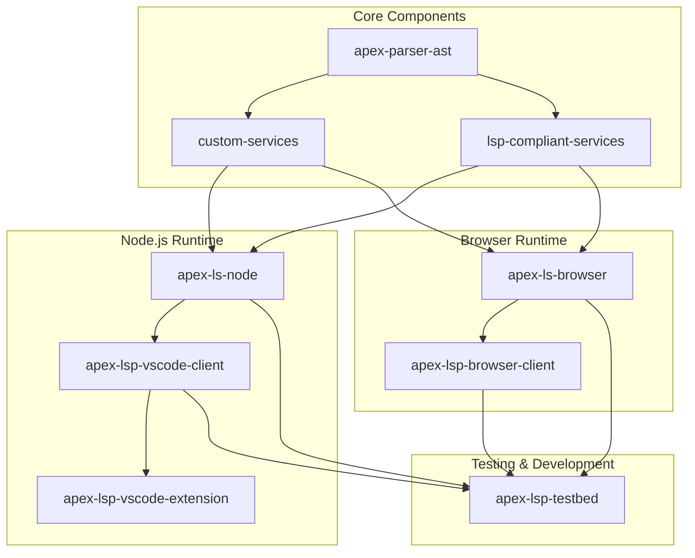

# Apex Language Support

# This repository is experimental - DO NOT USE

This repository contains a set of packages that collectively implement language support for Salesforce Apex, following the Language Server Protocol (LSP) specification.

## Architecture Overview

The project is structured as a monorepo with several interconnected packages that serve different purposes in the language support ecosystem.



## Package Descriptions

### Core Components

- **apex-parser-ast**: Provides AST (Abstract Syntax Tree) parsing capabilities for Apex code
- **custom-services**: Implements custom services beyond the standard LSP specification
- **lsp-compliant-services**: Implements standard LSP services (completion, hover, etc.)

### Node.js Runtime

- **apex-ls-node**: TypeScript implementation of the Apex Language Server for Node.js
- **apex-lsp-vscode-client**: VS Code specific client that communicates with the language server
- **apex-lsp-vscode-extension**: The VS Code extension package that integrates with VS Code's extension API

### Browser Runtime

- **apex-ls-browser**: Browser-compatible implementation of the Apex Language Server
- **apex-lsp-browser-client**: Browser-based client for the language server

### Testing & Development

- **apex-lsp-testbed**: Testing utilities and integration tests for the language server

## Key Differences Between Node.js and Browser Implementations

The repository provides two parallel implementations of the language server:

1. **Node.js implementation** (`apex-ls-node`):
   - Runs in Node.js environment
   - Uses file system for storage
   - Designed for desktop IDE integration (VS Code)

2. **Browser implementation** (`apex-ls-browser`):
   - Runs in browser environment
   - Uses IndexedDB for storage
   - Designed for web-based editors

Both implementations maintain feature parity by implementing the same set of LSP handlers and capabilities, allowing for a consistent experience across different environments.

## Client Libraries

### Browser Client

The `apex-lsp-browser-client` package provides a TypeScript client for connecting to the Apex Language Server in web-based environments. It handles communication with a language server running in a web worker.

```bash
npm install @salesforce/apex-lsp-browser-client
```

### Testbed

The `apex-lsp-testbed` package provides a testbed for performance and qualitative analysis of different Apex language server implementations.

```bash
npm install @salesforce/apex-lsp-testbed
```

## Requirements

- Node.js (latest LTS recommended)
- npm

## Installation

```bash
# Clone the repository
git clone <repository-url>
cd apex-language-server-ts

# Install dependencies
npm install
```

## Recent Changes

- **Removed Babel References:**  
  All references to Babel have been removed from the project. The project now uses `ts-jest` exclusively for testing.

- **TypeScript Improvements:**  
  Explicit types have been added to test files to resolve TypeScript errors. For example, in `apex-lsp-testbed/test/performance/lsp-benchmarks.web.test.ts`, variables and parameters now have explicit `any` types.

- **Jest Configuration:**  
  Jest configurations have been streamlined. Each package now uses a single Jest configuration file (`jest.config.cjs`), and the `"jest"` key has been removed from `package.json` files to avoid conflicts.

## Development

```bash
# Build all packages
npm run build

# Watch all packages for changes during development
npm run dev

# Run tests
npm test

# Run tests with coverage
npm run test:coverage

# Run tests for a specific package
npm run test:packages

# Run tests with coverage for specific packages
npm run test:coverage:packages

# Generate a consolidated coverage report
npm run test:coverage:report

# Lint code
npm run lint

# Fix linting issues
npm run lint:fix
```

## Testing and Code Coverage

This project includes comprehensive test coverage for all packages. Test coverage reports are generated using Jest and Istanbul.

### Running Tests with Coverage

```bash
# Run all tests with coverage
npm run test:coverage

# Run tests with coverage for specific packages
npm run test:coverage:packages

# Generate a consolidated coverage report for the entire repository
npm run test:coverage:report
```

### Coverage Reports

After running the test coverage commands, coverage reports are available:

- **Package-level reports:** Generated in each package's `coverage` directory
- **Consolidated repository report:** Generated in the root `coverage` directory

The coverage reports include:

- HTML reports for interactive viewing (`coverage/lcov-report/index.html`)
- LCOV reports for CI integration
- Text summaries in the console
- JSON coverage data for further processing

### Coverage Thresholds

Global coverage thresholds are set in the Jest configuration file:

- Statements: 50%
- Branches: 50%
- Functions: 50%
- Lines: 50%

These thresholds can be adjusted per package as needed.

## License

Licensed under the BSD 3-Clause license.
For full license text, see LICENSE.txt file in the repo root or https://opensource.org/licenses/BSD-3-Clause
