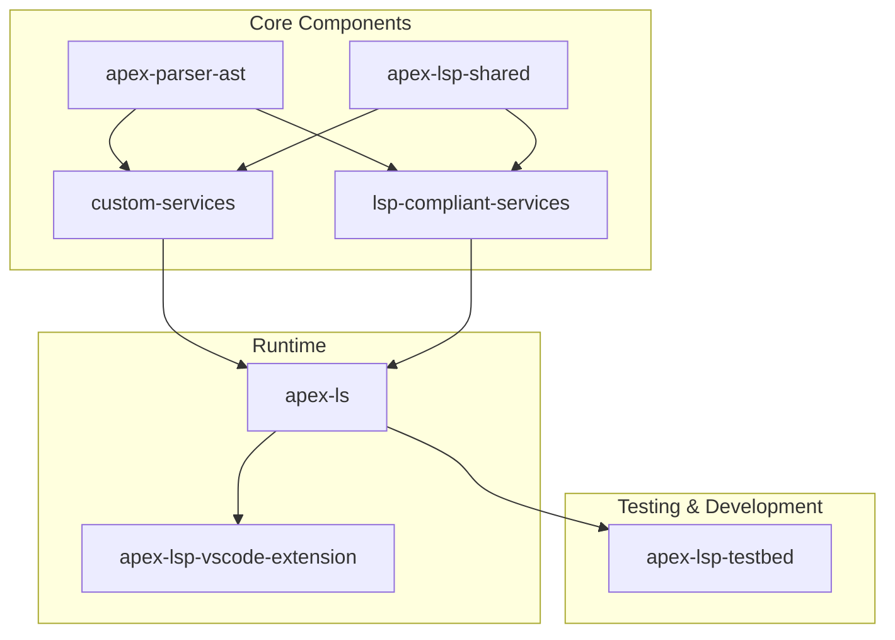

# Apex Language Support

# This repository is experimental - DO NOT USE

This repository contains a set of packages that collectively implement language support for Salesforce Apex, following the Language Server Protocol (LSP) specification.

## Architecture Overview

The project is structured as a monorepo with several interconnected packages that serve different purposes in the language support ecosystem.



## Package Descriptions

### Core Components

- **apex-parser-ast**: Provides AST (Abstract Syntax Tree) parsing capabilities for Apex code
- **custom-services**: Implements custom services beyond the standard LSP specification
- **lsp-compliant-services**: Implements standard LSP services (completion, hover, etc.)
- **apex-lsp-shared**: Provides shared utilities including logging, notifications, and common functionality used across the language server ecosystem

### Runtime

- **apex-ls**: Apex Language Server that works across browser, Node.js, and web worker environments
- **apex-lsp-vscode-extension**: The VS Code extension package that integrates with VS Code's extension API

### Testing & Development

- **apex-lsp-testbed**: Testing utilities and integration tests for the language server

## Language Server Implementation

The repository provides an implementation of the language server that works across multiple environments:

**apex-ls**: Apex Language Server

- Runs in Node.js, browser, and web worker environments
- Uses appropriate storage mechanisms (file system for Node.js, IndexedDB for browser)
- Designed for both desktop IDE integration (VS Code) and web-based editors
- Maintains feature parity across all environments by implementing the same set of LSP handlers and capabilities

## Server Mode Configuration

The Apex Language Server supports different operational modes optimized for different environments:

### Server Modes

- **Production Mode**: Optimized for performance and stability in production environments
- **Development Mode**: Full feature set with enhanced debugging and development workflows
- **Test Mode**: Testing-specific features and configurations

### Mode Configuration

The server mode can be configured through multiple methods:

1. **Environment Variable Override**: Set `APEX_LS_MODE=production` or `APEX_LS_MODE=development`
2. **Extension Mode**: Automatically determined based on VS Code extension mode
3. **NODE_ENV**: Falls back to `NODE_ENV` environment variable

For detailed information about server mode configuration and capabilities, see:

- [Server Mode Override Documentation](packages/apex-lsp-vscode-extension/docs/server-mode-override.md)
- [Capabilities Documentation](packages/lsp-compliant-services/docs/CAPABILITIES.md)

## Client Libraries

### Unified Language Server

The `apex-ls` package provides a unified Apex Language Server that works across browser, Node.js, and web worker environments. It consolidates the functionality previously provided by separate browser and Node.js packages.

```bash
npm install @salesforce/apex-ls
```

### Testbed

The `apex-lsp-testbed` package provides a testbed for performance and qualitative analysis of different Apex language server implementations.

```bash
npm install @salesforce/apex-lsp-testbed
```

## Requirements

- Node.js (latest LTS recommended)
- npm

## Installation

```bash
# Clone the repository
git clone <repository-url>
cd apex-language-support

# Install dependencies
npm install
```

## Development

To build all packages, run the following command from the root of the repository:

```bash
# Build all packages
turbo build
```

Other useful commands for development include:

```bash
# Watch all packages for changes
turbo dev

# Run all tests
turbo test

# Run all tests with coverage
turbo test:coverage

# Lint all packages
turbo lint

# Fix linting issues
turbo lint:fix
```

### Building and Packaging the VS Code Extension

To build and package the VS Code extension (`.vsix` file), run the following command from the root of the repository:

```bash
# Build and package the VS Code extension
turbo package --filter=apex-language-server-extension
```

The packaged extension will be available in the `packages/apex-lsp-vscode-extension` directory.

## Testing and Code Coverage

This project includes comprehensive test coverage for all packages. Test coverage reports are generated using Jest and Istanbul.

### Running Tests with Coverage

```bash
# Run all tests with coverage
npm run test:coverage

# Run tests with coverage for specific packages
npm run test:coverage:packages

# Generate a consolidated coverage report for the entire repository
npm run test:coverage:report
```

### Coverage Reports

After running the test coverage commands, coverage reports are available:

- **Package-level reports:** Generated in each package's `coverage` directory
- **Consolidated repository report:** Generated in the root `coverage` directory

The coverage reports include:

- HTML reports for interactive viewing (`coverage/lcov-report/index.html`)
- LCOV reports for CI integration
- Text summaries in the console
- JSON coverage data for further processing

### Coverage Thresholds

Global coverage thresholds are set in the Jest configuration file:

- Statements: 50%
- Branches: 50%
- Functions: 50%
- Lines: 50%

These thresholds can be adjusted per package as needed.

## CI/CD and Release Processes

This project uses GitHub Actions for continuous integration and automated releases. The workflows are designed to handle both VS Code extensions and NPM packages.

### Automated Workflows

#### CI Pipeline

- **Trigger**: Push to `main` branch or pull requests
- **Platforms**: Ubuntu and Windows with Node.js 20.x and LTS versions
- **Tasks**: Linting, compilation, testing with coverage, and packaging

#### Release Workflows

##### VS Code Extensions Release

The `release-extensions.yml` workflow handles automated releases of VS Code extensions:

- **Supported Extensions**:
  - `apex-lsp-vscode-extension` (VS Code Marketplace and OpenVSX Registry)
- **Triggers**: Manual dispatch, workflow calls, or scheduled nightly builds
- **Features**:
  - Smart change detection (only releases extensions with changes)
  - Version bumping with even/odd minor version strategy for pre-releases
  - Dry-run mode for testing release plans
  - Support for multiple registries (VSCE, OVSX)
  - Automated GitHub releases with VSIX artifacts

##### NPM Packages Release

The `release-npm.yml` workflow handles automated releases of NPM packages:

- **Supported Packages**: All packages in the monorepo
- **Triggers**: Manual dispatch or workflow calls
- **Features**:
  - Conventional commit-based version bumping
  - Automated NPM publishing
  - Change detection to avoid unnecessary releases

### Release Strategies

#### Version Bumping

- **Auto**: Determined by conventional commit messages
- **Manual**: Patch, minor, or major bumps
- **Pre-release**: Uses odd minor versions (1.1.x, 1.3.x)
- **Stable**: Uses even minor versions (1.0.x, 1.2.x)

#### Nightly Builds

- Scheduled builds that create pre-release versions
- Use patch version bumps with nightly timestamps
- Automatically marked as pre-releases

### Manual Release Process

To manually trigger a release:

1. **VS Code Extensions**:

   ```bash
   # Go to Actions tab in GitHub
   # Select "Release VS Code Extensions"
   # Choose extensions, registries, and options
   # Set dry-run=true to test first
   ```

2. **NPM Packages**:
   ```bash
   # Go to Actions tab in GitHub
   # Select "Release NPM Packages"
   # Choose packages and options
   ```

### Dry-Run Mode

Both release workflows support dry-run mode for testing:

- Simulates the entire release process without making actual changes
- Shows what would be released and to which registries
- Displays version bump calculations
- Perfect for testing release configurations

### Dependencies

The workflows require several tools and dependencies:

- **Node.js 20.x**: For building and packaging
- **jq**: For JSON processing (pre-installed on Ubuntu runners)
- **GitHub CLI**: For creating releases
- **VSCE/OVSX**: For publishing to marketplaces

## License

Licensed under the BSD 3-Clause license.
For full license text, see LICENSE.txt file in the repo root or https://opensource.org/licenses/BSD-3-Clause
