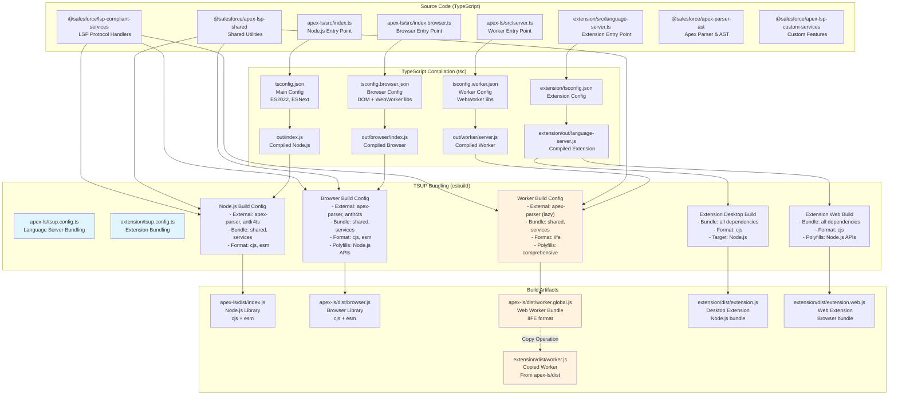
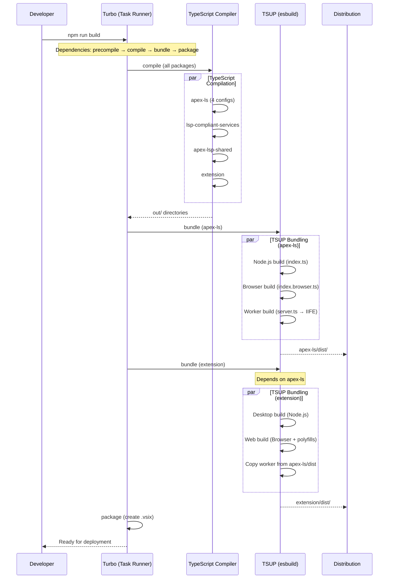
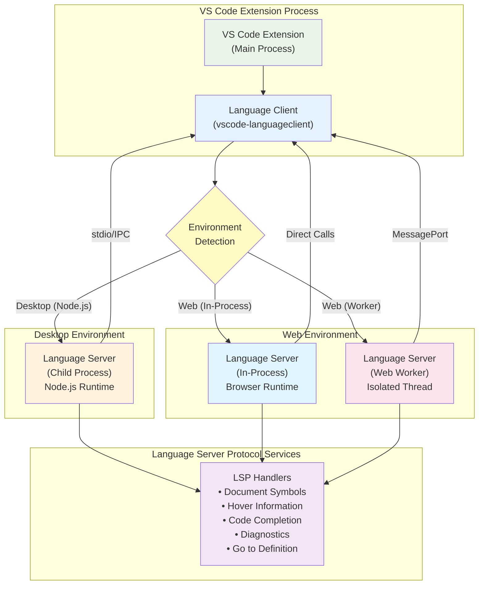

# Apex Language Server Build Architecture & Relationships

This diagram illustrates the comprehensive build process using tsup and tsconfig, showing how the language server components are built and their relationships between server/client, worker, and VS Code extension.

## Build Pipeline Overview



## Runtime Architecture & Communication

```mermaid
graph TB
    %% VS Code Extension Layer
    subgraph "VS Code Extension"
        EXT_DESKTOP["Desktop Extension
        extension.js
        Node.js Runtime"]
        EXT_WEB["Web Extension
        extension.web.js
        Browser Runtime"]
        EXT_DETECT{"Environment
        Detection
        vscode.env.uiKind"}
    end

    %% Language Server Instances
    subgraph "Language Server Implementations"
        LS_NODE["Node.js Language Server
        apex-ls/dist/index.js
        Child Process"]
        LS_BROWSER["Browser Language Server
        apex-ls/dist/browser.js
        In-Process"]
        LS_WORKER["Web Worker Language Server
        worker.js
        Dedicated Worker Thread"]
    end

    %% Core Services
    subgraph "Language Server Core"
        LSP_HANDLER["LSP Protocol Handlers
        lsp-compliant-services
        DocumentSymbols, Hover, etc."]
        APEX_PARSER["Apex Parser
        apex-parser-ast
        Syntax Analysis"]
        STORAGE["Storage Abstraction
        Node.js FS / Browser Storage"]
        LOGGER["Logging System
        Platform-specific Outputs"]
    end

    %% Communication Protocols
    subgraph "Communication Layer"
        LSP_STDIO["LSP over stdio
        Node.js Child Process"]
        LSP_BROWSER["LSP in-process
        Direct Function Calls"]
        LSP_WORKER["LSP over MessagePort
        Worker Messages"]
    end

    %% Dependencies (External/Lazy)
    subgraph "External Dependencies (Lazy Loaded)"
        APEX_PARSER_EXT["@apexdevtools/apex-parser
        ~2MB Apex Grammar"]
        ANTLR4["antlr4ts
        Parser Runtime"]
        CUSTOM_SERVICES["custom-services
        Advanced Features"]
    end

    %% Environment Detection & Routing
    EXT_DETECT -->|Desktop| EXT_DESKTOP
    EXT_DETECT -->|Web| EXT_WEB

    %% Desktop Path
    EXT_DESKTOP -->|spawn child process| LS_NODE
    LS_NODE -->|stdio| LSP_STDIO
    LSP_STDIO --> LSP_HANDLER

    %% Web In-Process Path
    EXT_WEB -->|direct instantiation| LS_BROWSER
    LS_BROWSER -->|function calls| LSP_BROWSER
    LSP_BROWSER --> LSP_HANDLER

    %% Web Worker Path
    EXT_WEB -->|new Worker()| LS_WORKER
    LS_WORKER -->|postMessage| LSP_WORKER
    LSP_WORKER --> LSP_HANDLER

    %% Core Dependencies
    LSP_HANDLER --> APEX_PARSER
    LSP_HANDLER --> STORAGE
    LSP_HANDLER --> LOGGER

    %% Lazy Loading (Runtime)
    APEX_PARSER -.->|lazy load| APEX_PARSER_EXT
    APEX_PARSER -.->|lazy load| ANTLR4
    LSP_HANDLER -.->|lazy load| CUSTOM_SERVICES

    %% Styling
    style EXT_DESKTOP fill:#e8f5e8
    style EXT_WEB fill:#e8f5e8
    style LS_NODE fill:#fff3e0
    style LS_BROWSER fill:#e3f2fd
    style LS_WORKER fill:#fce4ec
    style APEX_PARSER_EXT fill:#f3e5f5
    style ANTLR4 fill:#f3e5f5
    style CUSTOM_SERVICES fill:#f3e5f5
```

## Build Process Flow



## Key Build Configuration Details

### External Dependencies Strategy

- **Always External**: `@apexdevtools/apex-parser` (~2MB), `antlr4ts` - Too large for bundling
- **Always Bundled**: `@salesforce/apex-lsp-shared`, `lsp-compliant-services` - Core functionality
- **Lazy Loaded**: Parser engine loaded only when needed for better startup performance

### Multi-Platform Support

- **Node.js**: Full-featured desktop experience with child process isolation
- **Browser**: In-process language server with Node.js polyfills
- **Web Worker**: Isolated worker thread with comprehensive polyfills

### Build Optimizations

- **Tree Shaking**: Dead code elimination in all builds
- **Source Maps**: Full debugging support across all artifacts
- **Minification**: Production-ready worker bundle (IIFE format)
- **Module Formats**: CJS for Node.js compatibility, ESM for modern bundlers

### Communication Protocols

- **Desktop**: LSP over stdio (child process communication)
- **Browser**: Direct function calls (in-process)
- **Worker**: MessagePort API (worker thread communication)

This architecture enables the Apex language server to run efficiently across VS Code Desktop, VS Code for Web, and browser-based environments while maintaining consistent functionality and performance.

## Simplified Architecture Overview



### Key Relationships:

1. **Extension → Client**: The VS Code extension instantiates and manages the language client
2. **Client → Environment Detection**: Determines runtime environment (Desktop vs Web)
3. **Client ↔ Server**: Bidirectional LSP communication via different transport mechanisms:
   - **Desktop**: Child process with stdio/IPC communication
   - **Web (In-Process)**: Direct function calls within the same JavaScript context
   - **Web (Worker)**: MessagePort API for isolated worker thread communication
4. **Server → LSP Services**: All server variants use the same core LSP protocol handlers

## Detailed Build Pipeline Flow (ASCII)

```
🎯 APEX LANGUAGE SERVER - TypeScript Monorepo Build Pipeline
┌─────────────────────────────────────────────────────────────────────────────────────────────────┐
│                                    SOURCE FILES STRUCTURE                                       │
├─────────────────────────────────────────────────────────────────────────────────────────────────┤
│  packages/apex-ls/src/                                                                          │
│  ├── index.ts                    ◄── Node.js entry point (server + utilities)                   │
│  ├── index.browser.ts            ◄── Browser entry point (client-side APIs)                     │
│  ├── server.ts                   ◄── Web Worker entry point (LSP server)                        │
│  ├── communication/              ◄── Platform bridges & message handling                        │
│  ├── server/                     ◄── Language server implementations                            │
│  └── utils/                      ◄── Platform-specific utilities                                │
│                                                                                                 │
│  packages/lsp-compliant-services/ ◄── LSP protocol handlers (shared)                            │
│  packages/apex-lsp-shared/        ◄── Common utilities & types (shared)                         │
│  packages/apex-parser-ast/        ◄── Apex parsing & AST (external dependency)                  │
│  packages/custom-services/        ◄── Custom language features (external dependency)            │
└─────────────────────────────────────────────────────────────────────────────────────────────────┘
                                              │
                                              ▼
┌───────────────────────────────────────────────────────────────────────────────────────────────────┐
│                          🔄 TYPESCRIPT COMPILATION PHASE (Parallel)                               │
├───────────────────────────────────────────────────────────────────────────────────────────────────┤
│                                                                                                   │
│  ┌────────────────────┐  ┌─────────────────────┐  ┌─────────────────────┐  ┌─────────────────────┐  │
│  │   tsconfig.json    │  │ tsconfig.node.json  │  │tsconfig.browser.json│  │ tsconfig.worker.json│  │
│  │   ─────────────    │  │ ────────────────── │  │ ──────────────────── │  │ ─────────────────── │  │
│  │ • Base config      │  │ • CommonJS          │  │ • ES2022, ESNext     │  │ • ES2022, ESNext    │  │
│  │ • Type references  │  │ • Node.js only      │  │ • DOM + WebWorker    │  │ • WebWorker libs    │  │
│  │ • Common settings  │  │ • out/node/         │  │ • Browser-specific   │  │ • Worker-specific   │  │
│  │                    │  │                     │  │   files only         │  │   files only        │  │
│  └────────────────────┘  └─────────┬───────────┘  └─────────┬────────────┘  └─────────┬───────────┘  │
│                                   │                      │                      │               │
│                                   ▼                      ▼                      ▼               │
│           ┌─────────────────────┐    ┌─────────────────────┐     ┌─────────────────────┐         │
│           │   out/node/*.js     │    │ out/browser/*.js    │     │ out/worker/*.js     │         │
│           │   out/node/*.d.ts   │    │ out/browser/*.d.ts  │     │ out/worker/*.d.ts   │         │
│           │   + source maps     │    │ + source maps       │     │ + source maps       │         │
│           └─────────────────────┘    └─────────────────────┘     └─────────────────────┘         │
└───────────────────────────────────────────────────────────────────────────────────────────────────┘
                                              │
                                              ▼
┌──────────────────────────────────────────────────────────────────────────────────────────────────┐
│                              ⚡ TSUP BUNDLING PHASE (esbuild)                                     │
├──────────────────────────────────────────────────────────────────────────────────────────────────┤
│                                                                                                  │
│ ┌─────────────────┐  ┌─────────────────┐  ┌──────────────────────────────────────────────────┐   │
│ │   Node.js Build │  │  Browser Build  │  │              Worker Build                        │   │
│ │  ─────────────  │  │   ────────────  │  │              ────────────                        │   │
│ │ Entry: index.ts │  │Entry:browser.ts │  │ Entry: server.ts                                 │   │
│ │ Format: cjs,esm │  │Format: cjs,esm  │  │ Format: iife (self-contained)                    │   │
│ │ Platform: node  │  │Platform:browser │  │ Platform: browser                                │   │
│ │ Target: es2022  │  │Target: es2022   │  │ Target: es2022                                   │   │
│ │                 │  │                 │  │ Minify: true                                     │   │
│ │ External:       │  │ External:       │  │ External (lazy-loaded):                          │   │
│ │ • apex-parser   │  │ • apex-parser   │  │ • @apexdevtools/apex-parser                      │   │
│ │ • antlr4ts      │  │ • antlr4ts      │  │ • antlr4ts                                       │   │
│ │ • custom-svc    │  │ • custom-svc    │  │ • custom-services                                │   │
│ │                 │  │                 │  │ • data-structure-typed                           │   │
│ │ Bundled:        │  │ Bundled:        │  │ • effect                                         │   │
│ │ • lsp-shared    │  │ • lsp-shared    │  │                                                  │   │
│ │ • lsp-services  │  │ • lsp-services  │  │ Bundled (immediate):                             │   │
│ │ • vscode-lsp-*  │  │ • vscode-lsp-*  │  │ • lsp-shared, lsp-services                       │   │
│ │                 │  │ • NODE_POLYFILLS│  │ • vscode-lsp-* + NODE_POLYFILLS                  │   │
│ └─────────┬───────┘  └─────────┬───────┘  └─────────────────────┬────────────────────────────┘   │
│           │                    │                                │                                │
│           ▼                    ▼                                ▼                                │
│ ┌─────────────────┐  ┌─────────────────┐  ┌──────────────────────────────────────────────────┐   │
│ │ dist/index.js   │  │ dist/browser.js │  │ dist/worker.global.js                            │   │
│ │ dist/index.mjs  │  │dist/browser.mjs │  │ └── Single IIFE bundle (~500KB compressed)       │   │
│ │ dist/index.d.ts │  │dist/browser.d.ts│  │ └── Includes comprehensive Node.js polyfills     │   │
│ └─────────────────┘  └─────────────────┘  └──────────────────────────────────────────────────┘   │
└─────────────────────────────────────────────────────────────────────────────────────────────────┘
                                              │
                                              ▼
┌───────────────────────────────────────────────────────────────────────────────────────────────────┐
│                            📦 BUILD CONFIGURATION COMPARISON                                      │
├───────────────────────────────────────────────────────────────────────────────────────────────────┤
│                                                                                                   │
│ ┌─────────────┬───────────────┬───────────────┬─────────────────────────────────────────────┐     │
│ │   Aspect    │   Node.js     │    Browser    │               Worker                        │     │
│ ├─────────────┼───────────────┼───────────────┼─────────────────────────────────────────────┤     │
│ │ Entry Point │   index.ts    │index.browser.ts│              server.ts                     │     │
│ │ Output Dir  │   dist/       │    dist/      │              dist/                          │     │
│ │ Formats     │   cjs, esm    │   cjs, esm    │              iife                           │     │
│ │ Platform    │   node        │   browser     │              browser                        │     │
│ │ Runtime     │ Child Process │  In-Process   │           Web Worker                        │     │
│ │ Bundle Size │   ~50KB       │    ~75KB      │             ~500KB                          │     │
│ │ Load Time   │   Fast        │   Fastest     │             Medium                          │     │
│ │ Isolation   │   High        │    None       │             High                            │     │
│ │ Debugging   │   Full        │    Full       │             Limited                         │     │
│ │ Polyfills   │   None        │   NODE_*      │        Comprehensive                        │     │
│ └─────────────┴───────────────┴───────────────┴─────────────────────────────────────────────┘     │
└───────────────────────────────────────────────────────────────────────────────────────────────────┘
                                              │
                                              ▼
┌───────────────────────────────────────────────────────────────────────────────────────────────────┐
│                                  FINAL OUTPUTS & CONSUMPTION                                      │
├───────────────────────────────────────────────────────────────────────────────────────────────────┤
│                                                                                                   │
│  apex-ls/dist/                                                                                    │
│  ├── index.js, index.mjs          ► Used by: Node.js consumers, CLI tools                         │
│  ├── browser.js, browser.mjs      ► Used by: Browser applications, web bundlers                   │
│  ├── worker.global.js             ► Used by: Web Workers (copied to extension)                    │
│  └── *.d.ts files                 ► Used by: TypeScript consumers for type checking               │
│                                                                                                   │
│  VS Code Extension Build:                                                                         │
│  ┌──────────────────────────────────────────────────────────────────────────────┐                 │
│  │ extension/tsup.config.ts copies worker.global.js → extension/dist/worker.js  │                 │
│  │                                                                              │                 │
│  │ copyWorkerFiles() {                                                          │                 │
│  │   fs.copyFileSync('../apex-ls/dist/worker.global.js', 'dist/worker.js')      │                 │
│  │ }                                                                            │                 │
│  └──────────────────────────────────────────────────────────────────────────────┘                 │
│                                              │                                                    │
│                                              ▼                                                    │
│  extension/dist/                                                                                  │
│  ├── extension.js                 ► Desktop VS Code (Node.js runtime)                             │
│  ├── extension.web.js             ► VS Code for Web (browser runtime)                             │
│  └── worker.js                    ► Web Worker (copied from apex-ls)                              │
└───────────────────────────────────────────────────────────────────────────────────────────────────┘
                                              │
                                              ▼
┌───────────────────────────────────────────────────────────────────────────────────────────────────┐
│                                BEFORE/AFTER SIMPLIFICATIONS                                       │
├───────────────────────────────────────────────────────────────────────────────────────────────────┤
│                                                                                                   │
│ ┌─────────────────────────────────┬─────────────────────────────────────────────────────────────┐ │
│ │           BEFORE                │                    AFTER                                    │ │
│ ├─────────────────────────────────┼─────────────────────────────────────────────────────────────┤ │
│ │ • 4 separate worker builds      │ • Single consolidated worker build                          │ │
│ │ • worker-web.ts + worker.ts     │ • server.ts (unified entry point)                           │ │
│ │ • Complex build matrix          │ • Simplified 3-target strategy                              │ │
│ │ • Manual worker file copying    │ • Automated copyWorkerFiles() function                      │ │
│ │ • Static imports everywhere     │ • Dynamic imports for lazy loading                          │ │
│ │ • Inconsistent polyfill usage   │ • Universal NODE_POLYFILLS applied                          │ │
│ │ • Mixed bundle strategies       │ • Clear external vs bundled strategy                        │ │
│ │ • Platform-specific builds      │ • Platform-agnostic with runtime detection                  │ │
│ └─────────────────────────────────┴─────────────────────────────────────────────────────────────┘ │
└───────────────────────────────────────────────────────────────────────────────────────────────────┘
                                              │
                                              ▼
┌───────────────────────────────────────────────────────────────────────────────────────────────────┐
│                                 DEPENDENCY STRATEGY MATRIX                                        │
├───────────────────────────────────────────────────────────────────────────────────────────────────┤
│                                                                                                   │
│ ┌──────────────────────────────┬─────────────┬──────────────────────────────────────────────────┐ │
│ │         Dependency           │   Strategy  │                 Rationale                        │ │
│ ├──────────────────────────────┼─────────────┼──────────────────────────────────────────────────┤ │
│ │ @apexdevtools/apex-parser    │  EXTERNAL   │ ~2MB grammar file, lazy-load when needed         │ │
│ │ antlr4ts                     │  EXTERNAL   │ Large runtime, shared across instances           │ │
│ │ custom-services              │  EXTERNAL   │ Optional features, load on demand                │ │
│ │ data-structure-typed         │  EXTERNAL   │ Heavy algorithms, worker-only usage              │ │
│ │ effect                       │  EXTERNAL   │ Functional utilities, specialized usage          │ │
│ │ node-dir                     │  EXTERNAL   │ Directory scanning utilities (Node.js only)      │ │
│ │                              │             │                                                  │ │
│ │ @salesforce/apex-lsp-shared  │   BUNDLED   │ Core utilities, small size, always needed        │ │
│ │ lsp-compliant-services       │   BUNDLED   │ Main LSP logic, essential functionality          │ │
│ │ vscode-languageserver-*      │   BUNDLED   │ Protocol libraries, small and essential          │ │
│ │ vscode-jsonrpc               │   BUNDLED   │ Communication layer, always required             │ │
│ └──────────────────────────────┴─────────────┴──────────────────────────────────────────────────┘ │
│                                                                                                   │
│ Key Benefits:                                                                                     │
│ • Faster startup (external deps loaded lazily)                                                    │
│ • Smaller initial bundles                                                                         │
│ • Better caching (external deps cached separately)                                                │
│ • Easier debugging (source maps preserved)                                                        │
└───────────────────────────────────────────────────────────────────────────────────────────────────┘
```
