# Apex Language Support - Logging and Telemetry Architecture

## High-Level Architecture Overview

```mermaid
graph TB
    %% VS Code Environment
    subgraph VSCode["VS Code Environment"]
        User["👤 User"]
        VSCodeUI["VS Code UI"]
        Settings["⚙️ VS Code Settings<br/>apex.logLevel<br/>apex.trace.server<br/>apex.worker.*"]
    end

    %% Extension Host
    subgraph ExtHost["Extension Host Process"]
        ExtMain["📦 Extension Main<br/>(extension.ts)"]
        ExtLogger["📝 Extension Logger<br/>(logging.ts)"]
        ClientChannel["📺 Client Output Channel<br/>'Apex Language Server Extension (Client)'"]
        WorkerChannel["📺 Worker/Server Output Channel<br/>'Apex Language Server Extension (Worker/Server)'"]
        AggregatedChannel["📺 Aggregated Log View<br/>'Apex Logs (All)'"]
        ConfigMgr["⚙️ Configuration Manager<br/>(configuration.ts)"]
    end

    %% Language Client
    subgraph LangClient["Language Client"]
        LanguageClient["🔗 VS Code Language Client<br/>(LanguageClient)"]
        LSPConnection["🔌 LSP Connection<br/>(JSON-RPC)"]
        TraceHandler["📊 Trace Handler<br/>(apex.trace.server)"]
    end

    %% Web Worker
    subgraph Worker["Web Worker Process"]
        WorkerMain["⚙️ Worker Main<br/>(webWorkerServer.ts)"]
        WorkerLogger["📝 Worker Logger<br/>(WorkerLogNotificationHandler)"]
        LCSAdapter["🔧 LCS Adapter<br/>(LCSAdapter.ts)"]
        UniversalLogger["📝 Universal Logger<br/>(apex-lsp-shared)"]
    end

    %% LSP Compliant Services
    subgraph LCS["LSP Compliant Services"]
        SettingsManager["⚙️ Apex Settings Manager<br/>(ApexSettingsManager.ts)"]
        ServiceHandlers["🛠️ Service Handlers<br/>(DocumentProcessing, Hover, etc.)"]
        DiagnosticsService["🔍 Diagnostics Service"]
    end

    %% Telemetry System (Separate from Logging)
    subgraph Telemetry["Telemetry System"]
        TelemetryEvents["📈 Telemetry Events<br/>telemetry/event LSP notifications"]
        TelemetryData["📊 Telemetry Data<br/>- Performance metrics<br/>- Feature usage<br/>- Error tracking<br/>- Memory usage"]
        TelemetryProcessor["⚙️ Telemetry Processor<br/>(Language Server)"]
    end

    %% Flow connections
    User --> Settings
    Settings --> ConfigMgr
    ConfigMgr --> ExtLogger
    ConfigMgr --> LanguageClient

    ExtMain --> ExtLogger
    ExtLogger --> ClientChannel
    ExtLogger --> WorkerChannel

    LanguageClient --> LSPConnection
    LSPConnection --> WorkerMain
    LSPConnection --> TraceHandler

    WorkerMain --> WorkerLogger
    WorkerMain --> LCSAdapter
    WorkerLogger --> UniversalLogger

    LCSAdapter --> SettingsManager
    LCSAdapter --> ServiceHandlers
    ServiceHandlers --> DiagnosticsService

    %% Logging flow
    WorkerLogger -.->|"window/logMessage"| LSPConnection
    LSPConnection -.->|"Log Messages"| WorkerChannel
    ClientChannel -.->|"Aggregation"| AggregatedChannel
    WorkerChannel -.->|"Aggregation"| AggregatedChannel

    %% Telemetry flow
    ServiceHandlers -.->|"Performance Data"| TelemetryProcessor
    TelemetryProcessor -.->|"telemetry/event"| LSPConnection
    LSPConnection -.->|"Telemetry Events"| TelemetryEvents

    %% Output channels displayed to user
    ClientChannel --> VSCodeUI
    WorkerChannel --> VSCodeUI
    AggregatedChannel --> VSCodeUI

    %% Settings propagation
    SettingsManager -.->|"Log Level Updates"| UniversalLogger
    ConfigMgr -.->|"Configuration Changes"| SettingsManager

    %% Styling
    classDef userInterface fill:#e1f5fe,stroke:#01579b,stroke-width:2px
    classDef logging fill:#fff3e0,stroke:#ef6c00,stroke-width:2px
    classDef telemetry fill:#f3e5f5,stroke:#7b1fa2,stroke-width:2px
    classDef configuration fill:#e8f5e8,stroke:#2e7d32,stroke-width:2px
    classDef lsp fill:#fce4ec,stroke:#c2185b,stroke-width:2px

    class VSCode,VSCodeUI userInterface
    class ExtLogger,ClientChannel,WorkerChannel,AggregatedChannel,WorkerLogger,UniversalLogger logging
    class Telemetry,TelemetryEvents,TelemetryData,TelemetryProcessor telemetry
    class Settings,ConfigMgr,SettingsManager configuration
    class LangClient,LSPConnection,TraceHandler lsp
```



## Logging vs. Telemetry: Key Differences

### 🔍 **Logging System**

**Purpose**: Debug information, operational status, and troubleshooting

- **Scope**: Development, debugging, and support
- **Visibility**: Visible to developers and users via Output channels
- **Control**: User-configurable via VS Code settings
- **Content**: Text-based messages with timestamps and severity levels

#### Logging Components:

1. **Extension Logging** (`ClientChannel`)
   - Extension activation, configuration changes, lifecycle events
   - Managed by `logging.ts` in VS Code extension

2. **Worker/Server Logging** (`WorkerChannel`)
   - LSP messages, worker operations, performance timing
   - Uses LSP `window/logMessage` notifications
   - Managed by `WorkerLogNotificationHandler`

3. **Aggregated Logging** (`AggregatedChannel`)
   - Combined chronological view of all logging sources
   - Custom `AggregatedLogView` implementation

### 📊 **Telemetry System**

**Purpose**: Performance metrics, usage analytics, and error tracking

- **Scope**: Product analytics and performance monitoring
- **Visibility**: Structured data for analysis (not directly user-visible)
- **Control**: Typically follows VS Code's telemetry settings
- **Content**: Structured data with properties and numeric measures

#### Telemetry Data Types:

- **Performance Metrics**: Execution times, memory usage
- **Feature Usage**: Which LSP features are used and how often
- **Error Tracking**: Exception details and frequency
- **Startup Metrics**: Initialization and connection timing

#### Telemetry Flow:

```
Language Server → telemetry/event → LSP Connection → Telemetry Processor
```

## Configuration Hierarchy

### VS Code Settings Structure:

```json
{
  // Main extension settings
  "apex.logLevel": "info",
  "apex.trace.server": "off",

  // Worker-specific logging
  "apex.worker.logLevel": "info",
  "apex.worker.enablePerformanceLogs": false,
  "apex.worker.logCategories": ["STARTUP", "LSP", "SYMBOLS"]
}
```

### Configuration Flow:

1. **User Changes Settings** → VS Code Settings API
2. **Configuration Manager** → Validates and processes settings
3. **Settings Propagation** → Updates both extension and language server
4. **Runtime Updates** → Log levels and categories applied immediately

## Output Channels Breakdown

| Channel Name                                     | Purpose                       | Content Source         | User Visibility |
| ------------------------------------------------ | ----------------------------- | ---------------------- | --------------- |
| `Apex Language Server Extension (Client)`        | Extension host operations     | Extension main process | High            |
| `Apex Language Server Extension (Worker/Server)` | Language server operations    | Web worker via LSP     | High            |
| `Apex Logs (All)`                                | Aggregated chronological view | Combined from above    | Medium          |

## Key Integration Points

### 1. **VS Code ↔ Extension Settings**

- Direct binding via VS Code Configuration API
- Real-time updates via `onDidChangeConfiguration`
- Commands for quick log level changes

### 2. **Extension ↔ Language Server**

- Settings passed via LSP `initializationOptions`
- Dynamic updates via `workspace/didChangeConfiguration`
- LSP notifications for worker logs

### 3. **Language Server ↔ Services**

- Unified logging via `apex-lsp-shared` package
- Settings managed by `ApexSettingsManager`
- Performance data flows to telemetry system

## Research Focus Areas

### For VS Code Extension Logging:

1. **Settings Binding**: How VS Code settings map to internal configuration
2. **Output Channel Management**: Creation, lifecycle, and aggregation logic
3. **Command Integration**: Log level change commands and status bar items

### For Telemetry System:

1. **Data Collection Points**: Where telemetry events are generated
2. **LSP Telemetry Protocol**: How `telemetry/event` notifications work
3. **Privacy Considerations**: What data is collected and user control options

### For Integration Points:

1. **Settings Propagation**: How changes flow from VS Code to language server
2. **Error Boundary**: How logging vs. telemetry handle different error scenarios
3. **Performance Impact**: Overhead of logging and telemetry on language server performance
