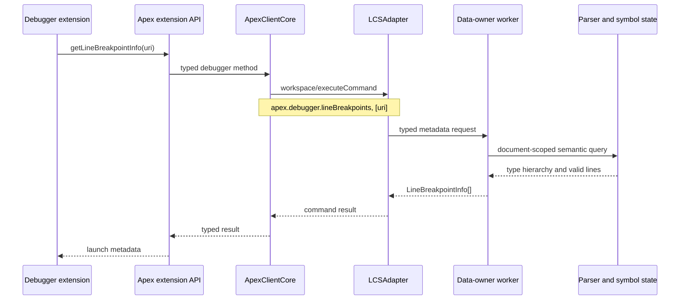

# Apex Debugger Command Service Plan

## Objective

Provide the Apex debugger metadata currently supplied by the legacy service,
using standard LSP `workspace/executeCommand` requests. The Apex client exposes
typed convenience methods; debugger extensions consume the Apex VS Code
extension API and do not need to know the LSP command names or payload shape.

The service is document-scoped. Each request receives one canonical Apex file
URI and reads only that document's current parser and symbol state. Namespace
provenance is stored when the document enters the workspace graph; it is never
inferred from source text, a package-directory name, or URI segments.

## Contract

### LSP transport

Both requests use `workspace/executeCommand` with exactly one argument: the
canonical document URI string.

| LSP command | Arguments | Result |
| --- | --- | --- |
| `apex.debugger.lineBreakpoints` | `[uri]` | `LineBreakpointInfo[]` |
| `apex.debugger.exceptionBreakpoints` | `[uri]` | `ExceptionBreakpointInfo[]` |

```ts
type LineBreakpointInfo = {
  uri: string;
  typeref: string;
  lines: number[];
};

type ExceptionBreakpointInfo = {
  uri?: string | null;
  typeref: string;
  label: string;
};
```

`lines` are sorted, unique, and 1-based. `typeref` is opaque debugger bytecode
identity. The server rejects missing, multiple, non-string, unsupported, and
unknown URI arguments. It must not guess a result from raw source text.

### Typed client and extension API

```ts
interface ApexDebuggerCommandSenders {
  getLineBreakpointInfo(uri: string): Promise<LineBreakpointInfo[]>;
  getExceptionBreakpointInfo(uri: string): Promise<ExceptionBreakpointInfo[]>;
}
```

The methods send standard LSP command requests internally:

```ts
sendRequest('workspace/executeCommand', {
  command: 'apex.debugger.lineBreakpoints',
  arguments: [uri]
});
```

The VS Code extension activates asynchronously and returns a materialized
`ApexExtensionApi` with `client: ApexClient`. Consumers call the same two typed
methods on that client; activation does not expose debugger-specific wrappers
or a no-client fallback.

### Namespace behavior

The URI determines the document to inspect; its namespace comes from persisted
document provenance.

| Source provenance | Namespace source | Fallback |
| --- | --- | --- |
| Project source | top-level `sfdx-project.json.namespace` | empty namespace |

Package-directory names, including `force-app`, are never namespaces. Type
ownership and nesting come from the parser and symbol graph. The projection is:

| Artifact | Namespace | Type | Debugger `typeref` |
| --- | --- | --- | --- |
| Class | none | `Outer` | `Outer` |
| Class | `acme` | `Outer` | `acme/Outer` |
| Inner class | `acme` | `Outer.Inner` | `acme/Outer$Inner` |
| Trigger | none | `AccountTrigger` | `__sfdc_trigger/AccountTrigger` |
| Trigger | `acme` | `AccountTrigger` | `__sfdc_trigger/acme/AccountTrigger` |

System exception typerefs remain `com/salesforce/api/exception/<Name>` and
labels remain `System.<Name>`.

## Architecture



The data-owner worker owns workspace document, namespace, and symbol state.
The coordinator only validates and routes the standard LSP command. Standard
library exception discovery remains behind the resource-loader boundary.

## Compatibility Decisions

- `typeref` preserves the legacy debugger bytecode contract: project namespace
  segments use `/`, nested type segments use `$`, and trigger types use
  `__sfdc_trigger/`.
- Namespace provenance is exclusively the top-level
  `sfdx-project.json.namespace`. `.sfdx/tools/installed-packages` is not read
  or supported; its legacy workspace-discovery fixtures do not apply to this
  document-scoped API.
- Incomplete source returns only locations confirmed by the parser. The service
  never derives semantic facts from raw text.
- Trigger units are the single source of trigger declaration and scope
  ownership. Nested trigger classes and exceptions retain trigger bytecode
  identity.

## Prioritized Tasks

### P0: Establish public command and client contracts

1. Add debugger command-name constants, result types, and typed command
   argument helpers to `apex-lsp-shared`.
   - Define the two command names and `LineBreakpointInfo` /
     `ExceptionBreakpointInfo` interfaces.
   - Define a URI-only argument decoder that validates exactly one string.
   - Keep `APEX_METHODS` unchanged because it is the registry for custom
     `apex/*` messages, not standard LSP commands.

2. Advertise commands in server capabilities.
   - Add both commands to `executeCommandProvider.commands` in production and
     development capabilities.
   - Ensure this capability is available to desktop and web clients unless a
     concrete runtime limitation is discovered.

3. Add the `ApexDebuggerCommandSenders` client surface.
   - Create a focused factory in `apex-lsp-client`, parallel to the existing
     typed `apex/*` method surface.
   - Implement both convenience methods over `workspace/executeCommand` with
     `[uri]` as the complete argument list.
   - Compose the surface into `ApexClientCore` and export it from the browser
     and Node package entry points.

Acceptance criteria:

- A client can call both typed methods without referencing a command string or
  `ExecuteCommandParams`.
- The raw JSON-RPC transport is standard `workspace/executeCommand`.
- Client tests prove command name, URI argument, result passthrough, and error
  propagation.

### P0: Make namespace provenance available to semantic requests

4. Extend workspace ingestion metadata with document provenance.
   - Add optional source-kind and debugger namespace fields to workspace file
     metadata/wire types.
   - Preserve them in compressed batches, the data-owner document store, and
     lifecycle updates for opened, changed, saved, and loaded documents.
   - Ensure canonical URI normalization occurs before metadata lookup.

5. Resolve project namespace metadata in the extension.
   - Read the top-level project namespace from `sfdx-project.json` once for a
     workspace-load session and apply it to project-source documents.
    - Missing, malformed, and unreadable project manifests produce an empty
      namespace. Do not infer namespace from folders.

Acceptance criteria:

- `force-app` never appears in a typeref merely because it is a path segment.
- Metadata is available from the data owner for unsaved open documents and
  workspace-loaded documents.

### P1: Implement data-owner debugger metadata queries

6. Add dedicated data-owner worker request schemas and dispatcher methods.
   - Add typed requests for line-breakpoint and exception-breakpoint metadata.
   - Route them directly to `dataOwnerRead`; do not route through the generic
     LSP request dispatcher or use coordinator-local symbol state.
   - Extend `WorkerCoordinator` with a typed debugger metadata dispatch API.
   - Implement the same service against the local symbol manager for the
     non-worker fallback path.

7. Implement parser-owned line-breakpoint collection.
   - Add a parse-tree visitor/listener that identifies grammar-defined
     executable breakpoint locations for the requested document.
   - Associate candidate lines with the containing type using parser/symbol
     ownership and collect outer and nested types separately.
   - Construct type references from source kind, parser-derived nesting, and
     data-owner namespace provenance.
   - Sort and deduplicate lines and records deterministically.
   - Define incomplete-parser behavior explicitly: return only stable,
     parser-confirmed results; never derive semantic locations using text
     heuristics.

8. Implement parser- and symbol-backed exception discovery.
   - Identify exception classes declared in the requested document through
     resolved superclass ancestry, including nested and indirect subclasses.
   - Centralize the exception-ancestry logic currently duplicated by semantic
     validators if practical, so debugger and diagnostics agree.
   - Retrieve system exception types through the resource-loader-owned standard
     library state, then append them to document-defined exceptions.
   - Produce opaque user typerefs using document namespace provenance and sort
     all results by label with a stable typeref tie-breaker.

Acceptance criteria:

- No debugger semantic result depends on raw-source regex or filename-derived
  namespace logic.
- All returned user-defined records match the requested canonical URI.
- System exceptions have no URI and use the required fixed typeref prefix.

### P1: Route standard commands to the data owner

9. Add debugger-command routing to `LCSAdapter`.
   - Continue registering only `workspace/executeCommand`.
   - Validate the command and URI argument at the LSP boundary.
   - Send debugger commands through the data-owner dispatcher from task 6.
   - Add request spans, duration and result-count attributes, and structured
     errors without logging source contents.

10. Add debugger command handlers only where needed.
   - Do not force these document-scoped commands through the existing
     coordinator-only `ExecuteCommandProcessingService`, because the
     coordinator does not own the complete workspace graph in worker mode.
   - Keep command dispatch logic narrow and typed; no stringly typed generic
     metadata request is needed beyond the LSP command selection.

Acceptance criteria:

- `workspace/executeCommand` is the sole server endpoint.
- Worker and non-worker modes return equivalent results for the same stable
  document state.
- Unknown commands maintain the existing error behavior.

### P2: Expose the VS Code debugger API

11. Return a materialized typed client from extension activation.
    - Update `apex-lsp-vscode-extension` activation to resolve only after its
      language client exists.
    - Return `ApexExtensionApi` with `client: ApexClient`.
    - Export the extension API type from the package entry point.

12. Verify downstream debugger adoption.
   - Update the Apex extension dependency/identity integration so the
     interactive and replay debugger extensions obtain this API instead of the
     legacy language extension.
   - Preserve existing launch-time snapshot semantics: callers fetch metadata
     during debug-configuration resolution and adapters retain their session
     mapping until the next launch.
   - Update debugger call sites to pass `vscode.Uri.toString()` for each source
     file whose metadata they need; aggregate/deduplicate system exceptions by
     typeref when querying several documents.

Acceptance criteria:

- Debugger extensions do not call raw JSON-RPC or know command strings.
- The extension API accepts URI strings only and is usable by Node and web
  extension hosts.

### P0: Test and compatibility gate

13. Build contract and unit tests before downstream adoption.
   - Shared tests: command constants, argument validation, and result types.
   - Client tests: exact standard-LSP method and payload for both commands.
   - Capability tests: commands advertised in production and development.
   - Extension tests: exported API delegation, no-client fallback, and error
     propagation.

14. Add parser/service fixtures.
   - Unnamespaced and namespaced top-level classes.
   - Nested types and nested exception classes.
    - Triggers with and without namespace, including nested trigger classes and
      trigger-defined exceptions.
   - Valid executable lines, comments, declarations, multiline statements, and
     incomplete source.
   - Direct and indirect exception inheritance.
   - Missing and malformed project manifests.

15. Add end-to-end worker-topology and real-server client coverage.
   - Ingest metadata and source into the data owner.
    - Invoke both typed client methods, which send `workspace/executeCommand`.
   - Assert exact result ordering, URI identity, typeref identity, namespace
     behavior, and data-owner dispatch.
    - Cover non-worker adapter routing with real compiler/symbol fixtures.

16. Establish compatibility fixtures from the legacy implementation.
   - Obtain representative expected responses from the original Java debugger
     service for equivalent source fixtures.
    - Treat exact type-reference encoding and valid-line behavior as the
      compatibility gate before rollout. Exclude installed-package discovery;
      it is intentionally unsupported by this API.

## Dependencies and Delivery Order

| Order | Work | Depends on |
| --- | --- | --- |
| 1 | Shared contracts and command capabilities | None |
| 2 | Typed Apex client methods | Shared contracts |
| 3 | Namespace provenance ingestion | Shared metadata contracts |
| 4 | Data-owner metadata requests and services | Namespace provenance |
| 5 | `workspace/executeCommand` routing | Data-owner requests |
| 6 | VS Code extension exports | Typed Apex client methods |
| 7 | Downstream debugger migration | Extension API and compatibility fixtures |

The line- and exception-metadata services may be developed in parallel after
task 4. Downstream debugger migration must wait until both services, namespace
provenance, and compatibility fixtures are complete.

## Verification

Run the focused package suites while implementing, then the full affected
workspace verification:

```sh
npm test --workspace @salesforce/apex-lsp-shared
npm test --workspace @salesforce/apex-lsp-client
npm test --workspace @salesforce/apex-ls
npm test --workspace apex-language-server-extension
npm run typecheck --workspaces
npm run lint --workspaces
```

Before release, run an integration workspace that starts the server, loads
project fixtures, invokes both standard LSP commands, and
compares their results with legacy-service fixture outputs.
