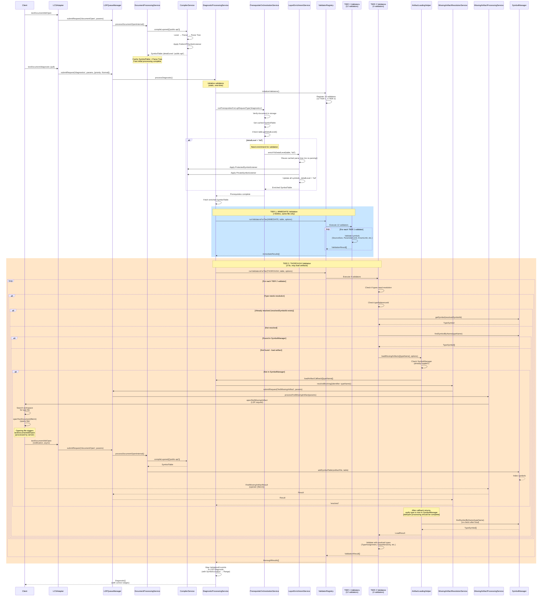

# Apex Parser & AST (`@salesforce/apex-parser-ast`)

This package is the foundational component of the Apex Language Server responsible for parsing Apex source code and constructing an Abstract Syntax Tree (AST). This AST is a specialized `SymbolTable` that provides a structured, hierarchical representation of the code, enabling advanced language features like code completion, navigation, and semantic analysis.

## Core Concepts

The package is built around a few core concepts that work together to turn raw source code into a meaningful data model.

- **`CompilerService`**: The main entry point and orchestrator for the parsing process. It manages the entire pipeline, from receiving the source code to returning a final compilation result.
- **`SymbolTable`**: The primary data structure produced by this package. It's a hierarchical collection of `ApexSymbol` objects organized by `parentId` relationships that mirrors the lexical scoping of the source code (file > class > method > block). It contains every symbol found in the file and allows for efficient lookup and scope-aware queries.
- **`ApexSymbol`**: A generic data structure representing a single named entity in the code, such as a class, interface, method, property, or variable. Specialized versions (`TypeSymbol`, `MethodSymbol`, `VariableSymbol`, `ScopeSymbol`) extend this base structure to hold relevant metadata.
- **`ScopeSymbol`**: A specialized `ApexSymbol` representing a lexical scope (class body, method body, block, control structure, etc.). The system defines 15 distinct scope types, each with its own subclass. Scope symbols use `parentId` relationships to establish containment hierarchies.
- **Parser Listeners**: Classes that subscribe to events emitted by the ANTLR parser as it traverses the parse tree. The key listeners include:
  - `ApexSymbolCollectorListener`: The full listener that collects symbols and references, using a stack-based approach to track scopes during parsing and builds the `SymbolTable` with proper parent-child relationships.
  - `ApexReferenceCollectorListener`: A dedicated listener for capturing symbol references independently of symbol declaration.
  - Layered Listeners (`PublicAPISymbolListener`, `ProtectedSymbolListener`, `PrivateSymbolListener`): Specialized listeners for progressive symbol collection based on visibility levels.
- **`ResourceLoader`**: A singleton service that manages the Standard Apex Library using an in-memory file system (memfs). It provides access to compiled symbol tables and source code for standard Apex classes like `System`, `Database`, `Schema`, etc.

## Architecture and Workflow

The package uses a classic compiler front-end architecture based on the ANTLR parser-generator tool.

1.  **Orchestration**: A consumer (like a language server) invokes the `CompilerService.compile()` method, passing in the Apex source code and a listener instance.
2.  **ANTLR Pipeline**: The `CompilerService` sets up the ANTLR pipeline:
    - The source code is fed into an `ApexLexer`, which performs lexical analysis, breaking the string into a sequence of tokens.
    - The tokens are passed to an `ApexParser`, which builds a concrete Parse Tree based on the Apex grammar.
3.  **Tree Traversal**: A `ParseTreeWalker` traverses the generated parse tree node by node.
4.  **Event-Driven Analysis**: As the walker visits each node (e.g., a class declaration), it triggers the corresponding method on the provided listener (e.g., `enterClassDeclaration`).
5.  **Symbol Table Construction**: The `ApexSymbolCollectorListener` responds to these events using a stack-based scope tracking system:
    - When entering a scope (like a class), it creates both the semantic symbol (e.g., `ClassSymbol`) and a block symbol (e.g., `ClassScopeSymbol`), then pushes the block symbol onto a scope stack
    - When finding a symbol (like a method), it creates the symbol and adds it to the `SymbolTable` with the current scope from the stack, establishing parent-child relationships via `parentId`
    - When leaving a scope, it pops the block symbol from the stack
    - All symbols are stored in the `SymbolTable` with containment determined by `parentId` relationships, not explicit scope containers
6.  **Result**: Once the traversal is complete, the listener's `getResult()` method returns the fully constructed `SymbolTable`, which is then packaged into a `CompilationResult` object and returned to the consumer.

## Scope Symbol System Architecture

The scope symbol system is a fundamental architectural component that provides a hierarchical representation of lexical scoping in Apex code. This system enables accurate symbol resolution, scope-aware lookups, and proper containment relationships between symbols.

### Design Philosophy

The scope symbol system uses a **stack-based approach** for tracking scopes during parsing, combined with a **parentId-based containment model** for symbol relationships. This design separates scope tracking (temporary, during parsing) from symbol storage (permanent, in the SymbolTable).

### Core Components

#### 1. Scope Symbol Hierarchy

Every lexical scope in Apex code is represented by a `ScopeSymbol` instance. The system defines 15 distinct scope types, differentiated by the `scopeType` property:

- **`'file'`**: Root scope representing the entire file
- **`'class'`**: Body scope for classes, interfaces, enums, and triggers
- **`'method'`**: Body scope for methods and constructors
- **`'block'`**: Generic anonymous blocks (fallback)
- **Control Flow Scopes**: `'if'`, `'while'`, `'for'`, `'doWhile'`
- **Exception Handling Scopes**: `'try'`, `'catch'`, `'finally'`
- **Switch Scopes**: `'switch'`, `'when'`
- **Property Scopes**: `'getter'`, `'setter'`
- **Special Scopes**: `'runAs'`

All scope symbols are instances of the `ScopeSymbol` class, which implements `ApexSymbol` with `kind: SymbolKind.Block`. The `scopeType` property distinguishes between different scope types.

#### 2. Stack-Based Scope Tracking

During parsing, `ApexSymbolCollectorListener` maintains a `scopeStack: Stack<ApexSymbol>` to track the current scope:

```typescript
// When entering a class declaration
enterClassDeclaration(ctx: ClassDeclarationContext): void {
  // 1. Create the class symbol (semantic symbol)
  const classSymbol = this.createTypeSymbol(...);
  this.symbolTable.addSymbol(classSymbol, this.getCurrentScopeSymbol());

  // 2. Create the class block symbol (scope container)
  const blockSymbol = this.createBlockSymbol('block1', 'class', location, parentScope, className);

  // 3. Push block symbol onto stack
  this.scopeStack.push(blockSymbol);
}

// When exiting a class declaration
exitClassDeclaration(): void {
  // Pop the class block from stack
  const popped = this.scopeStack.pop();
  // Validation ensures it's the expected scope type
}
```

**Key Characteristics:**

- The stack reflects the current parsing context (innermost scope at the top)
- Block symbols are pushed when entering scopes and popped when exiting
- The stack is used only for tracking during parsing, not for permanent storage
- No explicit `enterScope()`/`exitScope()` calls to SymbolTable - scope management is handled via the stack

#### 3. Parent-Child Relationships via parentId

Containment relationships are established through the `parentId` property, not through explicit scope containers:

```typescript
// Symbol containment is determined by parentId
classSymbol.parentId = null; // Top-level symbol
methodSymbol.parentId = classBlock.id; // Method belongs to class block
variableSymbol.parentId = methodBlock.id; // Variable belongs to method block
```

**Hierarchical Structure Example:**

```
File (implicit root)
└── ClassSymbol (parentId: null)
    └── ClassBlockSymbol (parentId: ClassSymbol.id)
        └── MethodSymbol (parentId: ClassBlockSymbol.id)
            └── MethodBlockSymbol (parentId: MethodSymbol.id)
                └── VariableSymbol (parentId: MethodBlockSymbol.id)
```

#### 4. Semantic Symbols vs. Block Symbols

The system distinguishes between **semantic symbols** (the actual code entities) and **block symbols** (their scope containers):

- **Semantic Symbols**: `ClassSymbol`, `MethodSymbol`, `VariableSymbol`, etc. - represent the actual declarations
- **Block Symbols**: `ScopeSymbol` instances with different `scopeType` values - represent the lexical scopes that contain symbols

**Relationship Pattern:**

- Class/Interface/Enum/Trigger: `ClassSymbol` → `ClassBlockSymbol` (block's `parentId` points to semantic symbol)
- Method/Constructor: `MethodSymbol` → `MethodBlockSymbol` (block's `parentId` points to method symbol)
- Control structures: Only block symbols exist (no semantic symbol)

**Example:**

```typescript
// Class declaration creates two symbols:
// 1. ClassSymbol: id = "file:///MyClass.cls:class:MyClass"
// 2. ClassBlockSymbol: id = "file:///MyClass.cls:class:MyClass:block1", parentId = ClassSymbol.id

// Method declaration creates two symbols:
// 1. MethodSymbol: id = "file:///MyClass.cls:class:MyClass:block1:method:myMethod", parentId = ClassBlockSymbol.id
// 2. MethodBlockSymbol: id = "file:///MyClass.cls:class:MyClass:block1:method:myMethod:block2", parentId = MethodSymbol.id
```

#### 5. Symbol ID Generation

Symbol IDs use a URI-based format that includes scope path information:

**Format:** `fileUri:scopePath:prefix:name`

**Components:**

- `fileUri`: The file containing the symbol (e.g., `file:///path/MyClass.cls`)
- `scopePath`: Colon-separated path from root to current scope (e.g., `class:MyClass:block1`)
- `prefix`: Symbol kind or scope type (e.g., `class`, `method`, `block`)
- `name`: Symbol name (e.g., `myMethod`)

**Examples:**

```
Class:        file:///MyClass.cls:class:MyClass
Class Block: file:///MyClass.cls:class:MyClass:block1
Method:      file:///MyClass.cls:class:MyClass:block1:method:myMethod
Method Block: file:///MyClass.cls:class:MyClass:block1:method:myMethod:block2
Variable:    file:///MyClass.cls:class:MyClass:block1:method:myMethod:block2:variable:x
```

**Scope Path Construction:**

- Includes root symbol's prefix and name (e.g., `class:MyClass`)
- Includes intermediate block names (e.g., `block1`, `block2`)
- Uses colons as separators for consistency
- Method blocks append directly to method symbol's path

#### 6. SymbolTable Integration

The `SymbolTable` class manages all symbols using a parentId-based containment model:

**Key Methods:**

- `addSymbol(symbol, currentScope)`: Adds a symbol and sets `parentId` based on `currentScope`
- `getSymbolsInScope(scopeId)`: Returns all symbols where `parentId === scopeId`
- `getCurrentScopePath(parentScope)`: Builds the scope path for ID generation
- `findSymbolInScope(scopeId, name)`: Finds a symbol by name within a specific scope

**Containment Resolution:**

```typescript
// Symbols are contained by their parentId, not by explicit scope containers
const classBlock = symbolTable.findSymbolById(classBlockId);
const methods = symbolTable
  .getAllSymbols()
  .filter((s) => s.parentId === classBlock.id && s.kind === SymbolKind.Method);
```

#### 7. Block Counter System

Anonymous blocks (like generic blocks, if statements, loops) use a counter-based naming scheme:

```typescript
this.blockCounter++; // Increment for each new block
const blockName = `block${this.blockCounter}`; // e.g., "block1", "block2"
```

Control flow blocks use descriptive prefixes:

- `if_1`, `if_2`, etc. for if statements
- `while_1`, `while_2`, etc. for while loops
- `for_1`, `for_2`, etc. for for loops
- Similar patterns for try/catch/finally, switch/when, etc.

### Scope Lifecycle

The complete lifecycle of a scope during parsing:

1. **Enter Scope**: Parser enters a scope (e.g., class body)
   - Create semantic symbol (if applicable)
   - Create block symbol with appropriate `scopeType`
   - Set `parentId` relationships
   - Push block symbol onto `scopeStack`
   - Add both symbols to `SymbolTable`

2. **Within Scope**: Parser processes symbols within the scope
   - Symbols are added with `currentScope` from stack
   - `parentId` is automatically set to current scope's ID

3. **Exit Scope**: Parser exits the scope
   - Pop block symbol from `scopeStack`
   - Validate scope type matches expected type
   - Stack now reflects the parent scope

### Benefits of This Design

1. **Separation of Concerns**: Scope tracking (stack) is separate from symbol storage (SymbolTable)
2. **Efficient Lookups**: ParentId-based containment enables O(1) parent resolution and efficient scope queries
3. **Type Safety**: Each scope type has its own subclass, enabling type-safe operations
4. **Accurate Scoping**: Mirrors the actual lexical scoping of Apex code
5. **Flexible Hierarchy**: Supports arbitrary nesting of scopes (classes, methods, blocks, control structures)
6. **Unique Identification**: URI-based IDs ensure global uniqueness while remaining human-readable

### Usage Examples

**Finding symbols in a scope:**

```typescript
const classBlock = symbolTable.findSymbolById(classBlockId);
const methods = symbolTable
  .getSymbolsInScope(classBlock.id)
  .filter((s) => s.kind === SymbolKind.Method);
```

**Traversing the scope hierarchy:**

```typescript
let currentScope: ScopeSymbol | null = methodBlock;
const path: string[] = [];
while (currentScope) {
  path.unshift(currentScope.name);
  currentScope = currentScope.parentId
    ? (symbolTable.findSymbolById(currentScope.parentId) as ScopeSymbol)
    : null;
}
// path: ['file', 'MyClass', 'block1', 'myMethod', 'block2']
```

**Resolving a symbol's scope:**

```typescript
const variable = symbolTable.findSymbolByName('x');
const parentScope = variable.parentId
  ? (symbolTable.findSymbolById(variable.parentId) as ScopeSymbol)
  : null;
// parentScope is the method block containing the variable
```

## Directory Structure

- `src/parser/`: Contains the ANTLR-driven parsing infrastructure.
  - `compilerService.ts`: The high-level `CompilerService` that orchestrates the process.
  - `listeners/`: Home to the various parser listeners:
    - `ApexSymbolCollectorListener`: The full listener that builds the symbol table
    - `ApexReferenceCollectorListener`: Dedicated listener for reference collection
    - Layered listeners (`PublicAPISymbolListener`, `ProtectedSymbolListener`, `PrivateSymbolListener`): Progressive symbol collection
    - `ApexErrorListener`: Collects syntax errors
  - `references/`: Reference resolution services:
    - `ApexReferenceResolver.ts`: Standalone service for resolving references to symbols
- `src/types/`: Defines the core data model for the AST.
  - `symbol.ts`: Defines the `ApexSymbol` hierarchy and the `SymbolTable` / `SymbolScope` classes.
  - `typeInfo.ts`: Defines structures for representing type information.
- `src/semantics/`: Contains modules for performing semantic analysis and validation on the AST after it's built.
  - `validation/`: 2-tier semantic validation system:
    - `ValidatorRegistry.ts`: Central registry for managing validators
    - `ValidationTier.ts`: Defines IMMEDIATE (TIER 1) and THOROUGH (TIER 2) tiers
    - `ValidationResult.ts`: Structured validation results with location-aware errors
    - `ValidatorInitialization.ts`: Validator registration and initialization
    - `ErrorCodes.ts`: Centralized error code constants aligned with Jorje (old LS)
    - `ArtifactLoadingHelper.ts`: Cross-file type resolution and artifact loading
    - `validators/`: 16 validator implementations (12 TIER 1, 4 TIER 2)
  - `i18n/`: Internationalization support for error messages:
    - `I18nSupport.ts`: Message formatting and parameter substitution
  - `generated/`: Auto-generated TypeScript modules (do not edit):
    - `messages_en_US.ts`: English messages from Jorje (generated from .properties)
- `resources/`: Externally acquired data files:
  - `messages_en_US.properties`: Source message file copied from Jorje
- `src/utils/`: Contains utility classes including the `ResourceLoader` for managing the Standard Apex Library.
  - `resourceLoader.ts`: Singleton service that manages standard Apex classes using memfs for in-memory file storage.
- `src/generated/`: Contains the lexer and parser code automatically generated by ANTLR from a grammar file (not present in this repo, but a standard part of the build process).
- `src/index.ts`: The public API entry point for the package, exporting all consumable classes and types.

## Overview

This package provides parser utilities, AST generation, and analysis tools for Apex code that are used by other packages in the Apex Language Server ecosystem. It includes:

- Parser utilities for Apex code
- **2-tier semantic validation system** with 16 validators (aligned with Jorje error codes)
- Semantic analysis tools
- Type definitions
- Abstract syntax tree (AST) generation and manipulation
- Annotation parsing and validation
- Symbol collection and scope management
- Namespace handling and FQN (Fully Qualified Name) resolution
- Error handling and reporting

## Dependencies

- `@apexdevtools/apex-parser`: For parsing Apex code
- `antlr4ts`: ANTLR runtime for TypeScript

## Usage

```typescript
import {
  ApexSymbolCollectorListener,
  ApexReferenceCollectorListener,
  ApexReferenceResolver,
  AnnotationValidator,
  AnnotationUtils,
  CompilerService,
} from '@salesforce/apex-lsp-parser-ast';

// Use the compiler service to parse and analyze code
const compiler = new CompilerService();
const listener = new ApexSymbolCollectorListener();
const result = compiler.compile(fileContent, fileName, listener);

// Access the symbol table and any errors/warnings
const symbolTable = result.result;
const errors = result.errors;
const warnings = result.warnings;

// References are automatically collected and resolved by ApexSymbolCollectorListener
// For custom reference handling, use the dedicated components:
const referenceCollector = new ApexReferenceCollectorListener(symbolTable);
const referenceResolver = new ApexReferenceResolver();
referenceResolver.resolveSameFileReferences(symbolTable, fileName);

// Use annotation utilities to work with annotations
const isTestClass = AnnotationUtils.isTestClass(classSymbol);
const resourceUrl = AnnotationUtils.getRestResourceUrlMapping(classSymbol);

// Validate annotations for correctness
AnnotationValidator.validateAnnotations(symbol, context, errorReporter);

// Run semantic validators
import {
  initializeValidators,
  runValidatorsForTier,
  ValidationTier,
  ValidatorRegistryLive,
} from '@salesforce/apex-lsp-parser-ast';
import { Effect } from 'effect';

// Initialize validators (typically done automatically)
await Effect.runPromise(
  initializeValidators().pipe(Effect.provide(ValidatorRegistryLive)),
);

// Run TIER 1 validators (fast, same-file only)
const immediateResults = await Effect.runPromise(
  runValidatorsForTier(ValidationTier.IMMEDIATE, symbolTable, {
    tier: ValidationTier.IMMEDIATE,
    allowArtifactLoading: false,
    maxDepth: 1,
    maxArtifacts: 5,
    timeout: 5000,
  }),
);

// Process validation results
for (const result of immediateResults) {
  if (!result.isValid) {
    for (const error of result.errors) {
      const message = typeof error === 'string' ? error : error.message;
      const location = typeof error === 'string' ? undefined : error.location;
      const code = typeof error === 'string' ? undefined : error.code;
      console.log(
        `Error [${code}]: ${message} at ${location?.symbolRange.startLine}`,
      );
    }
  }
}
```

## Features

### Reference Capture

The package provides **comprehensive reference capture** with 95%+ coverage of all identifier usage in Apex code:

#### **Complete Expression Coverage**

- **Primary expressions**: Simple variable references like `myVariable`
- **Assignment expressions**: Both left-hand and right-hand sides of assignments
- **Array expressions**: Array access like `myArray[index]`
- **Cast expressions**: Type casting like `(String) myVariable`
- **Arithmetic expressions**: Math operations like `a + b`, `a * b`
- **Comparison expressions**: Comparisons like `a > b`, `a == b`
- **Logical expressions**: Logical operations like `a && b`, `a || b`
- **Bitwise expressions**: Bit operations like `a & b`, `a << b`
- **Unary expressions**: Increment/decrement like `++a`, `a++`
- **Conditional expressions**: Ternary operators like `a ? b : c`
- **Instanceof expressions**: Type checking like `a instanceof String`

#### **LSP Features**

- **Go to Definition**: Works for all variable usage, not just declarations
- **Find References**: Captures all usages including parameters and operands
- **Hover**: Rich information for all identifier references
- **Rename**: Comprehensive reference tracking for accurate renaming
- **Code Completion**: Context-aware suggestions for all expression types

#### **Performance**

- **No performance regression** - Parse time and memory usage maintained
- **Efficient reference storage** with minimal overhead
- **Scalable for large codebases** with thousands of references

#### **Separated Reference Collection and Resolution Architecture**

The package provides a **modular reference processing system** that separates reference collection from resolution, enabling flexible and reusable reference handling across different symbol collection strategies:

##### **Components**

- **`ApexReferenceCollectorListener`**: A dedicated listener that captures symbol references during parse tree walk. Can be used independently or alongside symbol declaration listeners. Works with any `SymbolTable`, regardless of how symbols were collected.
- **`ApexReferenceResolver`**: A standalone service that resolves symbol references to their definitions. Works with any `SymbolTable` and provides consistent resolution logic across all listeners (full and layered).

##### **Benefits**

- **Separation of Concerns**: Reference capture/resolution is independent of symbol declaration
- **Reusability**: All layers can use the same reference resolution logic
- **Consistency**: Same resolution process across full and layered listeners
- **Flexibility**: Can be applied to any `SymbolTable` regardless of detail level
- **Progressive Enhancement**: Resolve references as more symbols become available across layers

##### **Usage**

```typescript
import {
  CompilerService,
  ApexReferenceCollectorListener,
  ApexReferenceResolver,
  PublicAPISymbolListener,
} from '@salesforce/apex-lsp-parser-ast';

const compilerService = new CompilerService();

// Option 1: Full listener with references (default behavior)
const fullListener = new ApexSymbolCollectorListener();
const result = compilerService.compile(content, fileName, fullListener);
// References are automatically collected and resolved

// Option 2: Layered compilation with references
const layeredResult = compilerService.compileLayered(
  content,
  fileName,
  ['public-api', 'protected'],
  undefined,
  { collectReferences: true, resolveReferences: true },
);

// Option 3: Collect references separately
const symbolTable = new SymbolTable();
const publicListener = new PublicAPISymbolListener(symbolTable);
const referenceCollector = new ApexReferenceCollectorListener(symbolTable);

// Walk parse tree for symbols
walker.walk(publicListener, parseTree);

// Walk parse tree again for references (parse tree reuse is efficient)
walker.walk(referenceCollector, parseTree);

// Resolve references
const resolver = new ApexReferenceResolver();
resolver.resolveSameFileReferences(symbolTable, fileName);
```

##### **Reference Collection**

The `ApexReferenceCollectorListener` captures all types of references:

- Method calls (qualified and unqualified)
- Constructor calls
- Type references (declarations, parameters, return types)
- Field/property access
- Variable usage
- Chain expressions (e.g., `obj.method().field`)
- Array expressions, cast expressions, etc.

##### **Reference Resolution**

The `ApexReferenceResolver` provides:

- **Context Correction**: Fixes misclassified references (e.g., VARIABLE_USAGE → CLASS_REFERENCE)
- **Same-File Resolution**: Resolves references to their symbol definitions within the same file
- **Scope-Aware Lookup**: Uses scope hierarchy for accurate symbol resolution
- **Chain Resolution**: Resolves chained expressions to their final targets

#### **Variable Declaration**

The package provides **comprehensive variable declaration handling**:

- **Accurate Duplicate Detection**: Properly handles multiple variables in single statements (e.g., `Integer x = 1, y = 2, z = 3;`) while preventing true duplicates
- **For Loop Variable Support**: Captures variables declared in traditional for loops (e.g., `for (Integer i = 0; i < 5; i++)`)
- **For-Each Loop Support**: Captures variables in enhanced for loops (e.g., `for (String item : items)`)
- **No Double Processing**: Variables are processed exactly once with proper context
- **Proper Scope Management**: Variables are placed in correct scopes with accurate location information

### Error Handling

The package provides comprehensive error handling:

- **Syntax Errors**: Captures and reports syntax errors during parsing
- **Semantic Errors**: Detects and reports semantic issues in the code
- **Warning System**: Supports both errors and warnings with different severity levels
- **Structured Error Reporting**: Errors include file path, line number, column, and detailed messages

### Symbol Collection

Comprehensive symbol collection and scope management:

- **Hierarchical Scopes**: Maintains a tree of symbol scopes for accurate symbol resolution
- **Symbol Lookup**: Efficient symbol lookup through nested scopes
- **Scope Navigation**: Easy navigation between parent and child scopes
- **Symbol Table Management**: Comprehensive API for managing symbols and their relationships

### Namespace Support

Robust namespace handling:

- **Global Namespaces**: Support for global namespace resolution
- **Module Namespaces**: Handling of module-specific namespaces
- **FQN Resolution**: Tools for resolving fully qualified names
- **Namespace Validation**: Validation of namespace usage and relationships

### Annotation Support

The package provides comprehensive support for Apex annotations:

- **Parsing**: Automatically extracts annotations and their parameters from Apex code
- **Validation**: Validates annotations for correct usage and reports errors for:
  - Invalid targets (e.g., using method-only annotations on classes)
  - Missing required parameters
  - Unrecognized parameters
  - Conflicting annotations
- **Utilities**: Helper functions for working with annotations, such as:
  - Checking if a symbol has specific annotations
  - Extracting parameter values from annotations
  - Specialized functions for common annotations like `@isTest` and `@RestResource`

### Inheritance Relationship Handling

The parser captures inheritance relationships between types:

- **Class Inheritance**: Correctly captures parent classes through the `extends` keyword
- **Interface Implementation**: Records interfaces implemented by classes through the `implements` keyword
- **Interface Extension**: Tracks interfaces extended by other interfaces
- **Symbol Information**: Provides easy access to inheritance information through the `TypeSymbol` interface:
  - `superClass`: The parent class that a class extends (if any)
  - `interfaces`: Interfaces implemented by a class or extended by an interface
- **Ancestor Chain**: Utilities to get the complete chain of ancestors for any type

## Semantic Validation

The package provides a comprehensive **2-tier semantic validation system** that performs deep semantic analysis on Apex code. This system validates code correctness beyond syntax, checking type compatibility, inheritance rules, method signatures, and other semantic constraints.

### Overview

The semantic validation system operates in two tiers:

- **TIER 1 (IMMEDIATE)**: Fast validations that run on every keystroke (PublishDiagnostics). Must complete in <500ms and operate on same-file data only.
- **TIER 2 (THOROUGH)**: Comprehensive validations that run on save or explicit request (Pull Diagnostics). Can take 2-5 seconds and may load missing artifacts for cross-file analysis.

### Architecture

The validation system consists of:

- **`ValidatorRegistry`**: Central registry for managing validators with Effect-based execution
- **`Validator` Interface**: Standard interface all validators implement
- **`ValidationResult`**: Structured result with location-aware errors and warnings
- **`ErrorCodes`**: Centralized error code constants maintaining parity with Jorje (old LS)
- **`I18nSupport`**: Message formatting using Jorje's English messages for consistency
- **`ArtifactLoadingHelper`**: Service for loading missing type definitions across files
- **16 Validators**: 12 TIER 1 validators + 4 TIER 2 validators

### Validators

#### TIER 1 (IMMEDIATE) Validators

Fast, same-file validations that run on every keystroke:

1. **`SourceSizeValidator`**: Validates source file size limits (1M for classes/interfaces/enums/triggers, 32K for anonymous blocks, 3.2M for test anonymous blocks)
2. **`ParameterLimitValidator`**: Validates method parameter count limits (max 32)
3. **`EnumLimitValidator`**: Validates enum constant count limits (max 100)
4. **`EnumConstantNamingValidator`**: Validates enum constant naming conventions
5. **`DuplicateMethodValidator`**: Detects duplicate method signatures (case-insensitive)
6. **`DuplicateFieldValidator`**: Detects duplicate field names within the same class (handles static/non-static distinction)
7. **`ConstructorNamingValidator`**: Validates constructor names match class names
8. **`TypeSelfReferenceValidator`**: Detects self-referencing type declarations
9. **`AbstractMethodBodyValidator`**: Validates abstract methods have no body
10. **`VariableShadowingValidator`**: Detects variable shadowing issues
11. **`ForwardReferenceValidator`**: Validates forward references
12. **`FinalAssignmentValidator`**: Validates final variable assignments

#### TIER 2 (THOROUGH) Validators

Comprehensive validations that may require cross-file analysis:

1. **`MethodSignatureEquivalenceValidator`**: Cross-file method signature validation
2. **`InterfaceHierarchyValidator`**: Interface inheritance validation (circular, missing, duplicate extends)
3. **`ClassHierarchyValidator`**: Class inheritance validation (circular, final, missing superclasses)
4. **`TypeAssignmentValidator`**: Type compatibility validation for variable assignments with cross-file type resolution

### Validation Result Structure

Validators return structured results with location information:

```typescript
interface ValidationErrorInfo {
  message: string;
  location?: SymbolLocation; // Precise source location
  code?: string; // Error code for categorization
}

interface ValidationWarningInfo {
  message: string;
  location?: SymbolLocation;
  code?: string;
}

interface ValidationResult {
  isValid: boolean;
  errors: ValidationErrorInfo[] | string[]; // Supports both formats
  warnings: ValidationWarningInfo[] | string[];
  type?: any; // For expression validation only
}
```

### Type Resolution

TIER 2 validators support cross-file type resolution:

- **`typeReferenceId`**: Links `TypeInfo` to `SymbolReference` objects for efficient lookup
- **`resolvedSymbolId`**: Checks if a type reference is already resolved (O(1) lookup)
- **Artifact Loading**: Dynamically loads missing type definitions via client request/response
  - Validator requests missing artifact via `loadArtifactCallback`
  - Server sends `apex/findMissingArtifact` LSP request to client
  - Client searches workspace and responds with file URI
  - Server compiles artifact and adds to `SymbolManager`
  - Validator can then resolve the type
- **Fallback Resolution**: Uses `symbolManager.findSymbolByName()` when `typeReferenceId` unavailable

### Error Code Alignment with Jorje

The new TypeScript-based Language Server maintains **error code parity** with the old Java-based Language Server (Jorje) for backward compatibility. This ensures that dependent tools and integrations continue to work correctly.

#### Error Code Management

- **`ErrorCodes.ts`**: Central file defining all semantic error code constants
  - Constants use semantic names (e.g., `PARAMETER_LIMIT_EXCEEDED`)
  - Values are Jorje's original error code strings (e.g., `'invalid.number.parameters'`)
  - Used for both diagnostic codes (LSP `diagnostic.code`) and message lookup keys

- **Message Parity**: Error messages come from Jorje's `messages_en_US.properties`
  - **Source Location**: `apex-jorje/apex-jorje-services/src/main/resources/messages_en_US.properties`
  - **Local Copy**: Messages are manually copied to `src/i18n/messages_en_US.properties`
  - **Generation**: Converted to TypeScript at build time via `scripts/generate-messages.mjs`
  - **Usage**: `I18nSupport.getLabel()` performs parameter substitution (`{0}`, `{1}`, etc.)

  **Syncing with Jorje**: To update messages from Jorje:

  ```bash
  # Copy from Jorje repository (adjust path as needed)
  cp /path/to/apex-jorje/apex-jorje-services/src/main/resources/messages_en_US.properties \
     packages/apex-parser-ast/src/i18n/messages_en_US.properties

  # Regenerate TypeScript module
  node packages/apex-parser-ast/scripts/generate-messages.mjs
  ```

#### Maintaining Alignment

When adding new validators or error codes:

1. **Identify Jorje Error Code**: Find the corresponding error code in Jorje's `messages_en_US.properties`
2. **Add to ErrorCodes.ts**: Create a constant with semantic name and Jorje's error code value:
   ```typescript
   export const NEW_ERROR_CODE = 'jorje.error.code.key';
   ```
3. **Add Message**: Copy the message from Jorje's `messages_en_US.properties` to `resources/messages_en_US.properties`
   - **Jorje Source**: `apex-jorje/apex-jorje-services/src/main/resources/messages_en_US.properties`
   - **Local Destination**: `packages/apex-parser-ast/resources/messages_en_US.properties`
4. **Regenerate Messages**: Run the message generation script to update `messages_en_US.ts`:
   ```bash
   node scripts/generate-messages.mjs
   ```
5. **Use in Validator**: Use `ErrorCodes.NEW_ERROR_CODE` and `I18nSupport.getLabel()`:
   ```typescript
   errors.push({
     message: I18nSupport.getLabel(ErrorCodes.NEW_ERROR_CODE, param1, param2),
     code: ErrorCodes.NEW_ERROR_CODE,
     location: symbol.location,
   });
   ```

#### Error Code Format

- **Constants**: UPPER_SNAKE_CASE (e.g., `PARAMETER_LIMIT_EXCEEDED`)
- **Values**: Dot-separated lowercase matching Jorje format (e.g., `'invalid.number.parameters'`)
- **Messages**: English messages from Jorje with parameter placeholders (`{0}`, `{1}`, etc.)

### Usage

```typescript
import {
  initializeValidators,
  ValidatorRegistry,
  runValidatorsForTier,
  ValidationTier,
  ValidationOptions,
  ARTIFACT_LOADING_LIMITS,
  ErrorCodes,
  I18nSupport,
} from '@salesforce/apex-lsp-parser-ast';

// Initialize validators (done automatically in DiagnosticProcessingService)
await Effect.runPromise(
  initializeValidators().pipe(Effect.provide(ValidatorRegistryLive)),
);

// Run validators for a specific tier
const options: ValidationOptions = {
  tier: ValidationTier.THOROUGH,
  allowArtifactLoading: true,
  maxDepth: ARTIFACT_LOADING_LIMITS.maxDepth,
  maxArtifacts: ARTIFACT_LOADING_LIMITS.maxArtifacts,
  timeout: ARTIFACT_LOADING_LIMITS.timeout,
  symbolManager: mySymbolManager,
  sourceContent: document.getText(), // Required for SourceSizeValidator
};

const results = await Effect.runPromise(
  runValidatorsForTier(ValidationTier.IMMEDIATE, symbolTable, options),
);

// Process results
for (const result of results) {
  if (!result.isValid) {
    for (const error of result.errors) {
      const errorMessage = typeof error === 'string' ? error : error.message;
      const location = typeof error === 'string' ? undefined : error.location;
      const code = typeof error === 'string' ? undefined : error.code;
      // Error codes match Jorje format for backward compatibility
      // Use errorMessage, location, and code for diagnostics
    }
  }
}
```

### Sequence Diagram: Document Open → 2-Tier Semantic Validation

The following sequence diagram illustrates the complete flow from client opening a document through 2-tier semantic validation with queue-based processing and layered enrichment:



### Key Features

1. **Automatic Registration**: Validators are automatically registered when `DiagnosticProcessingService` is first instantiated
2. **Location-Aware Errors**: All errors include precise source locations (`SymbolLocation`) mapped to LSP ranges
3. **Error Codes**: Each validator provides error codes for categorization (e.g., `TYPE_MISMATCH`, `CIRCULAR_INHERITANCE`)
4. **Cross-File Resolution**: TIER 2 validators can resolve types across files using `typeReferenceId` and `resolvedSymbolId`
5. **Artifact Loading**: Controlled loading of missing type definitions with limits (maxDepth: 1, maxArtifacts: 5, timeout: 5000ms)
6. **Backward Compatibility**: Supports both structured (`ValidationErrorInfo[]`) and legacy (`string[]`) formats

### Performance Characteristics

- **TIER 1**: <500ms execution time, operates on `SymbolTable` only (no AST traversal)
- **TIER 2**: 2-5 seconds execution time, may load up to 5 artifacts with 1-level depth
- **Memory Efficient**: Validators operate on `SymbolTable` without duplicating AST data
- **Effect-Based**: Built on Effect-TS for composable, type-safe async operations

### Error Codes

Common error codes returned by validators:

- `TYPE_MISMATCH`: Type incompatibility in assignments
- `CIRCULAR_INHERITANCE`: Circular inheritance detected
- `EXTEND_FINAL_CLASS`: Attempting to extend a final class
- `MISSING_SUPERCLASS`: Superclass not found
- `DUPLICATE_METHOD`: Duplicate method signatures
- `PARAMETER_LIMIT_EXCEEDED`: Too many method parameters
- `ENUM_LIMIT_EXCEEDED`: Too many enum constants
- `FINAL_PARAMETER_REASSIGNMENT`: Reassigning final parameter
- `VARIABLE_SHADOWING`: Variable shadows outer scope
- `FORWARD_REFERENCE`: Variable used before declaration

## Development

```bash
# Build the package
npm run build

# Watch for changes during development
npm run dev

# Run tests
npm test
```

## Comment Collection

Comments are collected by default for language server functionality like hover documentation, code completion, and symbol information.

### Usage Examples

```typescript
import {
  CompilerService,
  ApexSymbolCollectorListener,
} from '@salesforce/apex-lsp-parser-ast';

const compilerService = new CompilerService();
const symbolCollector = new ApexSymbolCollectorListener();

// Comments collected by default (recommended for language servers)
const result = compilerService.compile(
  apexCode,
  'MyClass.cls',
  symbolCollector,
);
console.log('Comments found:', result.comments.length);

// Explicitly include comments (same as default)
const resultWithComments = compilerService.compile(
  apexCode,
  'MyClass.cls',
  symbolCollector,
  { includeComments: true },
);

// Opt out of comment collection (for performance-critical scenarios)
const resultWithoutComments = compilerService.compile(
  apexCode,
  'MyClass.cls',
  symbolCollector,
  { includeComments: false },
);
// resultWithoutComments.comments is undefined

// Include single-line comments (default: false)
const resultWithLineComments = compilerService.compile(
  apexCode,
  'MyClass.cls',
  symbolCollector,
  { includeSingleLineComments: true },
);

// Include comment association (requires includeComments: true)
const resultWithAssociations = compilerService.compile(
  apexCode,
  'MyClass.cls',
  symbolCollector,
  {
    includeComments: true,
    associateComments: true,
  },
);

// All options combined
const resultWithAllOptions = compilerService.compile(
  apexCode,
  'MyClass.cls',
  symbolCollector,
  {
    includeComments: true,
    includeSingleLineComments: true,
    associateComments: true,
    projectNamespace: 'MyProject',
  },
);
```

### Comment Types

The parser identifies different types of comments:

- **Line comments**: `// Single line comment` (excluded by default)
- **Block comments**: `/* Multi-line comment */` (included by default)
- **Documentation comments**: `/** JavaDoc style */`, `/// Triple slash` (included when line comments are enabled)

### Comment Collection Behavior

By default, the parser collects block comments but excludes single-line comments. This behavior is optimized for language server use cases where:

- Block comments are more likely to contain meaningful documentation
- Single-line comments are often temporary or implementation-specific
- Reducing noise improves hover documentation and IntelliSense quality

To include single-line comments, set `includeSingleLineComments: true` in the compilation options.

### Standard Apex Library Support

The package includes a `ResourceLoader` that provides access to the Standard Apex Library using an in-memory file system (memfs). This enables comprehensive symbol resolution for standard Apex classes like `System`, `Database`, `Schema`, and many others.

#### ResourceLoader Features

- **In-Memory File System**: Uses memfs for efficient storage and access to standard Apex classes
- **Compiled Artifacts**: Pre-compiled symbol tables for all standard classes
- **Source Code Access**: Retrieve source code for goto definition and hover information
- **Namespace Organization**: Properly organized by namespace (System, Database, Schema, etc.)
- **Statistics and Monitoring**: Comprehensive statistics about loaded resources

#### Maintaining the Standard Apex Library

The Standard Apex Library is located in `src/resources/StandardApexLibrary/` and contains all standard Apex classes organized by namespace. The library is packaged into a ZIP file during the build process for efficient distribution.

**⚠️ CRITICAL WARNING: DO NOT REMOVE BUILTIN CLASSES**

The following 15 classes are **essential builtin classes** stored in `src/resources/builtins/` and merged into `StandardApexLibrary/System/` during ZIP creation. These classes are fundamental to Apex type resolution and **MUST NOT BE REMOVED**:

- `Blob.cls` - Blob primitive type wrapper
- `Boolean.cls` - Boolean primitive type wrapper
- `Date.cls` - Date primitive type wrapper (contains instance methods)
- `DateTime.cls` - DateTime primitive type wrapper
- `Decimal.cls` - Decimal primitive type wrapper
- `Double.cls` - Double primitive type wrapper
- `Id.cls` - Id primitive type wrapper
- `Integer.cls` - Integer primitive type wrapper
- `List.cls` - List collection type
- `Long.cls` - Long primitive type wrapper
- `Map.cls` - Map collection type
- `Object.cls` - Object base type
- `Set.cls` - Set collection type
- `String.cls` - String primitive type wrapper
- `Time.cls` - Time primitive type wrapper (contains instance methods)

**Why these classes are critical:**

- These classes provide the foundation for type resolution in the Apex language server
- They enable proper symbol resolution for primitive types and collections
- Removing them will break type checking, code completion, and symbol resolution
- The `Date.cls` and `Time.cls` files contain important instance methods that differ from the static-only versions

**Maintenance Guidelines:**

1. **Adding new classes**: Add new standard Apex classes to the appropriate namespace folder in `StandardApexLibrary/`
2. **Updating existing classes**: Update class stubs as needed, but preserve the structure and essential methods
3. **Removing classes**: Only remove classes that are confirmed deprecated by Salesforce and have been removed from the platform
4. **Never remove the builtin classes listed above** - they are required for the language server to function correctly
5. **ZIP generation**: After making changes, run `npm run build` to regenerate the ZIP file using `scripts/generate-zip.mjs`
   - The build script automatically merges `builtins/` into `StandardApexLibrary/System/` in the ZIP
   - Builtin classes should only be edited in `builtins/`, not in `StandardApexLibrary/System/`

**Source File Structure:**

```
src/resources/
├── builtins/
│   ├── Blob.cls
│   ├── Boolean.cls
│   ├── Date.cls
│   ├── DateTime.cls
│   ├── Decimal.cls
│   ├── Double.cls
│   ├── Id.cls
│   ├── Integer.cls
│   ├── List.cls
│   ├── Long.cls
│   ├── Map.cls
│   ├── Object.cls
│   ├── Set.cls
│   ├── String.cls
│   └── Time.cls
└── StandardApexLibrary/
    ├── System/
    │   ├── Assert.cls
    │   ├── Database.cls
    │   └── [other System namespace classes, NO builtin classes]
    ├── Database/
    │   └── [Database namespace classes]
    ├── Schema/
    │   └── [Schema namespace classes]
    └── [other namespaces...]
```

**ZIP File Structure (after build):**

The ZIP file contains a merged structure where builtin classes appear in `StandardApexLibrary/System/`:

```
src/resources/StandardApexLibrary/
├── System/
│   ├── [builtin classes from builtins/ merged here]
│   ├── Assert.cls
│   ├── Database.cls
│   └── [other System namespace classes]
├── Database/
│   └── [Database namespace classes]
├── Schema/
│   └── [Schema namespace classes]
└── [other namespaces...]
```

#### Usage

```typescript
import { ResourceLoader } from '@salesforce/apex-lsp-parser-ast';

// Get the singleton instance
const resourceLoader = ResourceLoader.getInstance();

// Wait for initialization and compilation
await resourceLoader.initialize();
await resourceLoader.waitForCompilation();

// Access compiled artifacts
const systemClass = resourceLoader.getCompiledArtifact('System/System.cls');
const databaseClass = resourceLoader.getCompiledArtifact(
  'Database/Database.cls',
);

// Get source code
const sourceCode = await resourceLoader.getFile('System/System.cls');

// Check available classes
const availableClasses = resourceLoader.getAvailableClasses();
const hasSystemClass = resourceLoader.hasClass('System/System.cls');

// Get all files
const allFiles = await resourceLoader.getAllFiles();

// Get statistics
const stats = resourceLoader.getStatistics();
console.log(
  `Loaded ${stats.totalFiles} files, ${stats.compiledFiles} compiled`,
);
```

#### Integration with ApexSymbolManager

The `ApexSymbolManager` automatically integrates with the ResourceLoader to provide comprehensive symbol resolution:

```typescript
import { ApexSymbolManager } from '@salesforce/apex-lsp-parser-ast';

const symbolManager = new ApexSymbolManager();

// Standard Apex classes are automatically resolved
const systemSymbol = symbolManager.resolveSymbol('System');
const databaseSymbol = symbolManager.resolveSymbol('Database');

// Get available standard classes
const standardClasses = symbolManager.getAvailableStandardClasses();
```

## Symbol and Type Reference Support

This package includes first-class symbol and type reference modeling that powers advanced navigation, refactoring, and analysis scenarios. The system is built around a lightweight reference graph layered over `SymbolTable` data, plus a type resolution pipeline.

### Reference Graph and Query APIs

- **Reference graph**: Maintains directed edges between symbols without duplicating symbol storage. Edges carry compact context (e.g., `methodName`, `parameterIndex`, `namespace`).
- **Core queries**:
  - `findReferencesTo(symbol)` and `findReferencesFrom(symbol)`: Retrieve inbound/outbound relationships for any `ApexSymbol` with location and context.
  - `findRelatedSymbols(symbol, relationshipType)`: Filter references by relationship kind.
  - `analyzeDependencies(symbol)`: Get dependencies, dependents, impact score, and circular dependency chains.
  - `detectCircularDependencies()`: Identify cycles in the project reference graph.
  - `findSymbolByName(name)` / `findSymbolByFQN(fqn)` / `findSymbolsInFile(filePath)`.
  - `lookupSymbolWithContext(name, context)`: Resolve ambiguous names with file/scope hints.

#### Reference types

Reference edges capture many relationship kinds, for example:

- Method/constructor calls, static/instance access, property/field access
- Type references, inheritance, interface implementation, enum references
- Annotations, triggers, DML, SOQL/SOSL, web service, remote action, page/component

These enable precise downstream features like Find References, Go to Implementation, and impact analysis.

### Type Reference Resolution

Type names in variables/parameters are resolved post-parse using `NamespaceResolutionService` and a `SymbolProvider` implementation:

- Resolves `TypeInfo` to concrete `ApexSymbol` with a confidence score.
- Handles project namespace, global scope, and standard library namespaces.
- Updates symbols with `resolvedSymbol` and `resolutionConfidence` for consumers.

### Standard Library Integration (Lazy + Full)

`ResourceLoader` provides fast access to the Standard Apex Library with two modes:

- **lazy**: Directory structure is immediately available; files compile on demand.
- **full**: Eager background compilation for maximum responsiveness.

Helpful APIs:

- `hasClass(pathOrFqn)`, `getAvailableClasses()`, `getNamespaceStructure()`
- `ensureClassLoaded(name)`, `getCompiledArtifact(name)` (async), `getCompiledArtifactSync(name)`
- `couldResolveSymbol(symbolName)`, `getPotentialMatches(partial)`

### Putting It Together: Typical Usage

```typescript
import {
  CompilerService,
  ApexSymbolCollectorListener,
  ApexSymbolManager,
} from '@salesforce/apex-lsp-parser-ast';

// 1) Compile a file and collect symbols
const compiler = new CompilerService();
const listener = new ApexSymbolCollectorListener();
const result = compiler.compile(source, 'MyClass.cls', listener, {
  includeComments: true,
  associateComments: true,
});

// 2) Register symbols with the manager for cross-file queries
const manager = new ApexSymbolManager();
const table = result.result; // SymbolTable
for (const s of table.getAllSymbols()) {
  manager.addSymbol(s, 'MyClass.cls', table);
}

// Optional: prime standard library (lazy loads on demand)
// manager integrates with ResourceLoader under the hood

// 3) Resolve a symbol and query references
const cls = manager.findSymbolByFQN('MyNamespace.MyClass');
if (cls) {
  const refsTo = manager.findReferencesTo(cls);
  const deps = manager.analyzeDependencies(cls);
  const cycles = manager.detectCircularDependencies();
}

// 4) Context-aware lookup for ambiguous names (public API)
const resolved = manager.resolveSymbol('List', { expectedNamespace: 'System' });
// resolved.symbol, resolved.confidence, resolved.isAmbiguous, resolved.candidates
```

### Consumer Scenarios

- **Go to Definition**: Use `findSymbolByFQN` or `lookupSymbolWithContext`, then jump to `symbol.location`.
- **Find References**: Use `findReferencesTo` for inbound usages; map results to LSP locations.
- **Rename**: Combine `findReferencesTo` + `findReferencesFrom` to get a closed set of edits.
- **Impact Analysis**: Use `analyzeDependencies` to estimate blast radius and `detectCircularDependencies` to surface risks.
- **Stdlib On-Demand**: Before failing a lookup, call `ResourceLoader.ensureClassLoaded(name)` or let `ApexSymbolManager` leverage it implicitly.

### Notes on Performance and Memory

- Symbols are stored once in `SymbolTable`. The graph only stores reference edges and lightweight node metadata.
- Caching of lookups, LRU eviction, TTL, and pattern invalidation are used internally to keep queries fast and memory-bounded.

### Comment Association

When `associateComments: true` is enabled, comments are automatically associated with nearby symbols using spatial analysis:

```typescript
import { CommentAssociationType } from '@salesforce/apex-lsp-parser-ast';

const result = compilerService.compile(
  apexCode,
  'MyClass.cls',
  symbolCollector,
  {
    includeComments: true,
    associateComments: true,
  },
);

// Access comment associations
const associations = result.commentAssociations;

// Get associations for a specific symbol
const classAssociations = associations.filter((a) => a.symbolKey === 'MyClass');

// Get associations by type
const precedingComments = associations.filter(
  (a) => a.associationType === CommentAssociationType.Preceding,
);
const inlineComments = associations.filter(
  (a) => a.associationType === CommentAssociationType.Inline,
);

// Get documentation for a symbol (high-confidence preceding comments)
const associator = new CommentAssociator();
const documentation = associator.getDocumentationForSymbol(
  'MyClass',
  associations,
);
```

#### Association Types

- **Preceding**: Comments that appear before a symbol (typical documentation)
- **Inline**: Comments on the same line as the symbol declaration
- **Internal**: Comments inside a symbol's body (for classes/methods)
- **Trailing**: Comments that appear after a symbol

### Filtering Comments

```typescript
// Get all comments
const allComments = result.comments;

// Get only documentation comments
const docComments = result.comments.filter((c) => c.isDocumentation);

// Get comments by type
const lineComments = result.comments.filter((c) => c.type === 'line');
const blockComments = result.comments.filter((c) => c.type === 'block');

// Get comments in a specific range
const rangeComments = result.comments.filter(
  (c) => c.startLine >= 10 && c.endLine <= 20,
);
```

## Priority Queue Scheduler

The package includes a high-performance priority-based task scheduler built on Effect-TS. This scheduler enables efficient background processing of tasks with configurable priority levels, making it ideal for language server operations like parsing, indexing, and symbol resolution.

### Features

- **Priority-Based Execution**: Five priority levels (Immediate, High, Normal, Low, Background) ensure critical tasks execute first
- **Starvation Prevention**: Automatic relief mechanism prevents low-priority tasks from being starved
- **Singleton Pattern**: Efficient singleton implementation ensures a single scheduler instance across your application
- **Effect-TS Integration**: Built on Effect-TS for type-safe, composable async operations
- **Metrics & Monitoring**: Built-in metrics for queue sizes, task counts, and performance monitoring
- **Graceful Shutdown**: Clean shutdown mechanism ensures all tasks complete before termination

### Priority Levels

The scheduler supports five priority levels, ordered from highest to lowest:

- **`Priority.Immediate`**: Critical tasks that must execute immediately (e.g., user-initiated actions)
- **`Priority.High`**: High-priority tasks (e.g., active file parsing)
- **`Priority.Normal`**: Standard priority tasks (e.g., background indexing)
- **`Priority.Low`**: Low-priority tasks (e.g., deferred analysis)
- **`Priority.Background`**: Background tasks (e.g., cleanup, maintenance)

### Usage: Effect-TS (Recommended)

For applications already using Effect-TS, use the `priority-scheduler-utils` API:

```typescript
import { Effect, Deferred, Fiber } from 'effect';
import {
  Priority,
  QueuedItem,
  initialize,
  offer,
  metrics,
  shutdown,
} from '@salesforce/apex-lsp-parser-ast';

// 1. Initialize the scheduler at application startup
await Effect.runPromise(
  initialize({
    queueCapacity: 64, // Capacity per priority queue
    maxHighPriorityStreak: 50, // Starvation relief threshold
    idleSleepMs: 1, // Controller idle sleep duration
  }),
);

// 2. Create a queued item from an Effect
const createQueuedItem = <A, E, R>(
  eff: Effect.Effect<A, E, R>,
  requestType?: string,
): Effect.Effect<QueuedItem<A, E, R>, never, never> =>
  Effect.gen(function* () {
    const fiberDeferred = yield* Deferred.make<Fiber.RuntimeFiber<A, E>, E>();
    return {
      id: `task-${Date.now()}`,
      eff,
      fiberDeferred,
      requestType,
    };
  });

// 3. Schedule a task
const queuedItem = await Effect.runPromise(
  createQueuedItem(Effect.succeed('Hello, World!')),
);

const scheduledTask = await Effect.runPromise(offer(Priority.High, queuedItem));

// 4. Wait for task completion
const fiber = await Effect.runPromise(scheduledTask.fiber);
const result = await Effect.runPromise(Fiber.await(fiber));
console.log(result); // 'Hello, World!'

// 5. Get metrics
const schedulerMetrics = await Effect.runPromise(metrics());
console.log(`Tasks started: ${schedulerMetrics.tasksStarted}`);
console.log(`Tasks completed: ${schedulerMetrics.tasksCompleted}`);
console.log(`Queue sizes:`, schedulerMetrics.queueSizes);

// 6. Shutdown when done
await Effect.runPromise(shutdown());
```

#### Composing with Effect Programs

The Effect-based API integrates seamlessly with Effect programs:

```typescript
import { Effect } from 'effect';
import {
  Priority,
  initialize,
  offer,
  metrics,
  shutdown,
} from '@salesforce/apex-lsp-parser-ast';

const program = Effect.gen(function* () {
  // Initialize scheduler
  yield* initialize();

  // Schedule multiple tasks
  const task1 = yield* createQueuedItem(Effect.succeed('Task 1'), 'parse');
  const task2 = yield* createQueuedItem(Effect.succeed('Task 2'), 'index');

  const scheduled1 = yield* offer(Priority.High, task1);
  const scheduled2 = yield* offer(Priority.Normal, task2);

  // Get metrics
  const schedulerMetrics = yield* metrics();
  console.log(
    `Queue has ${schedulerMetrics.queueSizes[Priority.High]} high-priority tasks`,
  );

  // Shutdown
  yield* shutdown();
});

Effect.runPromise(program);
```

### Usage: Non-Effect (OOP Wrapper)

For applications not using Effect-TS, use the `PrioritySchedulerOO` class:

```typescript
import {
  PrioritySchedulerOO,
  Priority,
  QueuedItem,
} from '@salesforce/apex-lsp-parser-ast';
import { Effect, Deferred, Fiber } from 'effect';

// 1. Create scheduler instance
const scheduler = new PrioritySchedulerOO({
  queueCapacity: 64,
  maxHighPriorityStreak: 50,
  idleSleepMs: 1,
});

// 2. Create a queued item
const createQueuedItem = async <A, E, R>(
  eff: Effect.Effect<A, E, R>,
  requestType?: string,
): Promise<QueuedItem<A, E, R>> => {
  const fiberDeferred = await Effect.runPromise(
    Deferred.make<Fiber.RuntimeFiber<A, E>, E>(),
  );
  return {
    id: `task-${Date.now()}`,
    eff,
    fiberDeferred,
    requestType,
  };
};

// 3. Schedule a task
const queuedItem = await createQueuedItem(Effect.succeed(42));
const scheduledTask = await scheduler.offer(Priority.Normal, queuedItem);

// 4. Wait for completion
const fiber = await Effect.runPromise(scheduledTask.fiber);
const result = await Effect.runPromise(Fiber.await(fiber));
console.log(result); // 42

// 5. Get metrics
const metrics = await scheduler.metrics();
console.log(`Tasks started: ${metrics.tasksStarted}`);

// 6. Shutdown
await scheduler.shutdown();
```

### Configuration Options

Both APIs support the same configuration options:

- **`queueCapacity`** (default: 64): Maximum number of tasks per priority queue. When full, `offer()` will retry until space is available.
- **`maxHighPriorityStreak`** (default: 50): Maximum number of consecutive high-priority tasks before starvation relief kicks in. Lower values provide better fairness but may reduce throughput.
- **`idleSleepMs`** (default: 1): Milliseconds the controller sleeps when no tasks are available. Lower values improve responsiveness but increase CPU usage.

### Advanced Usage

#### Priority Ordering Example

Tasks are executed in priority order, with starvation prevention:

```typescript
// Submit tasks in reverse priority order
const backgroundTask = await scheduler.offer(
  Priority.Background,
  await createQueuedItem(Effect.succeed('background')),
);
const highTask = await scheduler.offer(
  Priority.High,
  await createQueuedItem(Effect.succeed('high')),
);
const immediateTask = await scheduler.offer(
  Priority.Immediate,
  await createQueuedItem(Effect.succeed('immediate')),
);

// Tasks execute in priority order: immediate → high → background
// (subject to starvation relief for fairness)
```

#### Error Handling

The scheduler handles errors gracefully:

```typescript
const failingTask = await createQueuedItem(
  Effect.fail(new Error('Task failed')),
);

const scheduled = await scheduler.offer(Priority.Normal, failingTask);
const fiber = await Effect.runPromise(scheduled.fiber);

// Handle the error
const result = await Effect.runPromise(Fiber.await(fiber));
if (result._tag === 'Failure') {
  console.error('Task failed:', result.cause);
}
```

#### Request Type Tracking

Track different types of requests for monitoring:

```typescript
const parseTask = await createQueuedItem(
  Effect.succeed(parsedResult),
  'parse', // Request type identifier
);

const scheduled = await scheduler.offer(Priority.High, parseTask);
console.log(scheduled.requestType); // 'parse'
```

### Performance Considerations

- **Singleton Pattern**: The Effect-based utils API maintains a single scheduler instance, ensuring efficient resource usage
- **Background Processing**: Tasks execute asynchronously in background fibers, never blocking the caller
- **Back-Pressure**: Bounded queues provide natural back-pressure when the system is overloaded
- **Starvation Prevention**: Automatic relief ensures low-priority tasks eventually execute

### When to Use

- **Language Server Operations**: Parsing, indexing, and symbol resolution with different priorities
- **Background Processing**: Deferred analysis, cleanup, and maintenance tasks
- **Request Handling**: Prioritizing user-initiated actions over background work
- **Resource Management**: Controlling concurrency and preventing system overload
