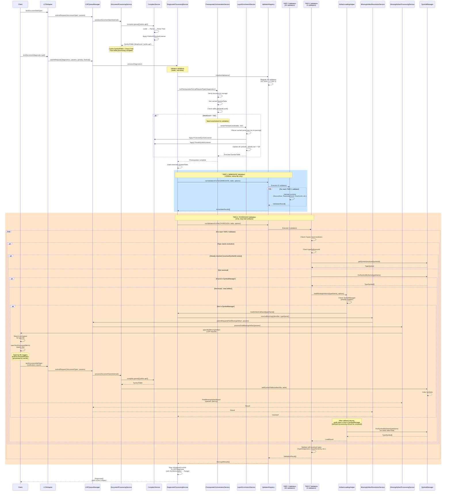

# Apex Parser & AST (`@salesforce/apex-parser-ast`)

This package is the foundational component of the Apex Language Server responsible for parsing Apex source code and constructing an Abstract Syntax Tree (AST). This AST is a specialized `SymbolTable` that provides a structured, hierarchical representation of the code, enabling advanced language features like code completion, navigation, and semantic analysis.

## Core Concepts

The package is built around a few core concepts that work together to turn raw source code into a meaningful data model.

- **`CompilerService`**: The main entry point and orchestrator for the parsing process. It manages the entire pipeline, from receiving the source code to returning a final compilation result.
- **`SymbolTable`**: The primary data structure produced by this package. It's a hierarchical collection of `ApexSymbol` objects organized by `parentId` relationships that mirrors the lexical scoping of the source code (file > class > method > block). It contains every symbol found in the file and allows for efficient lookup and scope-aware queries.
- **`ApexSymbol`**: A generic data structure representing a single named entity in the code, such as a class, interface, method, property, or variable. Specialized versions (`TypeSymbol`, `MethodSymbol`, `VariableSymbol`, `ScopeSymbol`) extend this base structure to hold relevant metadata.
- **`ScopeSymbol`**: A specialized `ApexSymbol` representing a lexical scope (class body, method body, block, control structure, etc.). The system defines 15 distinct scope types, each with its own subclass. Scope symbols use `parentId` relationships to establish containment hierarchies.
- **Parser Listeners**: Classes that subscribe to events emitted by the ANTLR parser as it traverses the parse tree. The key listeners include:
  - `ApexSymbolCollectorListener`: The full listener that collects symbols and references, using a stack-based approach to track scopes during parsing and builds the `SymbolTable` with proper parent-child relationships.
  - `ApexReferenceCollectorListener`: A dedicated listener for capturing symbol references independently of symbol declaration.
  - Layered Listeners (`PublicAPISymbolListener`, `ProtectedSymbolListener`, `PrivateSymbolListener`): Specialized listeners for progressive symbol collection based on visibility levels.
- **`ResourceLoader`**: A singleton service that manages the Standard Apex Library using an in-memory file system (memfs). It provides access to compiled symbol tables and source code for standard Apex classes like `System`, `Database`, `Schema`, etc.

## Architecture and Workflow

The package uses a classic compiler front-end architecture based on the ANTLR parser-generator tool.

1.  **Orchestration**: A consumer (like a language server) invokes the `CompilerService.compile()` method, passing in the Apex source code and a listener instance.
2.  **ANTLR Pipeline**: The `CompilerService` sets up the ANTLR pipeline:
    - The source code is fed into an `ApexLexer`, which performs lexical analysis, breaking the string into a sequence of tokens.
    - The tokens are passed to an `ApexParser`, which builds a concrete Parse Tree based on the Apex grammar.
3.  **Tree Traversal**: A `ParseTreeWalker` traverses the generated parse tree node by node.
4.  **Event-Driven Analysis**: As the walker visits each node (e.g., a class declaration), it triggers the corresponding method on the provided listener (e.g., `enterClassDeclaration`).
5.  **Symbol Table Construction**: The `ApexSymbolCollectorListener` responds to these events using a stack-based scope tracking system:
    - When entering a scope (like a class), it creates both the semantic symbol (e.g., `ClassSymbol`) and a block symbol (e.g., `ClassScopeSymbol`), then pushes the block symbol onto a scope stack
    - When finding a symbol (like a method), it creates the symbol and adds it to the `SymbolTable` with the current scope from the stack, establishing parent-child relationships via `parentId`
    - When leaving a scope, it pops the block symbol from the stack
    - All symbols are stored in the `SymbolTable` with containment determined by `parentId` relationships, not explicit scope containers
6.  **Result**: Once the traversal is complete, the listener's `getResult()` method returns the fully constructed `SymbolTable`, which is then packaged into a `CompilationResult` object and returned to the consumer.

## Scope Symbol System Architecture

The scope symbol system provides a hierarchical representation of lexical scoping in Apex code. It uses a **stack-based approach** for tracking scopes during parsing, combined with a **parentId-based containment model** for symbol relationships. This design separates scope tracking (temporary, during parsing) from symbol storage (permanent, in the SymbolTable).

### Scope Types

Every lexical scope is represented by a `ScopeSymbol` instance with one of 15 scope types:

- **`'file'`**: Root scope representing the entire file
- **`'class'`**: Body scope for classes, interfaces, enums, and triggers
- **`'method'`**: Body scope for methods and constructors
- **`'block'`**: Generic anonymous blocks (fallback)
- **Control Flow**: `'if'`, `'while'`, `'for'`, `'doWhile'`
- **Exception Handling**: `'try'`, `'catch'`, `'finally'`
- **Switch**: `'switch'`, `'when'`
- **Property**: `'getter'`, `'setter'`
- **Special**: `'runAs'`

All scope symbols implement `ApexSymbol` with `kind: SymbolKind.Block`.

### Stack-Based Scope Tracking

During parsing, `ApexSymbolCollectorListener` maintains a `scopeStack: Stack<ApexSymbol>` to track the current scope:

```typescript
enterClassDeclaration(ctx: ClassDeclarationContext): void {
  const classSymbol = this.createTypeSymbol(...);
  this.symbolTable.addSymbol(classSymbol, this.getCurrentScopeSymbol());

  const blockSymbol = this.createBlockSymbol('block1', 'class', location, parentScope, className);
  this.scopeStack.push(blockSymbol);
}

exitClassDeclaration(): void {
  const popped = this.scopeStack.pop();
}
```

The stack reflects the current parsing context (innermost scope at top). Block symbols are pushed when entering scopes and popped when exiting. No explicit `enterScope()`/`exitScope()` calls to SymbolTable — scope management is handled entirely via the stack.

### Parent-Child Relationships

Containment relationships are established through the `parentId` property:

```
File (implicit root)
└── ClassSymbol (parentId: null)
    └── ClassBlockSymbol (parentId: ClassSymbol.id)
        └── MethodSymbol (parentId: ClassBlockSymbol.id)
            └── MethodBlockSymbol (parentId: MethodSymbol.id)
                └── VariableSymbol (parentId: MethodBlockSymbol.id)
```

### Semantic Symbols vs. Block Symbols

The system distinguishes between **semantic symbols** (actual code entities like `ClassSymbol`, `MethodSymbol`) and **block symbols** (`ScopeSymbol` instances representing lexical scope containers):

- Class/Interface/Enum/Trigger: `ClassSymbol` → `ClassBlockSymbol` (block's `parentId` points to semantic symbol)
- Method/Constructor: `MethodSymbol` → `MethodBlockSymbol` (block's `parentId` points to method symbol)
- Control structures: Only block symbols exist (no semantic symbol)

### Symbol ID Generation

Symbol IDs use a stable URI-based format: `{fileUri}#{qualifiedName}{optionalSignature}{optional$prefix}`.

```
Class:         file:///MyClass.cls#MyClass.MyClass$class
Class block:   file:///MyClass.cls#MyClass.block1$block
Method:        file:///MyClass.cls#MyClass.block1.myMethod$method
Method block:  file:///MyClass.cls#MyClass.block1.myMethod.block2$block
```

Qualified names are built in dot form from the scope path and symbol name. `generateSymbolId` / `generateUnifiedId` produce the `#` fragment. Anonymous blocks use a counter-based naming scheme (`block1`, `block2`), while control flow blocks use descriptive prefixes (`if_1`, `while_1`, `for_1`, etc.).

### SymbolTable Integration

The `SymbolTable` class manages all symbols using parentId-based containment:

- `addSymbol(symbol, currentScope)`: Adds a symbol and sets `parentId` based on `currentScope`
- `getSymbolsInScope(scopeId)`: Returns all symbols where `parentId === scopeId`
- `getCurrentScopePath(parentScope)`: Builds the scope path for ID generation
- `findSymbolInScope(scopeId, name)`: Finds a symbol by name within a specific scope

```typescript
const classBlock = symbolTable.findSymbolById(classBlockId);
const methods = symbolTable
  .getSymbolsInScope(classBlock.id)
  .filter((s) => s.kind === SymbolKind.Method);
```

## Directory Structure

- `src/parser/`: Contains the ANTLR-driven parsing infrastructure.
  - `compilerService.ts`: The high-level `CompilerService` that orchestrates the process.
  - `listeners/`: Home to the various parser listeners:
    - `ApexSymbolCollectorListener`: The full listener that builds the symbol table
    - `ApexReferenceCollectorListener`: Dedicated listener for reference collection
    - Layered listeners (`PublicAPISymbolListener`, `ProtectedSymbolListener`, `PrivateSymbolListener`): Progressive symbol collection
    - `ApexErrorListener`: Collects syntax errors
  - `references/`: Reference resolution services:
    - `ApexReferenceResolver.ts`: Standalone service for resolving references to symbols
- `src/types/`: Defines the core data model for the AST.
  - `symbol.ts`: Defines the `ApexSymbol` hierarchy and the `SymbolTable` / `SymbolScope` classes.
  - `typeInfo.ts`: Defines structures for representing type information.
- `src/semantics/`: Contains modules for performing semantic analysis and validation on the AST after it's built.
  - `validation/`: 2-tier semantic validation system:
    - `ValidatorRegistry.ts`: Central registry for managing validators
    - `ValidationTier.ts`: Defines IMMEDIATE (TIER 1) and THOROUGH (TIER 2) tiers
    - `ValidationResult.ts`: Structured validation results with location-aware errors
    - `ValidatorInitialization.ts`: Validator registration and initialization
    - `ArtifactLoadingHelper.ts`: Cross-file type resolution and artifact loading
    - `validators/`: 46 validator implementations (42 TIER 1, 4 TIER 2)
  - `i18n/`: Internationalization support for error messages:
    - `messageInstance.ts`: Message formatting using @salesforce/vscode-i18n
  - `generated/`: Auto-generated TypeScript modules (ignored by git, do not edit):
    - `ErrorCodes.ts`: Error code constants for linting detection of unused codes
  - `resources/`: Source data files (tracked in git):
    - `messages/messages_en_US.properties`: Source message file copied from Jorje
  - `generated/`: Auto-generated TypeScript modules (ignored by git, do not edit):
    - `messages_en_US.ts`: English messages from Jorje (generated from .properties)
- `src/utils/`: Contains utility classes including the `ResourceLoader` for managing the Standard Apex Library.
  - `resourceLoader.ts`: Singleton service that manages standard Apex classes using memfs for in-memory file storage.
- `src/generated/`: Contains the lexer and parser code automatically generated by ANTLR from a grammar file (not present in this repo, but a standard part of the build process).
- `src/index.ts`: The public API entry point for the package, exporting all consumable classes and types.

## Dependencies

- `@apexdevtools/apex-parser`: For parsing Apex code
- `antlr4ts`: ANTLR runtime for TypeScript

## Usage

```typescript
import {
  CompilerService,
  ApexSymbolCollectorListener,
  ApexReferenceResolver,
  ApexSymbolManager,
} from '@salesforce/apex-lsp-parser-ast';

// 1. Compile Apex source and collect symbols
const compiler = new CompilerService();
const listener = new ApexSymbolCollectorListener();
const result = compiler.compile(source, 'MyClass.cls', listener, {
  includeComments: true,
  associateComments: true,
});

const symbolTable = result.result;
const errors = result.errors;

// 2. References are automatically collected and resolved by the full listener.
//    For custom reference handling, use the standalone resolver:
const resolver = new ApexReferenceResolver();
resolver.resolveSameFileReferences(symbolTable, 'MyClass.cls');

// 3. Layered compilation for progressive enrichment
const layeredResult = compiler.compileLayered(
  source,
  'MyClass.cls',
  ['public-api', 'protected'],
  undefined,
  { collectReferences: true, resolveReferences: true },
);

// 4. Register symbols with a manager for cross-file queries
const manager = new ApexSymbolManager();
for (const s of symbolTable.getAllSymbols()) {
  manager.addSymbol(s, 'MyClass.cls', symbolTable);
}

// 5. Run semantic validation
import {
  initializeValidators,
  runValidatorsForTier,
  ValidationTier,
  ValidatorRegistryLive,
} from '@salesforce/apex-lsp-parser-ast';
import { Effect } from 'effect';

await Effect.runPromise(
  initializeValidators().pipe(Effect.provide(ValidatorRegistryLive)),
);

const results = await Effect.runPromise(
  runValidatorsForTier(ValidationTier.IMMEDIATE, symbolTable, {
    tier: ValidationTier.IMMEDIATE,
    allowArtifactLoading: false,
    maxDepth: 1,
    maxArtifacts: 5,
    timeout: 5000,
  }),
);

for (const r of results) {
  if (!r.isValid) {
    for (const error of r.errors) {
      const msg = typeof error === 'string' ? error : error.message;
      const loc = typeof error === 'string' ? undefined : error.location;
      console.log(`Error: ${msg} at line ${loc?.symbolRange.startLine}`);
    }
  }
}
```

## Reference System

The package provides **comprehensive reference capture** with 95%+ coverage of all identifier usage in Apex code. The system separates reference collection from resolution, enabling flexible, reusable reference handling across different symbol collection strategies.

### Expression Coverage

References are captured for all expression types: primary expressions, assignments, array access, casts, arithmetic/comparison/logical/bitwise operations, unary increment/decrement, ternary conditionals, `instanceof` checks, and chained expressions (e.g., `obj.method().field`).

### LSP Features Powered

- **Go to Definition**: Works for all variable usage, not just declarations
- **Find References**: Captures all usages including parameters and operands
- **Hover**: Rich information for all identifier references
- **Rename**: Comprehensive reference tracking for accurate renaming
- **Code Completion**: Context-aware suggestions for all expression types

### Architecture

- **`ApexReferenceCollectorListener`**: A dedicated listener that captures symbol references during parse tree walk. Can be used independently or alongside symbol declaration listeners. Works with any `SymbolTable`, regardless of how symbols were collected.
- **`ApexReferenceResolver`**: A standalone service that resolves symbol references to their definitions. Provides context correction, same-file resolution, scope-aware lookup, and chain resolution.

This separation means all listener layers (full and layered) can reuse the same resolution logic, and references can be resolved progressively as more symbols become available.

### Reference Graph and Query APIs

The system maintains a directed reference graph layered over `SymbolTable` data, with edges carrying compact context (e.g., `methodName`, `parameterIndex`, `namespace`).

Core queries:

- `findReferencesTo(symbol)` / `findReferencesFrom(symbol)`: Inbound/outbound relationships
- `findRelatedSymbols(symbol, relationshipType)`: Filter by relationship kind
- `analyzeDependencies(symbol)`: Dependencies, dependents, impact score, circular chains
- `detectCircularDependencies()`: Identify cycles in the project reference graph
- `findSymbolByName(name)` / `findSymbolByFQN(fqn)` / `findSymbolsInFile(filePath)`
- `lookupSymbolWithContext(name, context)`: Resolve ambiguous names with file/scope hints

### Type Reference Resolution

Type names in variables/parameters are resolved post-parse using `NamespaceResolutionService` and a `SymbolProvider` implementation. The resolver handles project namespace, global scope, and standard library namespaces, updating symbols with `resolvedSymbol` and `resolutionConfidence`.

## Semantic Validation

The package provides a comprehensive **2-tier semantic validation system** that performs deep semantic analysis on Apex code beyond syntax checking.

### Tiers

- **TIER 1 (IMMEDIATE)**: Fast validations that run on every keystroke (PublishDiagnostics). Must complete in <500ms and operate on same-file data only.
- **TIER 2 (THOROUGH)**: Comprehensive validations that run on save or explicit request (Pull Diagnostics). Can take 2-5 seconds and may load missing artifacts for cross-file analysis.

### Architecture

- **`ValidatorRegistry`**: Central registry with Effect-based execution
- **`Validator` Interface**: Standard interface all validators implement
- **`ValidationResult`**: Structured results with location-aware errors and warnings
- **`ErrorCodes`**: Generated error code constants enabling linting detection of unused codes
- **`localizeTyped`**: Type-safe message formatting using @salesforce/vscode-i18n
- **`ArtifactLoadingHelper`**: Service for loading missing type definitions across files
- **46 Validators**: 42 TIER 1 + 4 TIER 2

See [SEMANTIC_VALIDATION_STATUS.md](./SEMANTIC_VALIDATION_STATUS.md) for the complete validator list and error code coverage.

### TIER 1 (IMMEDIATE) Validators

Fast, same-file validations. Examples include `SourceSizeValidator`, `ParameterLimitValidator` (max 32), `EnumLimitValidator` (max 100), `DuplicateMethodValidator`, `ConstructorNamingValidator`, `AbstractMethodBodyValidator`, `InnerTypeValidator`, plus 35 more.

### TIER 2 (THOROUGH) Validators

Comprehensive validations that may require cross-file analysis:

- **`TypeResolutionValidator`**: Type reference resolution including generic type arguments
- **`StaticContextValidator`**: Static vs non-static context validation
- **`NewExpressionValidator`**: `new` expression name conflicts
- **`TypeAssignmentValidator`**: Type compatibility for variable assignments
- **`MethodResolutionValidator`**: Method visibility and parameter types
- **`VariableResolutionValidator`**: Variable/field existence, visibility, void field load/store
- **`TypeVisibilityValidator`**: Type visibility; API version checks via `@Deprecated(removed=X)`
- **`ClassHierarchyValidator`**, **`InterfaceHierarchyValidator`**, **`MethodSignatureEquivalenceValidator`**

### Cross-File Type Resolution

TIER 2 validators support cross-file type resolution through `typeReferenceId` and `resolvedSymbolId` on type references. When a type is not found locally, the `ArtifactLoadingHelper` requests missing artifacts via `apex/findMissingArtifact` LSP requests, which triggers the client to search the workspace, open the file, and compile it into the `SymbolManager`.

### Error Code Alignment with Jorje

The TypeScript-based Language Server maintains **error code parity** with the Java-based Language Server (Jorje) for backward compatibility.

- **`ErrorCodes.ts`**: Auto-generated file with constants in UPPER_SNAKE_CASE (e.g., `INVALID_NUMBER_PARAMETERS`) mapped to Jorje's dot-separated values (e.g., `'invalid.number.parameters'`). Unused constants appear in linting output, indicating unimplemented validations.
- **Messages**: English messages come from Jorje's `messages_en_US.properties`, copied to `src/resources/messages/messages_en_US.properties`, and converted to TypeScript at build time via `scripts/generate-messages.mjs`.

To add a new error code:

1. Copy the message from Jorje's `messages_en_US.properties` to `src/resources/messages/messages_en_US.properties`
2. Run `node scripts/generate-messages.mjs` to regenerate `ErrorCodes.ts` and `messages_en_US.ts`
3. Use `ErrorCodes.NEW_CODE` and `localizeTyped()` in the validator:

```typescript
import { localizeTyped } from '../../i18n/messageInstance';
import { ErrorCodes } from '../../generated/ErrorCodes';

errors.push({
  message: localizeTyped(ErrorCodes.NEW_ERROR_CODE, param1, param2),
  code: ErrorCodes.NEW_ERROR_CODE,
  location: symbol.location,
});
```

### Sequence Diagram: Document Open → 2-Tier Semantic Validation

The following sequence diagram illustrates the complete flow from client opening a document through 2-tier semantic validation with queue-based processing and layered enrichment:


```mermaid
sequenceDiagram
    participant Client
    participant LCSAdapter
    participant LSPQueueManager
    participant DocumentProcessingService
    participant CompilerService
    participant DiagnosticProcessingService
    participant PrerequisiteOrchestrationService
    participant LayerEnrichmentService
    participant ValidatorRegistry
    participant TIER1Validators as TIER 1 Validators<br/>(42 validators)
    participant TIER2Validators as TIER 2 Validators<br/>(4 validators)
    participant ArtifactLoadingHelper
    participant MissingArtifactResolutionService
    participant MissingArtifactProcessingService
    participant SymbolManager

    Client->>LCSAdapter: textDocument/didOpen
    LCSAdapter->>LSPQueueManager: submitRequest('documentOpen', params)
    LSPQueueManager->>DocumentProcessingService: processDocumentOpenInternal()

    DocumentProcessingService->>CompilerService: compileLayered(['public-api'])
    CompilerService->>CompilerService: Lexer → Parser → Parse Tree
    CompilerService->>CompilerService: Apply PublicAPISymbolListener
    CompilerService-->>DocumentProcessingService: SymbolTable (detailLevel: 'public-api')

    Note over DocumentProcessingService: Cache SymbolTable + Parse Tree<br/>Fast initial processing complete

    Client->>LCSAdapter: textDocument/diagnostic (pull)
    LCSAdapter->>LSPQueueManager: submitRequest('diagnostics', params, {priority: Normal})
    LSPQueueManager->>DiagnosticProcessingService: processDiagnostic()

    Note over DiagnosticProcessingService: Initialize validators<br/>(static, one-time)
    DiagnosticProcessingService->>ValidatorRegistry: initializeValidators()
    ValidatorRegistry->>ValidatorRegistry: Register 46 validators<br/>(42 TIER 1, 4 TIER 2)

    DiagnosticProcessingService->>PrerequisiteOrchestrationService: runPrerequisitesForLspRequestType('diagnostics')

    PrerequisiteOrchestrationService->>PrerequisiteOrchestrationService: Verify document in storage
    PrerequisiteOrchestrationService->>PrerequisiteOrchestrationService: Get cached SymbolTable
    PrerequisiteOrchestrationService->>PrerequisiteOrchestrationService: Check table.getDetailLevel()

    alt detailLevel < 'full'
        Note over PrerequisiteOrchestrationService: Need enrichment for validation
        PrerequisiteOrchestrationService->>LayerEnrichmentService: enrichToDetailLevel(table, 'full')
        LayerEnrichmentService->>LayerEnrichmentService: Reuse cached parse tree (no re-parsing!)
        LayerEnrichmentService->>CompilerService: Apply ProtectedSymbolListener
        LayerEnrichmentService->>CompilerService: Apply PrivateSymbolListener
        LayerEnrichmentService->>LayerEnrichmentService: Update all symbols._detailLevel = 'full'
        LayerEnrichmentService-->>PrerequisiteOrchestrationService: Enriched SymbolTable
    end

    PrerequisiteOrchestrationService-->>DiagnosticProcessingService: Prerequisites complete
    DiagnosticProcessingService->>DiagnosticProcessingService: Fetch enriched SymbolTable

    rect rgb(200, 230, 255)
        Note over DiagnosticProcessingService,TIER1Validators: TIER 1: IMMEDIATE Validation<br/>(<500ms, same-file only)
        DiagnosticProcessingService->>ValidatorRegistry: runValidatorsForTier(IMMEDIATE, table, options)
        ValidatorRegistry->>TIER1Validators: Execute 42 validators

        loop For each TIER 1 validator
            TIER1Validators->>TIER1Validators: Validate symbols<br/>(SourceSize, ParameterLimit, EnumLimit, etc.)
            TIER1Validators-->>ValidatorRegistry: ValidationResult[]
        end

        ValidatorRegistry-->>DiagnosticProcessingService: immediateResults[]
    end

    rect rgb(255, 230, 200)
        Note over DiagnosticProcessingService,TIER2Validators: TIER 2: THOROUGH Validation<br/>(2-5s, may load artifacts)
        DiagnosticProcessingService->>ValidatorRegistry: runValidatorsForTier(THOROUGH, table, options)
        ValidatorRegistry->>TIER2Validators: Execute 4 validators

        loop For each TIER 2 validator
            TIER2Validators->>TIER2Validators: Check if types need resolution

            alt Type needs resolution
                TIER2Validators->>TIER2Validators: Check typeReferenceId
                alt Already resolved (resolvedSymbolId exists)
                    TIER2Validators->>SymbolManager: getSymbol(resolvedSymbolId)
                    SymbolManager-->>TIER2Validators: TypeSymbol
                else Not resolved
                    TIER2Validators->>SymbolManager: findSymbolByName(typeName)
                    alt Found in SymbolManager
                        SymbolManager-->>TIER2Validators: TypeSymbol[]
                    else Not found - load artifact
                        TIER2Validators->>ArtifactLoadingHelper: loadMissingArtifacts([typeName], options)
                        ArtifactLoadingHelper->>ArtifactLoadingHelper: Check SymbolManager<br/>(already loaded?)
                        alt Not in SymbolManager
                            ArtifactLoadingHelper->>DiagnosticProcessingService: loadArtifactCallback([typeName])
                            DiagnosticProcessingService->>MissingArtifactResolutionService: resolveBlocking({identifier: typeName})
                            MissingArtifactResolutionService->>LSPQueueManager: submitRequest('findMissingArtifact', params)
                            LSPQueueManager->>MissingArtifactProcessingService: processFindMissingArtifact(params)
                            MissingArtifactProcessingService->>Client: apex/findMissingArtifact<br/>(LSP request)
                            Client->>Client: Search workspace<br/>for type file
                            Client->>Client: openTextDocument(fileUri)<br/>(opens file)
                            Note over Client: Opening file triggers<br/>textDocument/didOpen<br/>(processed by server)
                            Client->>LCSAdapter: textDocument/didOpen<br/>(notification, async)
                            LCSAdapter->>LSPQueueManager: submitRequest('documentOpen', params)
                            LSPQueueManager->>DocumentProcessingService: processDocumentOpenInternal()
                            DocumentProcessingService->>CompilerService: compileLayered(['public-api'])
                            CompilerService-->>DocumentProcessingService: SymbolTable
                            DocumentProcessingService->>SymbolManager: addSymbolTable(artifactFile, table)
                            SymbolManager-->>SymbolManager: Index symbols
                            Client-->>MissingArtifactProcessingService: FindMissingArtifactResult<br/>(opened: [fileUri])
                            MissingArtifactProcessingService-->>LSPQueueManager: Result
                            LSPQueueManager-->>MissingArtifactResolutionService: Result
                            MissingArtifactResolutionService-->>DiagnosticProcessingService: 'resolved'
                        end
                        Note over ArtifactLoadingHelper: After callback returns,<br/>verify type is now in SymbolManager<br/>(didOpen processing should be complete)
                        ArtifactLoadingHelper->>SymbolManager: findSymbolByName(typeName)<br/>(re-check after load)
                        SymbolManager-->>ArtifactLoadingHelper: TypeSymbol[]
                        ArtifactLoadingHelper-->>TIER2Validators: LoadResult
                    end
                end
            end

            TIER2Validators->>TIER2Validators: Validate with resolved types<br/>(TypeAssignment, ClassHierarchy, etc.)
            TIER2Validators-->>ValidatorRegistry: ValidationResult[]
        end

        ValidatorRegistry-->>DiagnosticProcessingService: thoroughResults[]
    end

    DiagnosticProcessingService->>DiagnosticProcessingService: Map ValidationErrorInfo<br/>to LSP Diagnostic<br/>(with SymbolLocation → Range)
    DiagnosticProcessingService-->>Client: Diagnostic[]<br/>(with correct ranges)
```

## Comment Collection

Comments are collected by default for language server functionality like hover documentation, code completion, and symbol information.

The `CompilerService.compile()` method accepts comment-related options:

- **`includeComments`** (default: `true`): Collects block comments. Set to `false` for performance-critical scenarios.
- **`includeSingleLineComments`** (default: `false`): Also collects `//` line comments.
- **`associateComments`** (default: `false`): Associates comments with nearby symbols using spatial analysis. Supports four association types: Preceding (documentation), Inline, Internal (inside a body), and Trailing.

```typescript
const result = compilerService.compile(
  apexCode,
  'MyClass.cls',
  symbolCollector,
  {
    includeComments: true,
    includeSingleLineComments: true,
    associateComments: true,
  },
);

const docComments = result.comments.filter((c) => c.isDocumentation);
const associations = result.commentAssociations;
```

## Standard Apex Library

The package includes a `ResourceLoader` that provides access to the Standard Apex Library. Symbol tables are loaded from a pre-built protobuf cache for fast startup, and source code is available from a ZIP file for goto definition.

### Protobuf Cache Architecture

All `.cls` files from `StandardApexLibrary/` are parsed at build time, serialized to protobuf format, and compressed as `apex-stdlib.pb.gz`. The build fails if any class throws an exception during parsing, guaranteeing 100% coverage. At runtime, the cache loads in ~1ms and classes are loaded on-demand (lazy loading).

### GlobalTypeRegistry

The `GlobalTypeRegistry` provides O(1) type lookup for standard library types by fully qualified name, eliminating O(n²) symbol table scans. It is loaded at startup (<1ms) from `apex-type-registry.pb.gz` and provides namespace-aware resolution.

### ResourceLoader Usage

```typescript
import { ResourceLoader } from '@salesforce/apex-lsp-parser-ast';

const resourceLoader = ResourceLoader.getInstance();
await resourceLoader.initialize();

const symbolTable = await resourceLoader.getSymbolTable('System/System.cls');
const sourceCode = await resourceLoader.getFile('System/System.cls');
const stats = resourceLoader.getStatistics();
```

The `ApexSymbolManager` automatically integrates with the `ResourceLoader`, so standard Apex classes are resolved transparently when using the manager's `resolveSymbol()` API.

### Maintaining the Standard Apex Library

The library is located in `src/resources/StandardApexLibrary/` organized by namespace.

**CRITICAL WARNING: DO NOT REMOVE STDLIB FOUNDATION CLASSES**

The following 15 classes in `src/resources/builtins/` are **essential build inputs** merged into `StandardApexLibrary/System/` during ZIP creation: `Blob`, `Boolean`, `Date`, `DateTime`, `Decimal`, `Double`, `Id`, `Integer`, `List`, `Long`, `Map`, `Object`, `Set`, `String`, `Time`. These provide the foundation for type resolution of primitive types and collections. Removing them will break type checking, code completion, and symbol resolution.

**Source file structure:**

```
src/resources/
├── builtins/                    # Hand-crafted foundation classes
│   ├── Blob.cls, Integer.cls, Long.cls, Object.cls, DateTime.cls
└── StandardApexLibrary/
    ├── System/                  # From public docs (builtins override at build)
    │   ├── Boolean.cls, Date.cls, Decimal.cls, Double.cls, ...
    ├── Database/
    ├── Schema/
    └── [other namespaces...]
```

The build script (`scripts/generate-zip.mjs`) merges `builtins/` into `StandardApexLibrary/System/` in the output ZIP. Edit foundation stubs only in `builtins/`, not in `StandardApexLibrary/System/`.

**Cache files:**

- `apex-stdlib.pb.gz` / `.md5` — Compressed protobuf cache of symbol tables
- `apex-type-registry.pb.gz` / `.md5` — Compressed GlobalTypeRegistry cache
- `StandardApexLibrary.zip` / `.md5` — Source code for goto definition

## Development

```bash
# Build the package
npm run build

# Watch for changes during development
npm run dev

# Run tests
npm test
```
