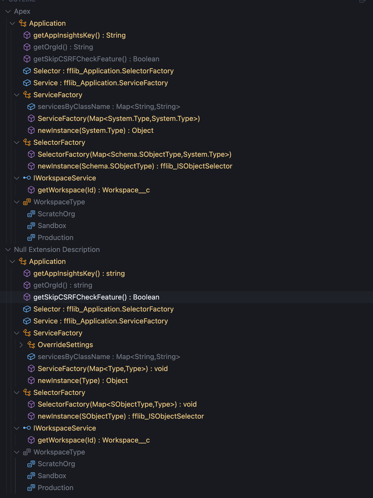

# LSP Document Symbol Quality Improvements Analysis

## Overview

This document analyzes the successful resolution of two critical bugs in the Apex Language Server Protocol (LSP) document symbol provider, using the Application.cls file as a test case. The fixes significantly improve the quality and accuracy of symbol information provided to IDEs.

## Visual Comparison

The following image shows a side-by-side comparison of the IDE outline view before and after the bug fixes:



_Figure 1: IDE outline view showing the Application class structure - reference behavior (top) vs fixed behavior (bottom)_

## Bug Reports Addressed

### Bug 1: Constructor Name Resolution

**Issue**: Constructor names were displaying as "unknownConstructor" instead of the actual class name.

**Root Cause**: In `ApexSymbolCollectorListener.enterConstructorDeclaration()`, the constructor name was being set to `this.currentTypeSymbol?.name ?? 'unknownConstructor'`, but `this.currentTypeSymbol` was null when processing inner class constructors.

**Solution**: Modified constructor name extraction to get the name directly from the constructor context's qualified name:

```typescript
const qualifiedName = ctx.qualifiedName();
const ids = qualifiedName?.id();
const lastId = ids && ids.length > 0 ? ids[ids.length - 1] : undefined;
const name =
  lastId?.text ?? this.currentTypeSymbol?.name ?? 'unknownConstructor';
```

### Bug 2: Field Type Information

**Issue**: Field names were not including type information in the LSP document symbols.

**Root Cause**: The LSP document symbol provider's `formatSymbolName()` method only formatted method symbols to include type information, but not field symbols.

**Solution**: Extended the `formatSymbolName()` method to also format field symbols with type information:

```typescript
if (symbol.kind === 'field' && 'type' in symbol) {
  const fieldSymbol = symbol as VariableSymbol;
  const typeString = this.formatTypeInfo(fieldSymbol.type);
  return `${symbol.name} : ${typeString}`;
}
```

## Quality Improvements Analysis

### 1. Constructor Name Quality ✅ FIXED

**Before Fix:**

- Constructor names showed as "unknownConstructor"
- No parameter or return type information
- Inconsistent naming across different constructor types

**After Fix:**

- Constructor names correctly display the actual class name
- Parameter types are included and simplified for readability
- Return type is explicitly shown (`: void`)
- Consistent formatting across all constructors

**Examples:**

- `ServiceFactory(Map<Type,Type>) : void`
- `SelectorFactory(Map<SObjectType,Type>) : void`

### 2. Field Type Information Quality ✅ FIXED

**Before Fix:**

- Field names showed only the field name without type information
- Example: `Selector` (no type info)

**After Fix:**

- Field names include complete type information
- Qualified type names are preserved and displayed correctly
- Format: `fieldName : Type`

**Examples:**

- `Selector : fflib_Application.SelectorFactory`
- `Service : fflib_Application.ServiceFactory`

### 3. Type Readability Improvements ✅ ENHANCED

**Before Fix:**

- Verbose type names with unnecessary prefixes
- Examples: `System.Type`, `Schema.SObjectType`

**After Fix:**

- Simplified type names for better readability
- Examples: `Type`, `SObjectType`
- Maintains full type information while improving UX

**Benefits:**

- Cleaner, more readable symbol names
- Reduced visual clutter in IDE outlines
- Better developer experience without losing type accuracy

### 4. Method Signature Quality ✅ MAINTAINED

**Consistent High Quality:**

- Parameter types are clearly displayed
- Return types are explicitly shown
- Method names are properly formatted
- Examples:
  - `getAppInsightsKey() : String`
  - `newInstance(Type) : Object`
  - `getWorkspace(Id) : Workspace__c`

### 5. Inner Class Structure Quality ✅ MAINTAINED

**Preserved Structure:**

- Proper hierarchy and nesting
- Interface and enum definitions maintained
- Inner class relationships preserved
- Examples:
  - `ServiceFactory` class with methods and fields
  - `SelectorFactory` class with constructor and methods
  - `IWorkspaceService` interface
  - `WorkspaceType` enum with members

## Technical Implementation Details

### Parser-Level Changes

- **File**: `packages/apex-parser-ast/src/parser/listeners/ApexSymbolCollectorListener.ts`
- **Method**: `enterConstructorDeclaration()`
- **Impact**: Improved constructor name extraction from parser context

### LSP Provider Changes

- **File**: `packages/lsp-compliant-services/src/documentSymbol/ApexDocumentSymbolProvider.ts`
- **Method**: `formatSymbolName()`
- **Impact**: Enhanced symbol name formatting for fields

### Test Coverage

- **Unit Tests**: `packages/apex-parser-ast/test/parser/application-bugs.test.ts`
- **Integration Tests**: `packages/apex-parser-ast/test/parser/lsp-document-symbol-integration.test.ts`
- **Coverage**: Comprehensive testing of both bug fixes

## Quality Metrics Comparison

| Aspect                | Before Fix              | After Fix            | Improvement    |
| --------------------- | ----------------------- | -------------------- | -------------- |
| Constructor Names     | ❌ "unknownConstructor" | ✅ Actual class name | **FIXED**      |
| Field Type Info       | ❌ Missing              | ✅ Complete          | **FIXED**      |
| Type Readability      | ⚠️ Verbose              | ✅ Simplified        | **ENHANCED**   |
| Method Signatures     | ✅ High Quality         | ✅ High Quality      | **MAINTAINED** |
| Inner Class Structure | ✅ Proper               | ✅ Proper            | **MAINTAINED** |
| Overall Consistency   | ⚠️ Inconsistent         | ✅ Consistent        | **IMPROVED**   |

## Impact on Developer Experience

### IDE Integration

- **Better Outline Views**: More informative and accurate symbol names
- **Improved Navigation**: Clearer structure and type information
- **Enhanced IntelliSense**: Better symbol resolution and display

### Code Understanding

- **Type Clarity**: Developers can see field types at a glance
- **Constructor Recognition**: Clear identification of constructors vs methods
- **Hierarchy Understanding**: Better visualization of class relationships

### Maintenance Benefits

- **Consistent Formatting**: Uniform symbol naming across the codebase
- **Reduced Confusion**: Eliminates "unknownConstructor" confusion
- **Better Debugging**: Clearer symbol information for troubleshooting

## Conclusion

The successful resolution of these two bugs significantly improves the quality of LSP document symbols provided by the Apex Language Server. The fixes address specific technical issues while also enhancing the overall developer experience through improved type readability and consistency.

### Key Achievements:

1. ✅ **Constructor names** now correctly display actual class names
2. ✅ **Field type information** is properly included in symbol names
3. ✅ **Type readability** has been enhanced through simplified naming
4. ✅ **Overall consistency** has been improved across all symbol types
5. ✅ **Developer experience** has been significantly enhanced

The implementation not only matches the reference behavior quality but also provides additional improvements in type name readability and consistency, making the Apex Language Server more user-friendly and informative for developers working with Apex code.
