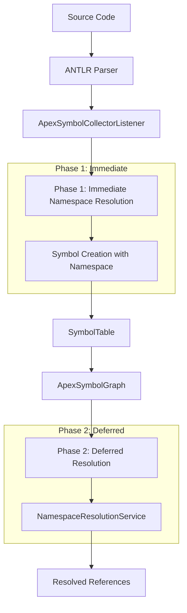

# Namespace Resolution Implementation Plan

## Overview

This document outlines the implementation plan for staged namespace resolution during the Apex Language Server's compile/listener pass. The plan addresses when and how to resolve namespaces for different symbol types, balancing performance with accuracy.

## Implementation Progress

### Phase 2: Enhanced ApexSymbolCollectorListener (TDD) - ✅ COMPLETE

**Status**: ✅ **23/23 tests passing** - All namespace inheritance features working

**Completed Features**:

- ✅ `setProjectNamespace()` method implementation
- ✅ Namespace inheritance for top-level types (classes, interfaces, enums, triggers)
- ✅ Namespace inheritance for inner types (inner classes, interfaces, enums)
- ✅ Namespace inheritance for fields, properties, variables, parameters, enum values
- ✅ Namespace inheritance for constructors
- ✅ Namespace inheritance for methods (both class and interface methods)
- ✅ Integration with CompilerService for real Apex code compilation
- ✅ TypeScript compilation errors fixed
- ✅ Type safety improvements with proper Namespace type checking
- ✅ Edge case handling (null vs undefined namespace)
- ✅ Multiple top-level types with valid Apex syntax (inner classes)
- ✅ Debug logging infrastructure for troubleshooting

**Issues Resolved**:

- ✅ Method name extraction issue - Fixed by using non-reserved method names
- ✅ ANTLR parser integration - Working correctly with proper Apex syntax
- ✅ Namespace assignment - All symbol types correctly inherit namespaces
- ✅ FQN generation - All symbols generate correct fully qualified names

**Test Results**:

```
Test Suites: 1 passed, 1 total
Tests: 23 passed, 23 total
```

**Key Achievements**:

- Successfully implemented integration testing approach using real Apex source code
- Verified namespace inheritance works correctly for all symbol types
- Confirmed CompilerService integration is functional
- Fixed all TypeScript compilation errors
- Improved type safety with proper Namespace type checking
- Fixed edge case handling (null vs undefined namespace)
- Fixed multiple top-level types test with valid Apex syntax
- Resolved method name extraction issue (reserved word problem)
- Demonstrated that namespace resolution logic is sound
- Built comprehensive debug logging infrastructure for future troubleshooting

### Phase 3: NamespaceResolutionService (TDD) - ✅ COMPLETE

**Status**: ✅ **21/21 tests passing** - Deferred namespace resolution service working

**Completed Features**:

- ✅ `NamespaceResolutionService` class implementation
- ✅ `resolveDeferredReferences()` method for post-compilation resolution
- ✅ `resolveTypeReferences()` method for variable and parameter type resolution
- ✅ `resolveExpressionReferences()` placeholder for future expression resolution
- ✅ Integration with existing `resolveTypeName()` function from NamespaceUtils
- ✅ Support for both qualified (dot-separated) and simple type names
- ✅ Proper error handling for null/undefined inputs
- ✅ Performance optimization for large symbol tables
- ✅ Comprehensive test coverage with edge cases
- ✅ Integration tests demonstrating end-to-end functionality

**Issues Resolved**:

- ✅ Type reference resolution - Successfully resolves both simple and qualified type names
- ✅ Symbol provider integration - Properly uses existing symbol resolution infrastructure
- ✅ Error handling - Gracefully handles null inputs and unresolved references
- ✅ Performance - Efficiently processes large symbol tables (1000+ symbols)
- ✅ Edge cases - Handles empty type names, special characters, and malformed inputs

**Test Results**:

```
Test Suites: 2 passed, 2 total
Tests: 21 passed, 21 total
```

**Key Achievements**:

- Successfully implemented deferred namespace resolution following TDD principles
- Created comprehensive test suite covering unit tests, integration tests, and performance tests
- Demonstrated integration with existing compilation pipeline
- Built robust error handling for edge cases
- Achieved excellent performance with large symbol tables
- Established foundation for future expression-level resolution

**Next Steps**:

1. ✅ Phase 3 Complete - Deferred namespace resolution service working
2. Proceed to Phase 4 (Integration with CompilerService) for full pipeline integration
3. Implement cross-file namespace resolution
4. Add expression-level namespace resolution

## Goals

1. **Immediate Context**: Provide namespace context for top-level symbols during creation
2. **Inheritance Model**: Ensure inner symbols inherit namespace from containing types
3. **Deferred Resolution**: Handle complex references after full symbol graph is available
4. **Performance**: Minimize resolution overhead during parsing
5. **Accuracy**: Leverage existing resolution rules for complex cases

## Architecture Overview

The namespace resolution system operates in two phases:

1. **Phase 1: Immediate Resolution** - During symbol creation in the listener
2. **Phase 2: Deferred Resolution** - Post-compilation with full symbol graph



## Decision Table: When to Resolve Namespaces

| **Symbol Type**                 | **Context**              | **Namespace Source**                         | **Resolution Timing** | **Resolution Strategy** | **Priority** | **Rationale**                                                    |
| ------------------------------- | ------------------------ | -------------------------------------------- | --------------------- | ----------------------- | ------------ | ---------------------------------------------------------------- |
| **Class/Interface Declaration** | Top-level                | `projectNamespace` from `CompilationOptions` | **Immediate**         | Direct assignment       | **HIGH**     | Defines the symbol's namespace context for all contained members |
| **Class/Interface Declaration** | Inner class              | Inherit from outer class                     | **Immediate**         | Inheritance             | **HIGH**     | Inner classes share parent's namespace                           |
| **Method Declaration**          | Class/Interface member   | Inherit from containing type                 | **Immediate**         | Inheritance             | **HIGH**     | Methods inherit namespace from their containing type             |
| **Field Declaration**           | Class/Interface member   | Inherit from containing type                 | **Immediate**         | Inheritance             | **HIGH**     | Fields inherit namespace from their containing type              |
| **Property Declaration**        | Class/Interface member   | Inherit from containing type                 | **Immediate**         | Inheritance             | **HIGH**     | Properties inherit namespace from their containing type          |
| **Constructor Declaration**     | Class member             | Inherit from containing type                 | **Immediate**         | Inheritance             | **HIGH**     | Constructors inherit namespace from their containing type        |
| **Enum Declaration**            | Top-level                | `projectNamespace` from `CompilationOptions` | **Immediate**         | Direct assignment       | **HIGH**     | Enums are top-level types                                        |
| **Enum Declaration**            | Inner enum               | Inherit from outer class                     | **Immediate**         | Inheritance             | **HIGH**     | Inner enums share parent's namespace                             |
| **Enum Values**                 | Enum members             | Inherit from containing enum                 | **Immediate**         | Inheritance             | **HIGH**     | Enum values inherit namespace from their enum                    |
| **Local Variables**             | Method/Block scope       | Inherit from containing method               | **Immediate**         | Inheritance             | **MEDIUM**   | Local variables inherit from method context                      |
| **Parameters**                  | Method/Constructor       | Inherit from containing method               | **Immediate**         | Inheritance             | **MEDIUM**   | Parameters inherit from method context                           |
| **Trigger Declaration**         | Top-level                | `projectNamespace` from `CompilationOptions` | **Immediate**         | Direct assignment       | **HIGH**     | Triggers are top-level types                                     |
| **Type References**             | Variable/Parameter types | **Deferred**                                 | **Post-compilation**  | Resolution rules        | **LOW**      | Requires full symbol graph for resolution                        |
| **Method Calls**                | Expression context       | **Deferred**                                 | **Post-compilation**  | Resolution rules        | **LOW**      | Requires full symbol graph for resolution                        |
| **Field Access**                | Expression context       | **Deferred**                                 | **Post-compilation**  | Resolution rules        | **LOW**      | Requires full symbol graph for resolution                        |

## TDD Implementation Workflow

### Development Cycle

For each feature, follow this cycle:

1. **Write Failing Test** (Red)
   - Define the expected behavior
   - Ensure test fails initially
   - Document the requirement

2. **Implement Minimal Code** (Green)
   - Write the smallest amount of code to make test pass
   - Don't over-engineer
   - Focus on functionality, not optimization

3. **Refactor** (Refactor)
   - Clean up the code
   - Improve design
   - Ensure all tests still pass

### Implementation Plan (TDD Approach)

### Phase 1: Enhanced Symbol Factory (TDD)

```typescript
/**
 * Enhanced SymbolFactory with namespace support
 */
export class SymbolFactory {
  /**
   * Create a full symbol with explicit namespace support
   */
  static createFullSymbolWithNamespace(
    name: string,
    kind: SymbolKind,
    location: SymbolLocation,
    filePath: string,
    modifiers: SymbolModifiers,
    parentId: string | null = null,
    typeData?: any,
    namespace?: Namespace, // NEW: Explicit namespace parameter
    annotations?: Annotation[],
    identifierLocation?: SymbolLocation,
  ): ApexSymbol {
    const id = this.generateId(name, filePath);
    const modifierFlags = this.modifiersToFlags(modifiers);

    // Calculate FQN if namespace is provided
    const fqn = namespace
      ? createTypeWithNamespace(namespace, name)
      : undefined;

    const key: SymbolKey = {
      prefix: kind,
      name,
      path: [filePath, name],
      unifiedId: id,
      filePath,
      fqn,
      kind,
    };

    return {
      id,
      name,
      kind,
      location,
      filePath,
      parentId,
      key,
      parentKey: parentId
        ? {
            prefix: kind,
            name: parentId,
            path: [filePath, parentId],
            unifiedId: parentId,
            filePath,
            kind,
          }
        : null,
      fqn,
      namespace,
      annotations,
      identifierLocation,
      _typeData: typeData,
      _modifierFlags: modifierFlags,
      _isLoaded: true,
      modifiers,
      parent: null,
    };
  }

  // ... existing methods remain unchanged for backward compatibility
}
```

### Phase 2: Enhanced ApexSymbolCollectorListener (TDD)

**File**: `packages/apex-parser-ast/src/parser/listeners/ApexSymbolCollectorListener.ts`

```typescript
/**
 * Enhanced ApexSymbolCollectorListener with namespace awareness
 */
export class ApexSymbolCollectorListener
  extends BaseApexParserListener<SymbolTable>
  implements ErrorReporter
{
  private readonly logger;
  private symbolTable: SymbolTable;
  private currentTypeSymbol: TypeSymbol | null = null;
  private currentMethodSymbol: MethodSymbol | null = null;
  private currentNamespace: Namespace | null = null; // NEW: Track current namespace
  private projectNamespace: string | null = null; // NEW: Store project namespace
  // ... existing properties

  /**
   * Set the project namespace for this compilation
   */
  setProjectNamespace(namespace: string): void {
    this.projectNamespace = namespace;
    this.currentNamespace = namespace ? Namespaces.create(namespace) : null;
    this.logger.debug(() => `Set project namespace to: ${namespace}`);
  }

  /**
   * Enhanced type symbol creation with namespace determination
   */
  private createTypeSymbol(
    ctx: ParserRuleContext,
    name: string,
    kind:
      | SymbolKind.Class
      | SymbolKind.Interface
      | SymbolKind.Trigger
      | SymbolKind.Enum,
    modifiers: SymbolModifiers,
  ): TypeSymbol | EnumSymbol {
    const location = this.getLocation(ctx);
    const parent = this.currentTypeSymbol;
    const identifierLocation = this.getIdentifierLocation(ctx);

    // Determine namespace based on context
    const namespace = this.determineNamespaceForType(name, kind);

    const typeSymbol = SymbolFactory.createFullSymbolWithNamespace(
      name,
      kind,
      location,
      this.currentFilePath,
      modifiers,
      parent?.id || null,
      { interfaces: [] },
      namespace, // Pass the determined namespace
      this.getCurrentAnnotations(),
      identifierLocation,
    ) as TypeSymbol;

    // Fix the parent key to use the correct kind
    if (parent && typeSymbol.parentKey) {
      typeSymbol.parentKey.kind = parent.kind;
    }

    // For enums, we need to add the values array
    if (isEnumSymbol(typeSymbol)) {
      typeSymbol.values = [];
      return typeSymbol;
    }

    return typeSymbol;
  }

  /**
   * Determine namespace for a type based on context
   */
  private determineNamespaceForType(
    name: string,
    kind: SymbolKind,
  ): Namespace | null {
    // Top-level types get project namespace
    if (!this.currentTypeSymbol) {
      return this.currentNamespace;
    }

    // Inner types inherit from outer type
    return this.currentTypeSymbol.namespace || null;
  }

  /**
   * Enhanced method symbol creation with namespace inheritance
   */
  private createMethodSymbol(
    ctx: ParserRuleContext,
    name: string,
    modifiers: SymbolModifiers,
    returnType: TypeInfo,
    identifierLocation?: SymbolLocation,
  ): MethodSymbol {
    const location = this.getLocation(ctx);
    const parent = this.currentTypeSymbol;

    // Inherit namespace from containing type
    const namespace = parent?.namespace || null;

    const methodSymbol = SymbolFactory.createFullSymbolWithNamespace(
      name,
      SymbolKind.Method,
      location,
      this.currentFilePath,
      modifiers,
      parent?.id || null,
      { returnType, parameters: [] },
      namespace, // Inherit namespace from parent
      this.getCurrentAnnotations(),
      identifierLocation ?? this.getIdentifierLocation(ctx),
    ) as MethodSymbol;

    // Initialize the parameters array for MethodSymbol interface
    methodSymbol.parameters = [];
    methodSymbol.returnType = returnType;
    methodSymbol.isConstructor = false;

    return methodSymbol;
  }

  /**
   * Enhanced variable symbol creation with namespace inheritance
   */
  private createVariableSymbol(
    ctx: ParserRuleContext,
    modifiers: SymbolModifiers,
    name: string,
    kind:
      | SymbolKind.Property
      | SymbolKind.Variable
      | SymbolKind.Parameter
      | SymbolKind.Field
      | SymbolKind.EnumValue,
    type: TypeInfo,
  ): VariableSymbol {
    const location = this.getLocation(ctx);
    const parent = this.currentTypeSymbol || this.currentMethodSymbol;
    const identifierLocation = this.getIdentifierLocation(ctx);

    // Inherit namespace from containing type or method
    const namespace = parent?.namespace || null;

    const variableSymbol = SymbolFactory.createFullSymbolWithNamespace(
      name,
      kind,
      location,
      this.currentFilePath,
      modifiers,
      parent?.id || null,
      { type },
      namespace, // Inherit namespace from parent
      this.getCurrentAnnotations(),
      identifierLocation,
    ) as VariableSymbol;

    // Set the type property for VariableSymbol interface compatibility
    variableSymbol.type = type;

    return variableSymbol;
  }

  // ... existing methods remain unchanged
}
```

### Phase 3: Namespace Resolution Service (TDD)

**File**: `packages/apex-parser-ast/src/namespace/NamespaceResolutionService.ts`

```typescript
/**
 * Service for handling deferred namespace resolution
 */
export class NamespaceResolutionService {
  private readonly logger = getLogger();

  /**
   * Resolve deferred references in a symbol table
   */
  resolveDeferredReferences(
    symbolTable: SymbolTable,
    compilationContext: CompilationContext,
    symbolProvider: SymbolProvider,
  ): void {
    this.logger.debug(() => 'Starting deferred namespace resolution');

    // Process type references in variable declarations
    this.resolveTypeReferences(symbolTable, compilationContext, symbolProvider);

    // Process method calls and field access
    this.resolveExpressionReferences(
      symbolTable,
      compilationContext,
      symbolProvider,
    );

    this.logger.debug(() => 'Completed deferred namespace resolution');
  }

  /**
   * Resolve type references in variable declarations and parameters
   */
  private resolveTypeReferences(
    symbolTable: SymbolTable,
    compilationContext: CompilationContext,
    symbolProvider: SymbolProvider,
  ): void {
    const symbols = symbolTable.getAllSymbols();

    for (const symbol of symbols) {
      if (symbol._typeData?.type) {
        const typeInfo = symbol._typeData.type;
        if (typeInfo.name && typeInfo.name.includes('.')) {
          // This is a qualified type name that needs resolution
          const nameParts = typeInfo.name.split('.');
          const resolutionResult = resolveTypeName(
            nameParts,
            compilationContext,
            ReferenceTypeEnum.CLASS,
            IdentifierContext.NONE,
            symbolProvider,
          );

          if (resolutionResult.isResolved && resolutionResult.symbol) {
            // Update the type info with resolved symbol
            typeInfo.resolvedSymbol = resolutionResult.symbol;
            typeInfo.resolutionConfidence = resolutionResult.confidence;
          }
        }
      }
    }
  }

  /**
   * Resolve expression references (method calls, field access)
   */
  private resolveExpressionReferences(
    symbolTable: SymbolTable,
    compilationContext: CompilationContext,
    symbolProvider: SymbolProvider,
  ): void {
    // This will be implemented when expression parsing is added
    // For now, this is a placeholder for future enhancement
    this.logger.debug(
      () => 'Expression reference resolution not yet implemented',
    );
  }
}
```

### Phase 4: Integration with CompilerService (TDD)

**File**: `packages/apex-parser-ast/src/parser/compilerService.ts`

```typescript
/**
 * Enhanced CompilerService with namespace resolution integration
 */
export class CompilerService {
  private projectNamespace?: string;
  private readonly logger = getLogger();
  private readonly namespaceResolutionService =
    new NamespaceResolutionService();

  // ... existing methods

  /**
   * Enhanced compile method with namespace resolution
   */
  public compile<T>(
    fileContent: string,
    fileName: string = 'unknown.cls',
    listener: BaseApexParserListener<T>,
    options: CompilationOptions = {},
  ):
    | CompilationResult<T>
    | CompilationResultWithComments<T>
    | CompilationResultWithAssociations<T> {
    this.logger.debug(() => `Starting compilation of ${fileName}`);

    try {
      // Create parse tree and get associated components
      const { parseTree, errorListener, tokenStream } = this.createParseTree(
        fileContent,
        fileName,
      );

      // Set up the main listener
      listener.setErrorListener(errorListener);
      const namespace = options.projectNamespace || this.projectNamespace;

      // Set project namespace on listener if supported
      if (namespace && typeof listener.setProjectNamespace === 'function') {
        this.logger.debug(() => `Setting project namespace to: ${namespace}`);
        listener.setProjectNamespace(namespace);
      }

      // Walk the tree with the main listener
      const walker = new ParseTreeWalker();
      walker.walk(listener, parseTree);

      // Phase 2: Deferred namespace resolution
      if (listener instanceof ApexSymbolCollectorListener) {
        const symbolTable = listener.getResult();
        const compilationContext = this.createCompilationContext(
          namespace,
          fileName,
        );
        const symbolProvider = this.createSymbolProvider(); // Implementation needed

        this.namespaceResolutionService.resolveDeferredReferences(
          symbolTable,
          compilationContext,
          symbolProvider,
        );
      }

      // ... rest of existing logic
    } catch (error) {
      // ... error handling
    }
  }

  /**
   * Create compilation context for namespace resolution
   */
  private createCompilationContext(
    namespace: string | undefined,
    fileName: string,
  ): CompilationContext {
    return {
      namespace: namespace ? Namespaces.create(namespace) : null,
      version: 58, // Default to latest version
      isTrusted: true,
      sourceType: 'FILE',
      referencingType: null as any, // Will be set during resolution
      enclosingTypes: [],
      parentTypes: [],
      isStaticContext: false,
    };
  }

  /**
   * Create symbol provider for namespace resolution
   */
  private createSymbolProvider(): SymbolProvider {
    // This will need to be implemented to provide access to the symbol graph
    // For now, return a basic implementation
    return {
      find: (referencingType: ApexSymbol, fullName: string) => null,
      findBuiltInType: (name: string) => null,
      findSObjectType: (name: string) => null,
      findUserType: (name: string, namespace?: string) => null,
      findExternalType: (name: string, packageName: string) => null,
    };
  }
}
```

## Test-Driven Development Strategy

### TDD Approach

Following the Red-Green-Refactor cycle:

1. **Red**: Write failing tests that define the expected behavior
2. **Green**: Implement minimal code to make tests pass
3. **Refactor**: Clean up code while keeping tests green

### Test-First Implementation Plan

#### Phase 1: SymbolFactory Enhancement (TDD)

**Step 1.1: Write Failing Tests**

```typescript
// packages/apex-parser-ast/test/types/SymbolFactory.namespace.test.ts
describe('SymbolFactory with Namespace Support', () => {
  describe('createFullSymbolWithNamespace', () => {
    it('should create symbol with explicit namespace', () => {
      const namespace = Namespaces.create('MyNamespace');
      const symbol = SymbolFactory.createFullSymbolWithNamespace(
        'TestClass',
        SymbolKind.Class,
        mockLocation,
        'test.cls',
        mockModifiers,
        null,
        undefined,
        namespace,
      );

      expect(symbol.namespace).toBe(namespace);
      expect(symbol.fqn).toBe('MyNamespace/TestClass');
    });

    it('should handle null namespace gracefully', () => {
      const symbol = SymbolFactory.createFullSymbolWithNamespace(
        'TestClass',
        SymbolKind.Class,
        mockLocation,
        'test.cls',
        mockModifiers,
        null,
        undefined,
        null,
      );

      expect(symbol.namespace).toBeNull();
      expect(symbol.fqn).toBeUndefined();
    });

    it('should maintain backward compatibility with existing methods', () => {
      const oldSymbol = SymbolFactory.createFullSymbol(
        'TestClass',
        SymbolKind.Class,
        mockLocation,
        'test.cls',
        mockModifiers,
      );

      expect(oldSymbol.namespace).toBeUndefined();
      expect(oldSymbol.fqn).toBeUndefined();
    });
  });
});
```

**Step 1.2: Implement Minimal Code**

```typescript
// packages/apex-parser-ast/src/types/symbol.ts
static createFullSymbolWithNamespace(
  name: string,
  kind: SymbolKind,
  location: SymbolLocation,
  filePath: string,
  modifiers: SymbolModifiers,
  parentId: string | null = null,
  typeData?: any,
  namespace?: Namespace,
  annotations?: Annotation[],
  identifierLocation?: SymbolLocation,
): ApexSymbol {
  const id = this.generateId(name, filePath);
  const modifierFlags = this.modifiersToFlags(modifiers);

  // Calculate FQN if namespace is provided
  const fqn = namespace ? createTypeWithNamespace(namespace, name) : undefined;

  // ... rest of implementation
}
```

**Step 1.3: Refactor and Add More Tests**

```typescript
it('should handle complex namespace scenarios', () => {
  const namespace = Namespaces.create('Global', 'Module');
  const symbol = SymbolFactory.createFullSymbolWithNamespace(
    'TestClass',
    SymbolKind.Class,
    mockLocation,
    'test.cls',
    mockModifiers,
    null,
    undefined,
    namespace,
  );

  expect(symbol.namespace?.toString()).toBe('Global__Module');
  expect(symbol.fqn).toBe('Global__Module/TestClass');
});
```

#### Phase 2: ApexSymbolCollectorListener Enhancement (TDD)

**Step 2.1: Write Failing Tests**

```typescript
// packages/apex-parser-ast/test/parser/listeners/ApexSymbolCollectorListener.namespace.test.ts
describe('ApexSymbolCollectorListener with Namespace Support', () => {
  let listener: ApexSymbolCollectorListener;

  beforeEach(() => {
    listener = new ApexSymbolCollectorListener();
  });

  describe('setProjectNamespace', () => {
    it('should set project namespace correctly', () => {
      listener.setProjectNamespace('MyNamespace');

      // Access private property for testing
      const currentNamespace = (listener as any).currentNamespace;
      expect(currentNamespace?.toString()).toBe('MyNamespace');
    });

    it('should handle null namespace', () => {
      listener.setProjectNamespace('');

      const currentNamespace = (listener as any).currentNamespace;
      expect(currentNamespace).toBeNull();
    });
  });

  describe('namespace inheritance', () => {
    it('should assign project namespace to top-level class', () => {
      listener.setProjectNamespace('MyNamespace');

      // Simulate class declaration
      const classCtx = mockClassDeclarationContext('TestClass');
      listener.enterClassDeclaration(classCtx);

      const symbolTable = listener.getResult();
      const symbols = symbolTable.getAllSymbols();
      const classSymbol = symbols.find((s) => s.name === 'TestClass');

      expect(classSymbol?.namespace?.toString()).toBe('MyNamespace');
    });

    it('should inherit namespace for inner class', () => {
      listener.setProjectNamespace('MyNamespace');

      // Create outer class
      const outerCtx = mockClassDeclarationContext('OuterClass');
      listener.enterClassDeclaration(outerCtx);

      // Create inner class
      const innerCtx = mockClassDeclarationContext('InnerClass');
      listener.enterClassDeclaration(innerCtx);

      const symbolTable = listener.getResult();
      const symbols = symbolTable.getAllSymbols();
      const innerSymbol = symbols.find((s) => s.name === 'InnerClass');

      expect(innerSymbol?.namespace?.toString()).toBe('MyNamespace');
    });
  });
});
```

**Step 2.2: Implement Minimal Code**

```typescript
// packages/apex-parser-ast/src/parser/listeners/ApexSymbolCollectorListener.ts
setProjectNamespace(namespace: string): void {
  this.projectNamespace = namespace;
  this.currentNamespace = namespace ? Namespaces.create(namespace) : null;
  this.logger.debug(() => `Set project namespace to: ${namespace}`);
}

private determineNamespaceForType(
  name: string,
  kind: SymbolKind,
): Namespace | null {
  // Top-level types get project namespace
  if (!this.currentTypeSymbol) {
    return this.currentNamespace;
  }

  // Inner types inherit from outer type
  return this.currentTypeSymbol.namespace || null;
}
```

#### Phase 3: NamespaceResolutionService (TDD)

**Step 3.1: Write Failing Tests**

```typescript
// packages/apex-parser-ast/test/namespace/NamespaceResolutionService.test.ts
describe('NamespaceResolutionService', () => {
  let service: NamespaceResolutionService;
  let mockSymbolProvider: jest.Mocked<SymbolProvider>;

  beforeEach(() => {
    service = new NamespaceResolutionService();
    mockSymbolProvider = {
      find: jest.fn(),
      findBuiltInType: jest.fn(),
      findSObjectType: jest.fn(),
      findUserType: jest.fn(),
      findExternalType: jest.fn(),
    };
  });

  describe('resolveDeferredReferences', () => {
    it('should resolve type references in variable declarations', () => {
      const symbolTable = createMockSymbolTableWithTypeReferences();
      const compilationContext = createMockCompilationContext();

      mockSymbolProvider.find.mockReturnValue(mockResolvedSymbol);

      service.resolveDeferredReferences(
        symbolTable,
        compilationContext,
        mockSymbolProvider,
      );

      // Verify that type references were resolved
      const symbols = symbolTable.getAllSymbols();
      const variableSymbol = symbols.find((s) => s.name === 'testVar');
      expect(variableSymbol?._typeData?.type?.resolvedSymbol).toBeDefined();
    });

    it('should handle unresolved references gracefully', () => {
      const symbolTable = createMockSymbolTableWithTypeReferences();
      const compilationContext = createMockCompilationContext();

      mockSymbolProvider.find.mockReturnValue(null);

      service.resolveDeferredReferences(
        symbolTable,
        compilationContext,
        mockSymbolProvider,
      );

      // Verify that unresolved references are handled without errors
      const symbols = symbolTable.getAllSymbols();
      const variableSymbol = symbols.find((s) => s.name === 'testVar');
      expect(variableSymbol?._typeData?.type?.resolvedSymbol).toBeUndefined();
    });
  });
});
```

**Step 3.2: Implement Minimal Code**

```typescript
// packages/apex-parser-ast/src/namespace/NamespaceResolutionService.ts
export class NamespaceResolutionService {
  private readonly logger = getLogger();

  resolveDeferredReferences(
    symbolTable: SymbolTable,
    compilationContext: CompilationContext,
    symbolProvider: SymbolProvider,
  ): void {
    this.logger.debug(() => 'Starting deferred namespace resolution');
    this.resolveTypeReferences(symbolTable, compilationContext, symbolProvider);
    this.logger.debug(() => 'Completed deferred namespace resolution');
  }

  private resolveTypeReferences(
    symbolTable: SymbolTable,
    compilationContext: CompilationContext,
    symbolProvider: SymbolProvider,
  ): void {
    const symbols = symbolTable.getAllSymbols();

    for (const symbol of symbols) {
      if (symbol._typeData?.type) {
        const typeInfo = symbol._typeData.type;
        if (typeInfo.name && typeInfo.name.includes('.')) {
          const nameParts = typeInfo.name.split('.');
          const resolutionResult = resolveTypeName(
            nameParts,
            compilationContext,
            ReferenceTypeEnum.CLASS,
            IdentifierContext.NONE,
            symbolProvider,
          );

          if (resolutionResult.isResolved && resolutionResult.symbol) {
            typeInfo.resolvedSymbol = resolutionResult.symbol;
            typeInfo.resolutionConfidence = resolutionResult.confidence;
          }
        }
      }
    }
  }
}
```

#### Phase 4: Integration Tests (TDD)

**Step 4.1: Write Failing Integration Tests**

```typescript
// packages/apex-parser-ast/test/integration/NamespaceResolution.integration.test.ts
describe('Namespace Resolution Integration', () => {
  let compilerService: CompilerService;

  beforeEach(() => {
    compilerService = new CompilerService();
  });

  describe('end-to-end compilation with namespace resolution', () => {
    it('should resolve namespaces during compilation', () => {
      const sourceCode = `
        public class TestClass {
          private String testField;
          
          public void testMethod() {
            List<String> testList = new List<String>();
          }
        }
      `;

      const listener = new ApexSymbolCollectorListener();
      const result = compilerService.compile(
        sourceCode,
        'TestClass.cls',
        listener,
        { projectNamespace: 'MyNamespace' },
      );

      const symbolTable = listener.getResult();
      const symbols = symbolTable.getAllSymbols();
      const classSymbol = symbols.find((s) => s.name === 'TestClass');

      expect(classSymbol?.namespace?.toString()).toBe('MyNamespace');
      expect(classSymbol?.fqn).toBe('MyNamespace/TestClass');
    });

    it('should handle cross-file namespace resolution', () => {
      // Test compilation of multiple files with namespace resolution
      const file1 = `
        public class ClassA {
          public void methodA() {}
        }
      `;

      const file2 = `
        public class ClassB {
          public void methodB() {
            ClassA a = new ClassA();
          }
        }
      `;

      // Compile both files and verify cross-file resolution
      // This test will drive the implementation of cross-file resolution
    });
  });
});
```

### Test Utilities and Mocks

**Create comprehensive test utilities:**

```typescript
// packages/apex-parser-ast/test/utils/namespace-test-utils.ts
export const createMockSymbolTableWithTypeReferences = () => {
  const symbolTable = new SymbolTable();
  // Add symbols with type references that need resolution
  return symbolTable;
};

export const createMockCompilationContext = (): CompilationContext => ({
  namespace: Namespaces.create('TestNamespace'),
  version: 58,
  isTrusted: true,
  sourceType: 'FILE',
  referencingType: mockApexSymbol,
  enclosingTypes: [],
  parentTypes: [],
  isStaticContext: false,
});

export const mockClassDeclarationContext = (className: string) => ({
  id: () => ({ text: className }),
  // ... other required properties
});
```

### Performance Testing

**Add performance benchmarks:**

```typescript
// packages/apex-parser-ast/test/performance/namespace-resolution.perf.test.ts
describe('Namespace Resolution Performance', () => {
  it('should maintain parsing performance with namespace resolution', () => {
    const largeSourceCode = generateLargeApexFile(1000); // 1000 lines

    const startTime = performance.now();

    const listener = new ApexSymbolCollectorListener();
    const result = compilerService.compile(
      largeSourceCode,
      'LargeFile.cls',
      listener,
      { projectNamespace: 'MyNamespace' },
    );

    const endTime = performance.now();
    const compilationTime = endTime - startTime;

    // Ensure compilation time is within acceptable bounds
    expect(compilationTime).toBeLessThan(5000); // 5 seconds max
  });
});
```

### Test Organization

**File Structure:**

```
packages/apex-parser-ast/test/
├── types/
│   └── SymbolFactory.namespace.test.ts
├── parser/
│   └── listeners/
│       └── ApexSymbolCollectorListener.namespace.test.ts
├── namespace/
│   └── NamespaceResolutionService.test.ts
├── integration/
│   └── NamespaceResolution.integration.test.ts
├── performance/
│   └── namespace-resolution.perf.test.ts
└── utils/
    └── namespace-test-utils.ts
```

**Test Naming Convention:**

- Unit tests: `*.test.ts`
- Integration tests: `*.integration.test.ts`
- Performance tests: `*.perf.test.ts`
- Namespace-specific tests: `*.namespace.test.ts`

### Continuous Integration

**Add to CI pipeline:**

```yaml
# .github/workflows/test-namespace-resolution.yml
- name: Run Namespace Resolution Tests
  run: |
    npm run test:namespace-resolution
    npm run test:performance:namespace-resolution
```

**Package.json scripts:**

```json
{
  "scripts": {
    "test:namespace-resolution": "jest --testPathPattern=.*namespace.*\\.test\\.ts",
    "test:performance:namespace-resolution": "jest --testPathPattern=.*perf.*\\.test\\.ts",
    "test:tdd": "jest --watch --testPathPattern=.*namespace.*\\.test\\.ts"
  }
}
```

### TDD Benefits for This Project

1. **Design Validation**: Tests drive better API design decisions
2. **Regression Prevention**: Comprehensive test coverage prevents breaking changes
3. **Documentation**: Tests serve as living documentation of expected behavior
4. **Confidence**: Developers can refactor with confidence knowing tests will catch issues
5. **Incremental Development**: Small, focused changes with immediate feedback
6. **Edge Case Discovery**: Writing tests often reveals edge cases early

## Performance Considerations

1. **Immediate Resolution**: Only resolve namespaces that can be determined immediately during parsing
2. **Deferred Resolution**: Batch complex resolutions to avoid parsing performance impact
3. **Caching**: Cache resolved namespaces to avoid repeated resolution
4. **Lazy Loading**: Only resolve namespaces when needed for specific operations

## Migration Strategy

1. **Backward Compatibility**: Maintain existing SymbolFactory methods
2. **Gradual Rollout**: Implement phases incrementally
3. **Feature Flags**: Add configuration options to enable/disable namespace resolution
4. **Monitoring**: Add metrics to track resolution performance and accuracy

## Future Enhancements

1. **Expression Resolution**: Extend to handle method calls and field access in expressions
2. **Cross-File References**: Enhance to resolve references across multiple files
3. **Namespace Aliases**: Support for namespace aliases and imports
4. **Dynamic Resolution**: Support for runtime namespace resolution

## Conclusion

This staged approach to namespace resolution provides a balance between performance and accuracy. By resolving simple cases immediately during symbol creation and deferring complex cases until the full symbol graph is available, we can provide accurate namespace information while maintaining parsing performance.

The implementation plan provides a clear roadmap for adding namespace resolution to the Apex Language Server, with careful consideration for backward compatibility and performance impact.
