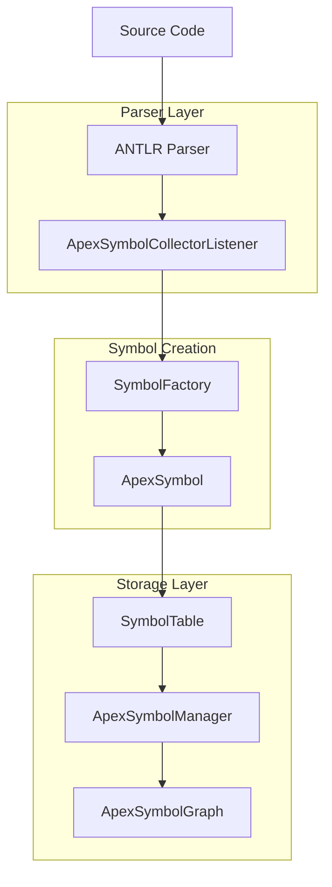
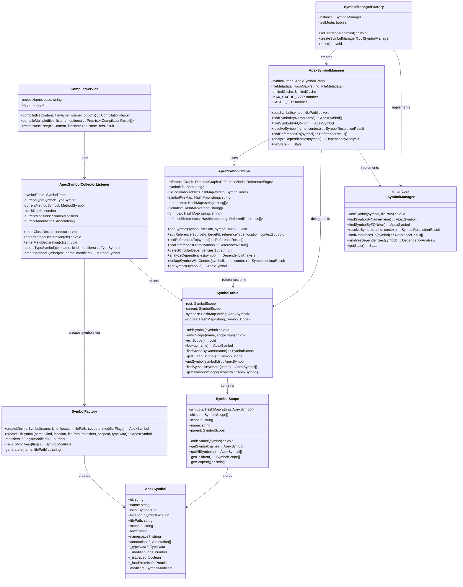
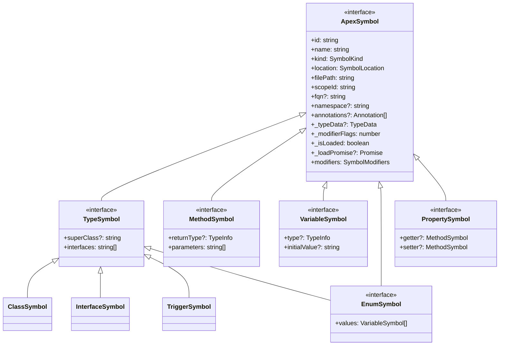
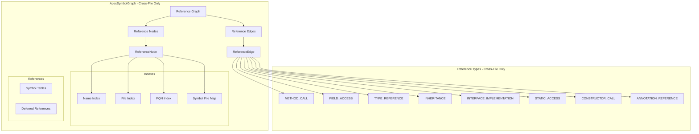
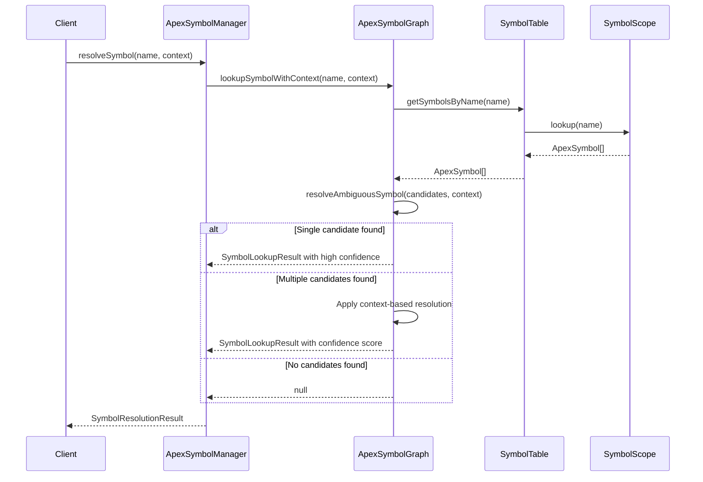

# Symbol Management Architecture - Optimized

## Overview

The Apex Language Server uses a sophisticated symbol management system built around a unified, graph-based architecture with optimized data storage. This document describes the optimized architecture that eliminates data duplication between `ApexSymbol` and `SymbolTable` while maintaining clear separation of concerns.

## Core Architecture Components

### 1. Symbol Production Pipeline

The symbol production pipeline starts with the ANTLR parser and flows through several key components:



### 2. Core Classes and Relationships - Optimized



### 3. Symbol Types and Inheritance - Optimized



### 4. Graph-Based Relationship Management - Optimized



### 5. Symbol Resolution Flow - Optimized



## Key Design Patterns

### 1. Factory Pattern

- `SymbolFactory` creates symbols with different loading strategies
- `SymbolManagerFactory` creates appropriate symbol manager instances
- `HandlerFactory` creates LSP handlers with proper dependencies

### 2. Graph-Based Architecture

- `ApexSymbolGraph` uses a directed graph to track cross-file relationships only
- Nodes represent symbol references, edges represent cross-file references
- Supports complex queries like circular dependency detection

### 3. Lazy Loading

- Symbols can be created in minimal or full mode
- Expensive data is loaded only when needed
- Uses `_loadPromise` pattern for async loading

### 4. Unified Interface

- Single `ApexSymbol` interface for all symbol types
- Simplified scope management through `scopeId` reference
- Type-safe operations with TypeScript

### 5. Scope-Based Organization

- `SymbolTable` manages scopes within a file (primary storage)
- `SymbolScope` represents lexical scoping hierarchy
- Supports nested scope resolution with efficient traversal

### 6. Separation of Concerns

- **SymbolTable**: Primary symbol storage and scope management
- **ApexSymbolGraph**: Cross-file relationship tracking only
- **Clear delegation**: Graph delegates symbol operations to SymbolTable

## Data Structures - Optimized

### Core Collections

- `HashMap` from `data-structure-typed` for efficient symbol storage
- `DirectedGraph` for cross-file relationship tracking only
- Multiple indexes for fast lookups (name, file, FQN)

### Symbol Storage

- **Primary**: `SymbolTable` owns all symbol data
- **Graph**: Only stores lightweight `ReferenceNode` for cross-file relationships
- **Scope**: Unified scope management through `scopeId` references

### Reference Types - Cross-File Only

The system tracks cross-file references between symbols:

- Method calls, field access, type references
- Inheritance and interface implementation
- Static access, constructor calls, annotations
- SOQL/SOSL references, DML operations

## Integration Points

### 1. LSP Services

- `DiagnosticProcessingService` uses symbol manager for cross-file analysis
- `CompletionProcessingService` provides intelligent code completion
- `DefinitionProcessingService` resolves symbol definitions
- `ReferencesProcessingService` finds symbol references

### 2. Storage Layer

- `ApexStorageManager` provides persistent storage
- `ApexStorageInterface` defines storage contract
- Integration with file system and database backends

### 3. Parser Integration

- `CompilerService` orchestrates parsing and symbol collection
- `ApexSymbolCollectorListener` builds symbol tables during parsing
- Real-time symbol updates during development

## Architecture Benefits - Optimized

### 1. Eliminated Data Duplication

- **Single source of truth**: `SymbolTable` owns all symbol data
- **No duplicate storage**: Graph only stores references, not full symbols
- **Reduced memory footprint**: Eliminates redundant symbol storage
- **Simplified maintenance**: Fewer places to update symbol data

### 2. Clear Separation of Concerns

- **SymbolTable**: Lexical scope and symbol storage within files
- **ApexSymbolGraph**: Cross-file relationship tracking only
- **Focused purpose**: Graph maintains its core purpose without scope pollution

### 3. Improved Performance

- **Faster lookups**: Direct delegation to optimized SymbolTable
- **Reduced cache misses**: Single symbol storage location
- **Efficient scope traversal**: Optimized scope hierarchy in SymbolTable
- **Streamlined data flow**: Clear delegation pattern

### 4. Simplified Symbol Interface

- **Removed redundancy**: Eliminated `parentId`, `parentKey`, `parent` properties
- **Unified scope reference**: Single `scopeId` for scope relationships
- **Cleaner API**: Simplified symbol interface with clear responsibilities

### 5. Scalable Design

- **Efficient data structures**: Optimized for large codebases
- **Batch operations support**: Delegated to appropriate components
- **Memory-conscious design**: Eliminated duplicate storage
- **Clear delegation**: Each component handles its specific domain

## Data Flow - Optimized

### Symbol Addition

```typescript
// 1. Symbol created by SymbolFactory
const symbol = SymbolFactory.createMinimalSymbol(
  name,
  kind,
  location,
  filePath,
  scopeId,
);

// 2. Added to SymbolTable (primary storage)
symbolTable.addSymbol(symbol);

// 3. Graph only stores reference and indexes
symbolGraph.addSymbol(symbol, filePath, symbolTable);
// - Stores symbolId in Set
// - Updates indexes for fast lookup
// - Registers SymbolTable reference
// - Does NOT store full symbol
```

### Symbol Resolution

```typescript
// 1. Graph delegates to SymbolTable
symbolGraph.getSymbol(symbolId) {
  const filePath = this.symbolFileMap.get(symbolId);
  const symbolTable = this.fileToSymbolTable.get(filePath);
  return symbolTable?.getSymbol(symbolId) || null;
}

// 2. SymbolTable handles scope-aware lookup
symbolTable.lookup(name) {
  let scope = this.current;
  while (scope) {
    const symbol = scope.getSymbol(name);
    if (symbol) return symbol;
    scope = scope.parent;
  }
}
```

### Cross-File Reference Tracking

```typescript
// Graph handles cross-file relationships only
symbolGraph.addReference(
  sourceId,
  targetId,
  ReferenceType.METHOD_CALL,
  location,
);
// - Creates edge in reference graph
// - Stores relationship metadata
// - Enables dependency analysis
```

## Conclusion

The optimized symbol management architecture eliminates data duplication while maintaining clear separation of concerns. The `SymbolTable` serves as the primary storage for symbols and scope management, while the `ApexSymbolGraph` focuses exclusively on cross-file relationship tracking.

This approach provides:

- **Memory efficiency** through eliminated duplicate storage
- **Performance improvements** through optimized data structures
- **Clear separation** between lexical scope and cross-file relationships
- **Simplified maintenance** with single source of truth for symbol data
- **Scalable design** that handles large codebases efficiently

The architecture maintains all the benefits of the original design while providing a more efficient and maintainable foundation for Apex language analysis.
