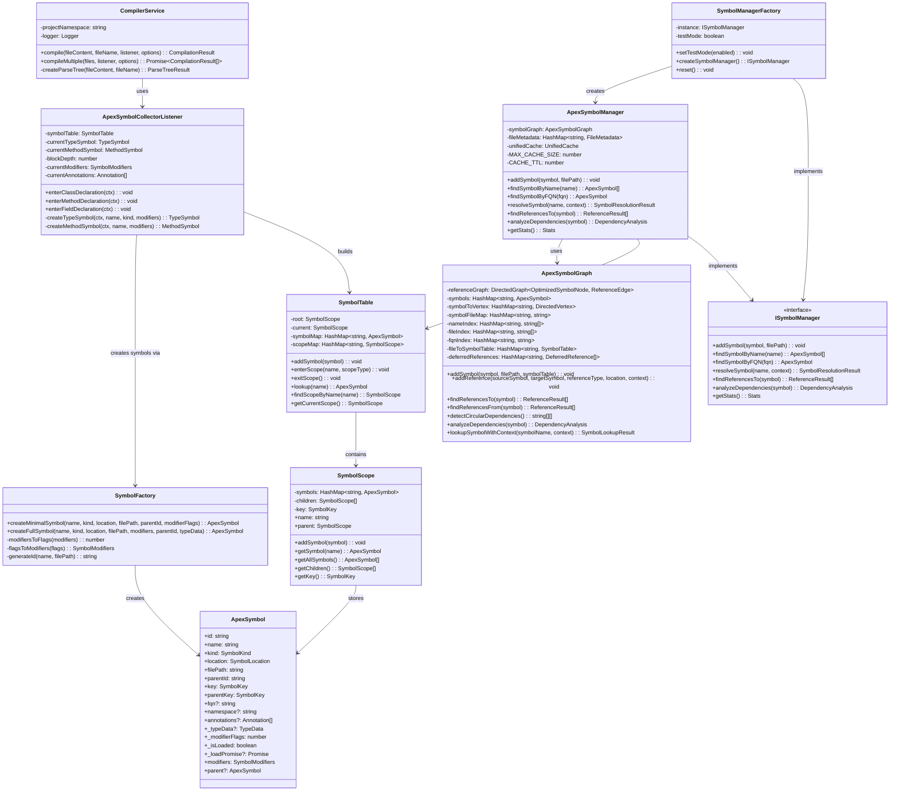

# Symbol Management Architecture

## Overview

The Apex Language Server uses a sophisticated symbol management system built around a unified, graph-based architecture. This document describes the current architecture, including the major classes involved in symbol production, management, and resolution.

## Core Architecture Components

### 1. Symbol Production Pipeline

The symbol production pipeline starts with the ANTLR parser and flows through several key components:

### 2. Core Classes and Relationships

### 3. Symbol Types and Inheritance

### 4. Graph-Based Relationship Management

### 5. Symbol Resolution Flow

## Key Design Patterns

### 1. Factory Pattern

- `SymbolFactory` creates symbols with different loading strategies
- `SymbolManagerFactory` creates appropriate symbol manager instances
- `HandlerFactory` creates LSP handlers with proper dependencies

### 2. Graph-Based Architecture

- `ApexSymbolGraph` uses a directed graph to track relationships
- Nodes represent symbols, edges represent references
- Supports complex queries like circular dependency detection

### 3. Lazy Loading

- Symbols can be created in minimal or full mode
- Expensive data is loaded only when needed
- Uses `_loadPromise` pattern for async loading

### 4. Unified Interface

- Single `ApexSymbol` interface for all symbol types
- Backward compatibility maintained through legacy properties
- Type-safe operations with TypeScript

### 5. Scope-Based Organization

- `SymbolTable` manages scopes within a file
- `SymbolScope` represents lexical scoping hierarchy
- Supports nested scope resolution

## Data Structures

### Core Collections

- `HashMap` from `data-structure-typed` for efficient symbol storage
- `DirectedGraph` for relationship tracking
- Multiple indexes for fast lookups (name, file, FQN)

### Symbol Storage

- `OptimizedSymbolNode` for graph vertices
- `ReferenceEdge` for relationship metadata
- `SymbolKey` for unique identification

### Reference Types

The system tracks 28 different types of references between symbols:

- Method calls, field access, type references
- Inheritance and interface implementation
- Scope relationships (parent, child, contains)
- Static access, constructor calls, annotations
- SOQL/SOSL references, DML operations

## Integration Points

### 1. LSP Services

- `DiagnosticProcessingService` uses symbol manager for cross-file analysis
- `CompletionProcessingService` provides intelligent code completion
- `DefinitionProcessingService` resolves symbol definitions
- `ReferencesProcessingService` finds symbol references

### 2. Storage Layer

- `ApexStorageManager` provides persistent storage
- `ApexStorageInterface` defines storage contract
- Integration with file system and database backends

### 3. Parser Integration

- `CompilerService` orchestrates parsing and symbol collection
- `ApexSymbolCollectorListener` builds symbol tables during parsing
- Real-time symbol updates during development

## Architecture Benefits

### 1. Unified Symbol System

- Single `ApexSymbol` interface eliminates type conversion overhead
- Consistent API across all symbol operations
- Simplified maintenance and debugging

### 2. Graph-Based Relationships

- Rich relationship tracking between symbols
- Bidirectional reference queries
- Circular dependency detection
- Impact analysis capabilities

### 3. Scalable Design

- Efficient data structures for large codebases
- Batch operations support
- Intelligent caching mechanisms
- Memory-conscious design

### 4. Extensible Architecture

- Clear separation of concerns
- Well-defined interfaces
- Factory patterns for testability
- Event-driven updates

## Conclusion

The current symbol management architecture provides a robust, scalable foundation for Apex language analysis. The unified symbol interface, graph-based relationship tracking, and scope-aware resolution create a powerful system capable of handling complex Apex codebases while maintaining clean, maintainable code.

The architecture supports advanced language server features like intelligent code completion, cross-file reference resolution, and dependency analysis, making it an essential component of the Apex Language Server ecosystem.
