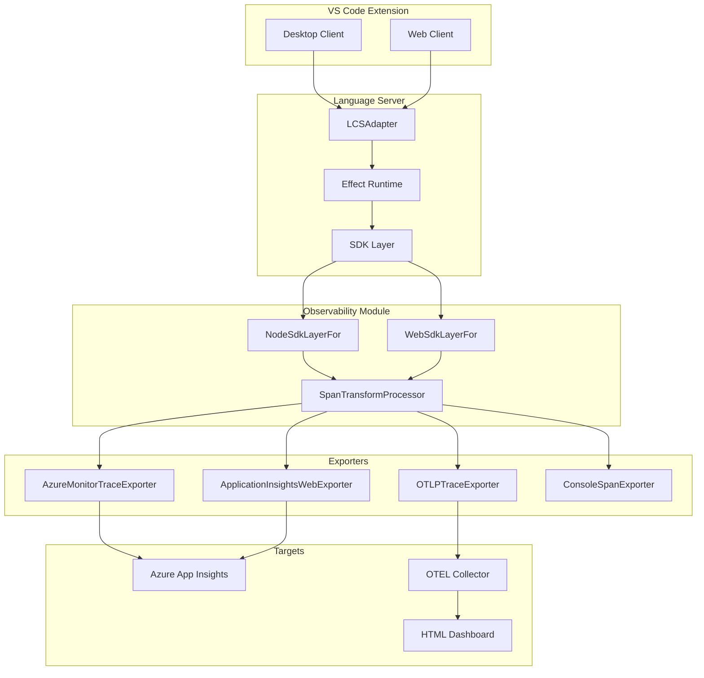

# OpenTelemetry Telemetry System for Apex Language Server

> **Overview**: Implement OpenTelemetry-based telemetry for the Apex Language Server using Effect-TS integration patterns from salesforcedx-vscode-services. Exports to Azure Application Insights with aggregate metrics, environment distinction (web/desktop), and a standalone HTML dashboard for visualization.

Based on the [salesforcedx-vscode-services observability patterns](https://github.com/forcedotcom/salesforcedx-vscode/tree/develop/packages/salesforcedx-vscode-services/src/observability) with Effect-TS integration.

## Implementation Phases

| Phase | Task | Status |
|-------|------|--------|
| 1.1 | Add @effect/opentelemetry, Azure Monitor, and OTEL dependencies | Pending |
| 1.2 | Create observability module with SDK layers following SF patterns | Pending |
| 1.3 | Implement App Insights exporters for Node and Web environments | Pending |
| 2.1 | Instrument LCSAdapter with Effect spans for all LSP handlers | Pending |
| 2.2-2.3 | Instrument queue operations and parser with Effect tracing | Pending |
| 3 | Create OTEL Collector config for local development and testing | Pending |
| 4 | Build HTML dashboard with App Insights data export integration | Pending |
| 5 | Create demo data generator and integration tests | Pending |
| 6 | Add telemetry settings, opt-out mechanism, and VS Code commands | Pending |

---

## Architecture Overview



## Key Design Decisions

1. **Effect-TS Native Integration**: Use `@effect/opentelemetry` with `NodeSdk.layer()` and `WebSdk.layer()` for seamless Effect integration
2. **Platform-Specific SDK Layers**: Separate configurations for Node.js (desktop) and browser (web) environments
3. **Multiple Exporters**: App Insights (production), OTEL Collector (local dev), Console (debugging)
4. **SpanTransformProcessor**: Custom processor for span transformation before export
5. **Consistent with SF Patterns**: Follow salesforcedx-vscode-services conventions for future compatibility

## Data Model

Aggregate metrics with environment distinction (no individual user tracking):

- **Environment**: `web` | `desktop` (via `service.platform` attribute)
- **Extension Info**: `extension.name`, `extension.version`
- **Operation Type**: `completion`, `hover`, `definition`, `diagnostics`, etc.
- **Span Measurements**: `duration` (ms)
- **Error Status**: `SpanStatusCode.ERROR` with message
- **Trace Context**: `traceID`, `spanID`, `parentID`

---

## Phase 1: Core Observability Infrastructure

### 1.1 Add Dependencies

Add to `packages/apex-lsp-shared/package.json`:

```json
{
  "@effect/opentelemetry": "^0.39.0",
  "@opentelemetry/api": "^1.7.0",
  "@opentelemetry/sdk-trace-base": "^1.19.0",
  "@opentelemetry/sdk-trace-web": "^1.19.0",
  "@opentelemetry/exporter-trace-otlp-http": "^0.45.0",
  "@opentelemetry/core": "^1.19.0",
  "@opentelemetry/resources": "^1.19.0",
  "@azure/monitor-opentelemetry-exporter": "^1.0.0-beta.21",
  "@vscode/extension-telemetry": "^0.9.0"
}
```

### 1.2 Create Observability Module

New directory: `packages/apex-lsp-shared/src/observability/`

Following the SF patterns, create:

```
packages/apex-lsp-shared/src/observability/
├── index.ts                        # Public exports
├── appInsights.ts                  # App Insights connection config
├── sdkLayerConfig.ts               # SDK layer configuration type
├── spans.ts                        # Factory for SDK layers (Node/Web switch)
├── spansNode.ts                    # NodeSdkLayerFor implementation
├── spansWeb.ts                     # WebSdkLayerFor implementation
├── spanTransformProcessor.ts       # Custom span processor
├── spanUtils.ts                    # Utility functions for spans
├── applicationInsightsWebExporter.ts  # Web-specific App Insights exporter
└── localTracing.ts                 # Local tracing configuration
```

### 1.3 Implement SDK Layer Configuration

New file: `packages/apex-lsp-shared/src/observability/sdkLayerConfig.ts`

```typescript
export type SdkLayerConfig = {
  extensionName: string;
  extensionVersion: string;
  appInsightsConnectionString?: string;
  localTracingEnabled?: boolean;
  consoleTracingEnabled?: boolean;
};
```

### 1.4 Implement Node SDK Layer

New file: `packages/apex-lsp-shared/src/observability/spansNode.ts`

```typescript
import { NodeSdk } from '@effect/opentelemetry';
import { AzureMonitorTraceExporter } from '@azure/monitor-opentelemetry-exporter';
import { OTLPTraceExporter } from '@opentelemetry/exporter-trace-otlp-http';
import { ConsoleSpanExporter } from '@opentelemetry/sdk-trace-base';
import { SpanTransformProcessor } from './spanTransformProcessor';

export const NodeSdkLayerFor = (config: SdkLayerConfig) =>
  NodeSdk.layer(() => ({
    resource: {
      serviceName: config.extensionName,
      serviceVersion: config.extensionVersion,
      attributes: {
        'extension.name': config.extensionName,
        'extension.version': config.extensionVersion,
        'service.platform': 'desktop'
      }
    },
    spanProcessor: [
      // Console exporter for debugging
      ...(config.consoleTracingEnabled 
        ? [new SpanTransformProcessor(new ConsoleSpanExporter())] 
        : []),
      // App Insights for production
      ...(config.appInsightsConnectionString
        ? [new SpanTransformProcessor(
            new AzureMonitorTraceExporter({
              connectionString: config.appInsightsConnectionString
            })
          )]
        : []),
      // Local OTEL Collector for development
      ...(config.localTracingEnabled
        ? [new SpanTransformProcessor(new OTLPTraceExporter())]
        : [])
    ]
  }));
```

### 1.5 Implement Web SDK Layer

New file: `packages/apex-lsp-shared/src/observability/spansWeb.ts`

```typescript
import { WebSdk } from '@effect/opentelemetry';
import { OTLPTraceExporter } from '@opentelemetry/exporter-trace-otlp-http';
import { ConsoleSpanExporter } from '@opentelemetry/sdk-trace-web';
import { ApplicationInsightsWebExporter } from './applicationInsightsWebExporter';
import { SpanTransformProcessor } from './spanTransformProcessor';

export const WebSdkLayerFor = (config: SdkLayerConfig) =>
  WebSdk.layer(() => ({
    resource: {
      serviceName: config.extensionName,
      serviceVersion: config.extensionVersion,
      attributes: {
        'extension.name': config.extensionName,
        'extension.version': config.extensionVersion,
        'service.platform': 'web',
        'service.environment': 'vscode-extension'
      }
    },
    spanProcessor: [
      ...(config.consoleTracingEnabled
        ? [new SpanTransformProcessor(new ConsoleSpanExporter())]
        : []),
      ...(config.appInsightsConnectionString
        ? [new SpanTransformProcessor(new ApplicationInsightsWebExporter(config))]
        : []),
      ...(config.localTracingEnabled
        ? [new SpanTransformProcessor(new OTLPTraceExporter())]
        : [])
    ]
  }));
```

### 1.6 Implement ApplicationInsightsWebExporter

New file: `packages/apex-lsp-shared/src/observability/applicationInsightsWebExporter.ts`

Following the SF pattern, use `@vscode/extension-telemetry` for web since `@azure/monitor-opentelemetry-exporter` doesn't work in browsers:

```typescript
import { SpanStatusCode } from '@opentelemetry/api';
import { ExportResult, ExportResultCode } from '@opentelemetry/core';
import { ReadableSpan, SpanExporter } from '@opentelemetry/sdk-trace-base';
import { TelemetryReporter } from '@vscode/extension-telemetry';
import * as Effect from 'effect/Effect';
import { isTopLevelSpan, spanDuration, convertAttributes } from './spanUtils';

export class ApplicationInsightsWebExporter implements SpanExporter {
  private reporter: TelemetryReporter;

  constructor(config: SdkLayerConfig) {
    this.reporter = new TelemetryReporter(config.appInsightsConnectionString!);
  }

  public export(spans: ReadableSpan[], resultCallback: (result: ExportResult) => void): void {
    // Export only top-level spans to avoid noise
    spans.filter(isTopLevelSpan).forEach(span => {
      const success = !span.status || span.status.code !== SpanStatusCode.ERROR;
      const props = {
        ...convertAttributes(span.attributes),
        traceID: span.spanContext().traceId,
        spanID: span.spanContext().spanId,
        'service.platform': 'web'
      };
      const measurements = { duration: spanDuration(span) };

      if (success) {
        this.reporter.sendDangerousTelemetryEvent(span.name, props, measurements);
      } else {
        this.reporter.sendDangerousTelemetryErrorEvent(span.name, props, measurements);
      }
    });
    resultCallback({ code: ExportResultCode.SUCCESS });
  }

  public shutdown(): Promise<void> {
    return this.reporter.dispose();
  }
}
```

### 1.7 Implement SpanTransformProcessor

New file: `packages/apex-lsp-shared/src/observability/spanTransformProcessor.ts`

Wrapper processor that adds configuration options:

```typescript
import { SpanProcessor, ReadableSpan, Span, SpanExporter } from '@opentelemetry/sdk-trace-base';
import { Context } from '@opentelemetry/api';

export class SpanTransformProcessor implements SpanProcessor {
  constructor(
    private exporter: SpanExporter,
    private options: { exportTimeoutMillis?: number; maxQueueSize?: number } = {}
  ) {}

  onStart(span: Span, parentContext: Context): void {}
  
  onEnd(span: ReadableSpan): void {
    this.exporter.export([span], () => {});
  }

  shutdown(): Promise<void> {
    return this.exporter.shutdown();
  }

  forceFlush(): Promise<void> {
    return Promise.resolve();
  }
}
```

### 1.8 Implement Span Utilities

New file: `packages/apex-lsp-shared/src/observability/spanUtils.ts`

```typescript
import type { Attributes } from '@opentelemetry/api';
import { ReadableSpan } from '@opentelemetry/sdk-trace-base';

export const isTopLevelSpan = (span: ReadableSpan): boolean => 
  span.parentSpanContext === undefined;

export const convertAttributes = (attributes: Attributes): Record<string, string> =>
  Object.fromEntries(
    Object.entries(attributes)
      .filter(([, value]) => value !== undefined && value !== null)
      .map(([key, value]) => [key, String(value)])
  );

export const spanDuration = (span: ReadableSpan): number =>
  span.duration ? span.duration[0] * 1000 + span.duration[1] / 1_000_000 : 0;
```

### 1.9 Create SDK Layer Factory

New file: `packages/apex-lsp-shared/src/observability/spans.ts`

```typescript
import type { SdkLayerConfig } from './sdkLayerConfig';
import { NodeSdkLayerFor } from './spansNode';
import { WebSdkLayerFor } from './spansWeb';
import { detectEnvironment } from '../utils/Environment';

export type { SdkLayerConfig } from './sdkLayerConfig';

/**
 * Factory for SDK layers based on environment.
 * Automatically selects Node or Web SDK based on runtime detection.
 */
export const SdkLayerFor = (config: SdkLayerConfig) =>
  detectEnvironment() === 'web' 
    ? WebSdkLayerFor(config) 
    : NodeSdkLayerFor(config);

/** Pre-built SDK layer for the Apex Language Server */
export const ApexLspSdkLayer = (version: string) =>
  SdkLayerFor({
    extensionName: 'apex-language-server',
    extensionVersion: version,
    appInsightsConnectionString: process.env.APEX_LSP_APP_INSIGHTS_CONNECTION_STRING,
    localTracingEnabled: process.env.APEX_LSP_LOCAL_TRACING === 'true',
    consoleTracingEnabled: process.env.APEX_LSP_CONSOLE_TRACING === 'true'
  });
```

---

## Phase 2: LSP Instrumentation with Effect Tracing

### 2.1 Instrument LCSAdapter with Effect Spans

Modify: `packages/apex-ls/src/server/LCSAdapter.ts`

Use Effect's native tracing which integrates with the SDK layer:

```typescript
import * as Effect from 'effect/Effect';
import { Tracer } from '@effect/opentelemetry';

// In setupProtocolHandlers(), wrap handlers with Effect.withSpan:
connection.onHover(async (params, token) => {
  return Effect.runPromise(
    Effect.gen(function* () {
      const result = yield* dispatchProcessOnHover(params);
      return result;
    }).pipe(
      Effect.withSpan('lsp.hover', {
        attributes: {
          'lsp.method': 'textDocument/hover',
          'document.uri': params.textDocument.uri
        }
      }),
      Effect.catchAllCause(cause => {
        // Span automatically marked as error
        return Effect.fail(cause);
      })
    )
  );
});
```

Key handlers to instrument:

- `textDocument/hover`
- `textDocument/completion`
- `textDocument/definition`
- `textDocument/references`
- `textDocument/documentSymbol`
- `textDocument/diagnostics`
- `textDocument/formatting`

### 2.2 Instrument Queue Operations

Modify: `packages/lsp-compliant-services/src/queue/LSPQueueManager.ts`

Add spans for queue lifecycle:

```typescript
import * as Effect from 'effect/Effect';

const processTask = (task: QueuedTask) =>
  Effect.gen(function* () {
    const result = yield* task.execute();
    return result;
  }).pipe(
    Effect.withSpan('lsp.queue.process', {
      attributes: {
        'queue.priority': task.priority,
        'queue.wait_time_ms': Date.now() - task.enqueuedAt,
        'queue.task_type': task.type
      }
    })
  );
```

### 2.3 Instrument Parser Operations

Modify key files in: `packages/apex-parser-ast/src/`

Add spans for expensive operations:

```typescript
// In parser entry points:
export const parseDocument = (content: string, uri: string) =>
  Effect.gen(function* () {
    const ast = yield* parseApexSource(content);
    return ast;
  }).pipe(
    Effect.withSpan('apex.parse', {
      attributes: {
        'document.uri': uri,
        'document.size_bytes': content.length
      }
    })
  );

// In symbol resolution:
export const resolveSymbols = (ast: ApexAST) =>
  Effect.gen(function* () {
    const symbols = yield* buildSymbolTable(ast);
    return symbols;
  }).pipe(
    Effect.withSpan('apex.resolve_symbols', {
      attributes: {
        'symbol.count': symbols.length
      }
    })
  );
```

---

## Phase 3: OTEL Collector Setup (Local Development)

### 3.1 Create Collector Configuration

New file: `telemetry/otel-collector-config.yaml`

```yaml
receivers:
  otlp:
    protocols:
      http:
        endpoint: 0.0.0.0:4318
        cors:
          allowed_origins: ["*"]
      grpc:
        endpoint: 0.0.0.0:4317

processors:
  batch:
    timeout: 5s
    send_batch_size: 100

exporters:
  # JSON file for dashboard consumption
  file/json:
    path: /data/traces.json
    format: json
  
  # Logging for debugging
  logging:
    verbosity: detailed
    sampling_initial: 5
    sampling_thereafter: 200

  # Optional: Forward to App Insights for comparison
  azuremonitor:
    connection_string: ${AZURE_MONITOR_CONNECTION_STRING}

service:
  pipelines:
    traces:
      receivers: [otlp]
      processors: [batch]
      exporters: [file/json, logging]
    traces/appinsights:
      receivers: [otlp]
      processors: [batch]
      exporters: [azuremonitor]
```

### 3.2 Docker Compose for Local Development

New file: `telemetry/docker-compose.yaml`

```yaml
version: '3.8'

services:
  otel-collector:
    image: otel/opentelemetry-collector-contrib:0.92.0
    command: ["--config=/etc/otelcol/config.yaml"]
    volumes:
      - ./otel-collector-config.yaml:/etc/otelcol/config.yaml:ro
      - ./data:/data
    ports:
      - "4317:4317"   # gRPC
      - "4318:4318"   # HTTP
      - "13133:13133" # Health check
    environment:
      - AZURE_MONITOR_CONNECTION_STRING=${AZURE_MONITOR_CONNECTION_STRING:-}
    healthcheck:
      test: ["CMD", "wget", "--spider", "-q", "localhost:13133"]
      interval: 10s
      timeout: 5s
      retries: 3

  # Optional: Jaeger UI for trace visualization
  jaeger:
    image: jaegertracing/all-in-one:1.53
    ports:
      - "16686:16686" # Jaeger UI
      - "14268:14268" # Accept spans
    profiles:
      - jaeger
```

### 3.3 NPM Scripts and Environment Setup

Add to root `package.json`:

```json
{
  "scripts": {
    "telemetry:start": "docker-compose -f telemetry/docker-compose.yaml up -d",
    "telemetry:stop": "docker-compose -f telemetry/docker-compose.yaml down",
    "telemetry:logs": "docker-compose -f telemetry/docker-compose.yaml logs -f otel-collector",
    "telemetry:jaeger": "docker-compose -f telemetry/docker-compose.yaml --profile jaeger up -d",
    "dashboard": "npx serve telemetry/dashboard -p 3000"
  }
}
```

New file: `telemetry/.env.example`

```bash
# Azure Application Insights connection string (for production)
AZURE_MONITOR_CONNECTION_STRING=InstrumentationKey=xxx;IngestionEndpoint=https://xxx.in.applicationinsights.azure.com/

# Local tracing options
APEX_LSP_LOCAL_TRACING=true
APEX_LSP_CONSOLE_TRACING=false
```

---

## Phase 4: HTML Dashboard

### 4.1 Dashboard Structure

New directory: `telemetry/dashboard/`

```
telemetry/dashboard/
├── index.html              # Main dashboard
├── styles.css              # Modern styling
├── js/
│   ├── app.js              # Main application
│   ├── charts.js           # Chart.js configurations
│   ├── data-loader.js      # Fetch and process OTEL JSON
│   └── aggregations.js     # Aggregate calculations
└── data/
    └── .gitkeep            # Placeholder for trace data
```

### 4.2 Dashboard Features

**Environment Comparison Panel**

- Side-by-side cards showing web vs desktop metrics
- Total operations, error count, average latency

**Operation Breakdown Chart**

- Stacked bar chart showing operation counts by type
- Grouped by environment (web/desktop)

**Latency Distribution**

- Histogram showing p50, p90, p99 percentiles
- Separate series for each environment

**Error Rate Timeline**

- Line chart showing error rate over time
- Threshold lines for alerting

**Live Data Table**

- Recent spans with filtering
- Columns: timestamp, operation, duration, status, environment

### 4.3 Data Loading from OTEL JSON

```javascript
// js/data-loader.js
export async function loadTraceData() {
  const response = await fetch('/data/traces.json');
  const lines = (await response.text()).split('\n').filter(Boolean);
  return lines.map(line => JSON.parse(line));
}

export function aggregateByEnvironment(traces) {
  const web = traces.filter(t => t.resource?.attributes?.['service.platform'] === 'web');
  const desktop = traces.filter(t => t.resource?.attributes?.['service.platform'] === 'desktop');
  
  return {
    web: computeMetrics(web),
    desktop: computeMetrics(desktop)
  };
}

function computeMetrics(traces) {
  const durations = traces.map(t => t.duration);
  return {
    count: traces.length,
    errors: traces.filter(t => t.status?.code === 2).length,
    avgDuration: durations.reduce((a, b) => a + b, 0) / durations.length,
    p50: percentile(durations, 50),
    p90: percentile(durations, 90),
    p99: percentile(durations, 99)
  };
}
```

### 4.4 App Insights Data Export (Alternative)

For production dashboards, query App Insights directly:

```javascript
// js/app-insights-loader.js
const APP_INSIGHTS_API = 'https://api.applicationinsights.io/v1/apps';

export async function queryAppInsights(appId, apiKey, query) {
  const response = await fetch(`${APP_INSIGHTS_API}/${appId}/query`, {
    method: 'POST',
    headers: {
      'x-api-key': apiKey,
      'Content-Type': 'application/json'
    },
    body: JSON.stringify({ query })
  });
  return response.json();
}

// Example query for environment comparison
const ENVIRONMENT_QUERY = `
  dependencies
  | where timestamp > ago(24h)
  | where name startswith "lsp."
  | extend environment = tostring(customDimensions['service.platform'])
  | summarize 
      count = count(),
      avgDuration = avg(duration),
      errorCount = countif(success == false)
    by environment
`;
```

---

## Phase 5: Testing and Demo Mode

### 5.1 Demo Data Generator

New file: `telemetry/scripts/generate-demo-data.ts`

```typescript
import * as fs from 'fs';

interface DemoSpan {
  traceId: string;
  spanId: string;
  name: string;
  duration: number;
  status: { code: number; message?: string };
  resource: {
    attributes: {
      'extension.name': string;
      'extension.version': string;
      'service.platform': 'web' | 'desktop';
    };
  };
  attributes: Record<string, string | number>;
  startTimeUnixNano: number;
  endTimeUnixNano: number;
}

const OPERATIONS = [
  'lsp.hover',
  'lsp.completion',
  'lsp.definition',
  'lsp.references',
  'lsp.documentSymbol',
  'lsp.diagnostics',
  'apex.parse',
  'apex.resolve_symbols'
];

function generateDemoData(count: number): DemoSpan[] {
  const spans: DemoSpan[] = [];
  const now = Date.now();
  
  for (let i = 0; i < count; i++) {
    const environment = Math.random() > 0.4 ? 'desktop' : 'web';
    const operation = OPERATIONS[Math.floor(Math.random() * OPERATIONS.length)];
    const isError = Math.random() < 0.05; // 5% error rate
    
    // Web operations typically slower
    const baseDuration = environment === 'web' ? 50 : 30;
    const duration = baseDuration + Math.random() * 200;
    
    spans.push({
      traceId: crypto.randomUUID().replace(/-/g, ''),
      spanId: crypto.randomUUID().replace(/-/g, '').slice(0, 16),
      name: operation,
      duration: Math.round(duration * 1_000_000), // nanoseconds
      status: isError 
        ? { code: 2, message: 'Operation failed' }
        : { code: 0 },
      resource: {
        attributes: {
          'extension.name': 'apex-language-server',
          'extension.version': '1.0.0',
          'service.platform': environment
        }
      },
      attributes: {
        'lsp.method': operation.replace('lsp.', 'textDocument/')
      },
      startTimeUnixNano: (now - (count - i) * 1000) * 1_000_000,
      endTimeUnixNano: (now - (count - i) * 1000 + duration) * 1_000_000
    });
  }
  
  return spans;
}

// Generate 500 demo spans
const demoData = generateDemoData(500);
fs.writeFileSync(
  'telemetry/data/traces.json',
  demoData.map(s => JSON.stringify(s)).join('\n')
);
console.log(`Generated ${demoData.length} demo spans`);
```

### 5.2 Unit Tests for Observability Module

New file: `packages/apex-lsp-shared/test/observability/spans.test.ts`

```typescript
import { describe, it, expect } from '@jest/globals';
import * as Effect from 'effect/Effect';
import { NodeSdkLayerFor } from '../../src/observability/spansNode';

describe('NodeSdkLayerFor', () => {
  it('creates layer with correct resource attributes', () => {
    const layer = NodeSdkLayerFor({
      extensionName: 'test-extension',
      extensionVersion: '1.0.0'
    });
    
    expect(layer).toBeDefined();
  });

  it('configures App Insights exporter when connection string provided', () => {
    const layer = NodeSdkLayerFor({
      extensionName: 'test-extension',
      extensionVersion: '1.0.0',
      appInsightsConnectionString: 'InstrumentationKey=test'
    });
    
    expect(layer).toBeDefined();
  });
});
```

### 5.3 Integration Test with Real Spans

New file: `packages/apex-lsp-shared/test/observability/integration.test.ts`

```typescript
import * as Effect from 'effect/Effect';
import { SdkLayerFor } from '../../src/observability/spans';

describe('Observability Integration', () => {
  it('records spans through Effect pipeline', async () => {
    const program = Effect.gen(function* () {
      yield* Effect.sleep(10);
      return 'done';
    }).pipe(
      Effect.withSpan('test.operation', {
        attributes: { 'test.attribute': 'value' }
      })
    );

    const layer = SdkLayerFor({
      extensionName: 'test',
      extensionVersion: '1.0.0',
      consoleTracingEnabled: true
    });

    await Effect.runPromise(Effect.provide(program, layer));
  });
});
```

---

## Phase 6: Configuration and Opt-out

### 6.1 Telemetry Settings

Extend: `packages/apex-lsp-shared/src/settings/ApexSettingsUtilities.ts`

```typescript
export interface ApexTelemetrySettings {
  /** Enable telemetry collection (respects VS Code global setting) */
  enabled: boolean;
  /** App Insights connection string (overrides default) */
  appInsightsConnectionString?: string;
  /** Enable local OTEL collector export */
  localTracingEnabled: boolean;
  /** Enable console span logging (development only) */
  consoleTracingEnabled: boolean;
}

export const DEFAULT_TELEMETRY_SETTINGS: ApexTelemetrySettings = {
  enabled: true,
  localTracingEnabled: false,
  consoleTracingEnabled: false
};
```

### 6.2 Opt-out Mechanism

New file: `packages/apex-lsp-shared/src/observability/telemetryConfig.ts`

```typescript
import { workspace, env } from 'vscode';

export const isTelemetryEnabled = (): boolean => {
  // Respect VS Code's global telemetry setting
  const vscodeLevel = workspace
    .getConfiguration('telemetry')
    .get<string>('telemetryLevel', 'all');
  
  if (vscodeLevel === 'off') {
    return false;
  }

  // Check extension-specific setting
  const extensionEnabled = workspace
    .getConfiguration('apex')
    .get<boolean>('telemetry.enabled', true);

  return extensionEnabled;
};

export const getLocalTracingEnabled = (): boolean => {
  return workspace
    .getConfiguration('apex')
    .get<boolean>('telemetry.localTracingEnabled', false);
};

export const getConsoleTracingEnabled = (): boolean => {
  return workspace
    .getConfiguration('apex')
    .get<boolean>('telemetry.consoleTracingEnabled', false);
};
```

### 6.3 Extension Contribution Points

Update: `packages/apex-lsp-vscode-extension/package.json`

```json
{
  "contributes": {
    "configuration": {
      "title": "Apex Language Server",
      "properties": {
        "apex.telemetry.enabled": {
          "type": "boolean",
          "default": true,
          "description": "Enable telemetry collection for the Apex Language Server. Respects VS Code's global telemetry setting."
        },
        "apex.telemetry.localTracingEnabled": {
          "type": "boolean",
          "default": false,
          "description": "Export traces to local OTEL collector (http://localhost:4318). For development only."
        },
        "apex.telemetry.consoleTracingEnabled": {
          "type": "boolean",
          "default": false,
          "description": "Log spans to console. For debugging only."
        }
      }
    },
    "commands": [
      {
        "command": "apex.telemetry.openDashboard",
        "title": "Apex: Open Telemetry Dashboard"
      }
    ]
  }
}
```

---

## Key Files Summary

| File | Purpose |
|------|---------|
| `packages/apex-lsp-shared/src/observability/index.ts` | Public exports |
| `packages/apex-lsp-shared/src/observability/spans.ts` | SDK layer factory |
| `packages/apex-lsp-shared/src/observability/spansNode.ts` | Node.js SDK configuration |
| `packages/apex-lsp-shared/src/observability/spansWeb.ts` | Web SDK configuration |
| `packages/apex-lsp-shared/src/observability/spanTransformProcessor.ts` | Custom span processor |
| `packages/apex-lsp-shared/src/observability/applicationInsightsWebExporter.ts` | Web App Insights exporter |
| `packages/apex-lsp-shared/src/observability/telemetryConfig.ts` | Configuration helpers |
| `packages/apex-ls/src/server/LCSAdapter.ts` | LSP handler instrumentation |
| `telemetry/otel-collector-config.yaml` | Collector configuration |
| `telemetry/docker-compose.yaml` | Local development setup |
| `telemetry/dashboard/index.html` | Visualization dashboard |
| `telemetry/scripts/generate-demo-data.ts` | Demo data generator |

---

## Demo Workflow

### Option A: Local Development (OTEL Collector + Dashboard)

```bash
# 1. Start OTEL Collector
npm run telemetry:start

# 2. Enable local tracing in VS Code settings
# Set apex.telemetry.localTracingEnabled = true

# 3. Launch extension in debug mode (F5)

# 4. Perform LSP operations (open Apex files, hover, complete, etc.)

# 5. Open dashboard
npm run dashboard
# View at http://localhost:3000
```

### Option B: Demo with Generated Data

```bash
# 1. Generate demo data
npx ts-node telemetry/scripts/generate-demo-data.ts

# 2. Open dashboard
npm run dashboard
# View at http://localhost:3000
```

### Option C: Production (App Insights)

```bash
# 1. Set App Insights connection string in environment
export APEX_LSP_APP_INSIGHTS_CONNECTION_STRING="InstrumentationKey=xxx;..."

# 2. Package and install extension

# 3. View data in Azure Portal > Application Insights > Logs
# Query: dependencies | where name startswith "lsp."
```

---

## Success Criteria

- Spans exported to App Insights within 30s of operations
- Dashboard shows web vs desktop comparison with accurate metrics
- Error rates match actual LSP errors (verified via logs)
- Performance overhead < 1ms per operation (measured via benchmarks)
- Works in both desktop and web VS Code environments
- Respects VS Code telemetry opt-out setting
- Console tracing works for local debugging
